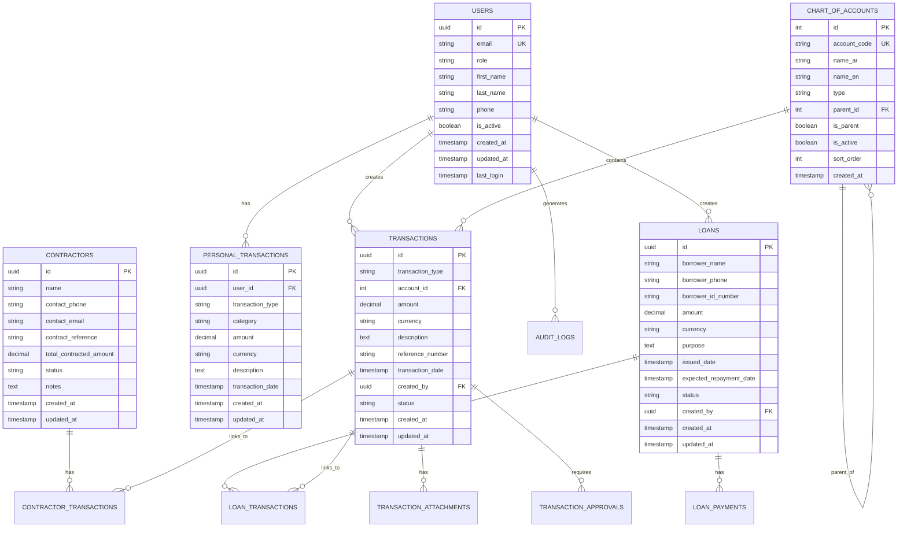

# Product Requirements Document (PRD) - Version 1.0

# "Mali Al-Mohtarif" System: Financial Management for Architectural Finishing Projects

## Table of Contents
1. [Introduction and Project Vision](#1-introduction-and-project-vision)
2. [Target Users and Use Cases](#2-target-users-and-use-cases)
3. [Detailed Functional Requirements](#3-detailed-functional-requirements)
4. [Non-Functional Requirements](#4-non-functional-requirements)
5. [UI/UX Specifications](#5-uiux-specifications)
6. [Technical Stack Comparison: Firebase vs Supabase](#6-technical-stack-comparison-firebase-vs-supabase)
7. [System Architecture and Technical Specifications](#7-system-architecture-and-technical-specifications)
8. [Data Models and Database Schema](#8-data-models-and-database-schema)
9. [API Specifications](#9-api-specifications)
10. [Security Requirements](#10-security-requirements)
11. [Testing Requirements](#11-testing-requirements)
12. [Deployment](#12-deployment)
13. [Roadmap and Phases](#13-roadmap-and-phases)
14. [Maintenance and Support](#14-maintenance-and-support)
15. [Appendices](#15-appendices)

## 1. Introduction and Project Vision

### 1.1. Executive Summary

"Mali Al-Mohtarif" aims to develop an integrated financial and accounting system, functioning as a Progressive Web App (PWA), specifically designed for the contracting and architectural finishing sector, Integrated with and strict isolation module  of the supervisor’s personal finance management. The system provides a centralized, secure, and user-friendly solution for the financial and administrative supervisor of a hotel and residential building project in Sana'a, Yemen. to move beyond paperwork, scattered spreadsheets, and manual processes. Through an interactive dashboard, a smart transaction ledger, and streamlined workflows, and a precise tracking system for contractor and loan accounts, the system will transform the chaos of paperwork and scattered spreadsheet data into clear financial insights and informed decisions,  the delivers transparency, accountability, and efficiency in financial management.

The key value proposition lies in the unique integration of meticulous  and Its dual capabilities: (1) project financial management e.x categorized tracking of contractors, material costs, daily labor, and administrative expenses, and (2) strict isolation module  of the supervisor’s personal finance management.

In the initial (current) phase, the system is distinguished by a unique business logic: **the main cash account (treasury) balance will only be affected by deposit transactions**. All other transactions, including expenses, loans, and disbursements, will be recorded solely for tracking, reporting, and monitoring purposes without reducing the treasury balance. This ensures that the system’s recorded treasury balance always aligns with the actual bank balance at *Al-Dhafri Bank & Exchange*. This approach provides a flexible yet controlled foundation for financial management in the early phase, while remaining scalable for future enhancements where deduction rules may be applied. In doing so, the system eliminates reconciliation errors while offering full traceability of all project-related and personal transactions.

By incorporating advanced modules such as the Chart of Accounts, batch processing of daily wages, receipt scanning with OCR, automated categorization, and real-time collaboration between supervisors and assistants, the solution transforms traditional practices into a streamlined, auditable, and highly reliable financial system.

### 1.2. Product Vision

To be the leading, reliable, and accessible digital tool for supervisors and managers of small to medium-sized architectural and contracting projects in Yemen and beyond, complete control and absolute clarity over their financial health, reducing errors, enhancing transparency, and supporting successful decision-making that leads to efficient and profitable project completion. The system will:

- Provide absolute clarity and control over both project and personal finances.
- Reduce human error and fraud by enforcing business rules and system validations.
- Enhance transparency with real-time dashboards and automated audit trails.
- Deliver decision-making support through forecasting, budget vs. actual comparisons, and trend analysis.
- Guarantee accessibility on any device, with offline-first support through PWA technology.
- Support future scalability into a fully integrated enterprise-grade financial management solution.

The system vision emphasizes a **dual-layered financial management structure**: one that guarantees real-time monitoring of deposits in the treasury account (with full alignment to the actual bank statement) and another that provides comprehensive recording of all other financial activities (expenses, loans, disbursements) for detailed tracking and reporting. By adopting this phased logic, the system ensures operational precision and scalability, creating a practical solution for the current needs while preparing for future, fully integrated accounting capabilities.

The long-term vision is to set a standard in the local construction industry by bridging informal financial practices with structured, digital-first accounting workflows, enabling supervisors to manage multiple projects simultaneously with confidence and clarity.

### 1.3. Project Goals (SMART Goals)

1. **Centralization & Efficiency**  
   - Reduce time spent on manual transaction entry and reconciliation by **70% within the first 2 months** of adoption.  
   - Decrease the number of steps required to record a transaction from an average of **8 steps (spreadsheets)** to **3 steps in the system**.  
   - Implement batch transaction features for daily labor and recurring payments by **Phase 1 rollout**.  
   - Integrate automated receipt scanning and OCR-based data entry by **Phase 2**.  

2. **Accuracy & Reconciliation**  
   - Ensure **100% alignment** between the system’s Main Cash Account balance and the actual *Al-Dhafri Bank & Exchange* balance.  
   - Achieve 100% accuracy in matching the system's Main Cash Account (treasury) balance with the actual bank balance at *Al-Dhafri Bank & Exchange*.
   - Reduce calculation and categorization errors to **zero** through automated system validations.  
   - Deliver a reconciliation module that allows one-click matching of system records with bank statements by **Phase 2**.  
   - Provide automated alerts for discrepancies between recorded and actual balances within **24 hours of detection**.  
   - Ensure that only deposit transactions affect the treasury balance, while expenses, loans, and other disbursements are tracked and reported without reducing the treasury balance, in alignment with the initial operational model.
   
3. **Control & Decision Support**  
   - Offer **real-time reporting** for treasury balances, contractor payments, material expenses, and loans.  
   - Provide a **data-driven executive dashboard** updated in real-time with drill-down analytics.  
   - Enable supervisors to make quick financial decisions by reducing report preparation time by **80%**.  
   - Add forecasting and trend analysis tools by **Phase 3**, including budget vs. actual comparisons for each expense category.  

4. **Accessibility & Usability**  
   - Ensure full system functionality across devices (smartphone with the highest priority, tablet, desktop).  
   - Deliver a responsive and intuitive UI optimized for both supervisors (advanced dashboard) and assistants (simplified expense recording interface), and smartphones are given top priority, and secondary for other devices of all screen sizes.  
   - Implement PWA technology to allow offline access and synchronization when connectivity is restored, **offline-first support** with background synchronization upon connectivity restoration.  
   - Achieve **WCAG 2.1 AA compliance** to ensure usability for all users.  
   - Achieve a Web Content Accessibility Guidelines (WCAG) 2.1 AA compliance level.

5. **Security, Privacy & Isolation**  
   - Guarantee **100% isolation** between project-related financial data and personal finance data within the system.  
   - Introduce **role-based access controls** to ensure assistants and contractors can only access relevant data or **data is only accessible to authorized personnel**.  
   - Maintain detailed **audit trails** or **audit logs for all financial transactions** for every financial action (who, when, what).  
   - Encrypt all data in transit (TLS 1.3) and at rest (AES-256).  
   - Roll out **multi-factor authentication** for administrative accounts by **Phase 2**. 

### 1.4. Business Context and Justification

The architectural finishing and contracting industry in Yemen faces significant financial management challenges that hinder efficiency, transparency, and profitability. The business context for developing the "Mali Al-Mohtarif" system is rooted in these challenges and the urgent need for a digital-first, adaptive, and context-specific solution.

1. **Complex Financial Flows**: Projects involve multiple contractors, frequent daily labor payments, recurring material purchases, and diverse operational expenses, web of financial transactions that are difficult to track manually. Manual tracking creates inconsistencies and often leads to disputes.

2. **Documentation Challenges**: Paper-based invoices, receipts, and payment records are fragile, prone to loss, and difficult to organize, causing frequent disputes and gaps in accountability, and financial discrepancies.

3. **Reconciliation Issues**: Manual reconciliation between actual bank balances and recorded transactions consumes significant time and increases the risk of errors. Supervisors often find mismatches that delay reporting.

4. **Decision-Making Delays**: Without access to real-time, accurate financial insights, supervisors and project managers are forced to make decisions based on outdated or incomplete information, risking cost overruns and mismanagement.

5. **Personal/Project Finance Mixing**: Supervisors frequently mix personal and project finances, making it difficult to generate accurate financial reports and increasing the risk of misallocation or misuse of funds.

6. **Limited Connectivity**: With intermittent internet access in Yemen, systems that require continuous connectivity are unreliable. A solution that ensures offline functionality with seamless synchronization is essential.

7. **Multi-Currency Complexity**: Handling multiple currencies (YER, USD, SAR) in a single project complicates tracking and reconciliation. Manual conversion methods increase human error.

8. **Treasury Logic as Core Value**: In the initial phase, the system will implement a unique treasury management logic: the main cash account (treasury) will only be affected by deposit transactions. Expenses, loans, and other outflows will be recorded without deducting from the treasury balance, enabling precise manual reconciliation with real-world bank statements while still capturing complete financial activity for reporting and analysis.

**Justification:**  
The "Mali Al-Mohtarif" system directly addresses these challenges by providing:
- Centralizes all financial data in one place and with one system.
- A centralized, secure financial platform tailored to project and personal finance management.  
- Separates personal and project finances while maintaining integrated management
- A unique business logic that mirrors actual banking practices and ensures reliable treasury management.  
- Real-time reporting and dashboards to enhance decision-making.  
- Automated validations to reduce errors.  
- PWA technology that supports offline operations and synchronization.  
- Multi-currency and multi-account capabilities to reflect real project dynamics.  

By solving these industry-specific pain points, the system will deliver immediate value in its initial phase while laying a flexible foundation for future accounting enhancements.

### 1.5. Key Success Metrics

To ensure the system meets its objectives and delivers tangible value, success will be measured against the following criteria:

1. **User Adoption Rate**:  
   - 100% adoption by the financial supervisor (primary user) within 1 week of deployment.  
   - 100% adoption by security guards and on-site staff (e.g., Mosa) within 2 weeks of deployment.  
   - At least 90% of financial transactions recorded through the system within the first month.  
   - Achievement of sustained usage rates of over 95% after 3 months.

2. **System Reliability**:  
   - 99.9% uptime during business hours.  
   - Zero data loss incidents.  
   - 100% successful offline-to-online synchronization within 24 hours of restored connectivity.  
   - Automated backup and restore procedures tested monthly.

3. **Financial Accuracy**:  
   - Zero discrepancies between the system’s treasury balance and the actual bank statement.  
   - 100% traceability of all financial transactions, including contractor payments and labor disbursements.  
   - 100% accuracy in applying the treasury logic (deposits affect balance, expenses do not) in the initial phase.  

4. **Efficiency Improvements**:  
   - 70% reduction in time spent on transaction entry and reconciliation tasks.  
   - 90% reduction in paper-based record keeping by migrating to digital-first processes.  
   - 80% reduction in time required to generate daily, weekly, and monthly reports.  
   - Batch processing reduces daily labor payment entry effort by at least 60%.

5. **User Satisfaction**:  
   - Achieve a satisfaction score of at least 4.5/5 in post-implementation surveys.  
   - Less than 2 support requests per week after the first month of deployment.  
   - Zero critical usability issues reported after the first month.  
   - Positive qualitative feedback from both financial supervisors (e.g., Naseem) and field staff (e.g., Mosa).

6. **Business Impact Metrics**:  
   - Reduction in financial disputes with contractors by 50% within 6 months.  
   - Improvement in timeliness of contractor and laborer payments by 40%.  
   - Increased clarity in personal vs. project finance separation, with supervisors reporting 100% confidence in financial reports within 3 months of use.

## 2. Target Users and Use Cases

### 2.1. User Personas

#### Persona 1: Naseem - Financial & Administrative Supervisor (Admin, Deputy Stakeholde) 

**Demographics**:
- Male, 30 years old
- Currently working as a supervisor on some architectural works
- Tech-savvy with experience using smartphones, computers, and basic software
- Responsible for managing the entire finishing project

**Background**:
- Has been managing architectural projects for 3 years
- Currently oversees a team of 6 contractors and their crews with incremnt contractors in futatre
- Manages a monthly budget of approximately $30,000 USD
- Reports directly to the building owner

**Goals**:
- Know the actual balance in the treasury for all currencies (YER, USD, SAR) at any moment
- Easily track all amounts paid to each contractor
- Monitor daily labor costs and material purchases
- Generate reports for the building owner showing financial status and progress
- Easily track and manage personal expenses/expenditures
- Securely separate personal expenses/expenditures from project funds
- Maintain accurate records for tax and audit purposes

**Pain Points**:
- Spends 2-3 hours daily on financial record-keeping
- Struggles to reconcile bank statements with his records
- Fears forgetting to record payments, causing accounting issues with contractors
- Fears forgetting to record payments to contractors, such as daily expenses, weekly payments, and monthly payments, causing accounting issues with contractors
- Has experienced disputes with contractors over payment amounts
- Fear of forgetting to record the amounts of invoices for materials purchased for the various works of this project for this building, with the various commercial companies/suppliers, either cash invoices or credit notes, This could cause accounting problems with these various commercial companies/suppliers, and accounting problems in tracking material purchases for the various works of this project for this building
- Fear of forgetting to record various financial procedures and transactions, such as daily expenses, operating and administrative expenses, etc, for various aspects of this project's operations, such as the basic and additional costs of this commercial building, This can cause accounting problems and problems tracking expenditures and the treasury account balance funded by the various activities of this project for this commercial building
- Finds it difficult to track expenses across multiple currencies
- Worries about mixing personal and project finances
- Etc

**Behaviors**:
- Record and Keeping a  payments financial for various financial procedures and transactions, such as expenses and payments to contractors, such as daily expenses, weekly, monthly payments, etc
- Record and Keeping  the details and amounts of invoices for materials purchased for the various works of this project for this building, with the various commercial companies/suppliers, either cash invoices or credit notes
- Record to various other transactions, such as other daily expenses, operating and administrative expenses, and miscellaneous expenses, the various basic and additional costs for these various activities, etc, for this commercial building project as a whole
- Checks financial status multiple times throughout the day
- Reviews financial reports weekly
- Makes funding decisions based on progress and financial status
- Prefers descriptive reports, alongside visual representations of data (data with regular and clear details, charts graphs)
- Often needs to access financial information while on construction sites
- Frequently communicates financial updates to stakeholders

**Technical Proficiency**:
- High comfort with digital tools
- Preferable to use personal mobile device (Smart Phone) instead of laptop and desktop, but sometimes it is possible to work on laptop and desktop
- Familiar with Excel and basic accounting software
- Prefers Arabic interface but can work with English

#### Persona 2: Mosa - Building Security Guard (SecurityGuard)

**Demographics**:
- Male, 32 years old
- Limited formal education
- Basic smartphone skills
- Responsible for building security and occasional errands

**Background**:
- Has worked as a security guard for 8 years
- Lives on-site at the building
- Trusted by the supervisor to handle small purchases and payments

**Goals**:
- Quickly and easily record expenses when making purchases
- Capture photos of receipts and invoices
- Avoid carrying paper notebooks for recording expenses
- Ensure all his expenditures are properly documented

**Pain Points**:
- Fear of forgetting to record various receipts/invoices, various financial procedures and transactions assigned to him by the Financial & Administrative Supervisor (Admin), such as some daily expenses, such as daily labor expenses within the work team, etc, and operational and administrative expenses and costs, such as paying water and electricity bills, etc, I have various activities for this project for this commercial building, and I have various additional expenses.
- Sometimes loses small paper receipts
- Struggles with complex applications
- Has difficulty remembering details of purchases when reporting later
- Occasionally makes mathematical errors when calculating totals

**Behaviors**:
- Receives all purchased materials for the various works of this project for this building, from various commercial companies and suppliers, These purchased materials are delivered and shipped by the concerned commercial company/supplier to this building after ordering and purchasing them from it, either with a cash or credit invoice, Mosa - Building Security Guard (SecurityGuard) receives them and is given an receipt/invoice for these purchased materials for review and storage, These purchased materials are sometimes purchased by Persona 1: Naseem - Financial & Administrative Supervisor (Admin) after receiving a list of the relevant materials from the contractor concerned with these materials for one of these works for this building that this contractor manages, for example - a plumber, i.e. plumbing materials, etc, from various commercial companies and suppliers with a cash or credit invoice. Sometimes the concerned contractor purchases them himself through his dealings with some commercial companies as a credit invoice, Later, any credit invoice is paid by Persona 1: Naseem - Financial & Administrative Supervisor (Admin)
- Often he is responsible for paying some daily expenses and some operational and administrative expenses
- Sometimes makes 3 to 5 additional and small material purchases for the project
- Prefers simple, straightforward interfaces
- Uses his smartphone primarily for calls, messaging, and basic apps
- Needs visual cues and minimal text in applications

**Technical Proficiency**:
- Basic smartphone skills
- Comfortable with simple forms and camera functionality
- Prefers Arabic interface
- Limited typing ability, favors selection from predefined options

#### Persona 3: Ahmed - Building Owner - Stakeholde (Currently this person is not a system user, we do not need him in the system in our current case)

**Demographics**:
- Male, 50 years olds
- Business owner with start up propertie
- Low technical proficiency
- Final decision-maker for project budgets, along with Persona 1: Naseem - Financial & Administrative Supervisor (Admin, Deputy Stakeholde), appointed by him

**Background**:
- Investing in this hotel/residential building as a business venture
- He is unable to attend to supervise the ongoing architectural and construction work on the building, as he currently resides in another country, His deputy is the Persona 1: Naseem - Financial & Administrative Supervisor (Admin, Deputy Stakeholde), appointed by him
- Relies heavily on the Naseem - financial and administrative to supervise the ongoing architectural and construction work on the building

**Goals**:
- Receive financial reports in regular and clear paper documents.
- Understand how project funds are being utilized
- Ensure the project stays within budget
- Have visibility into major expenses without micromanaging
- Reviews financial reports weekly
- Makes funding decisions based on progress and financial status

### 2.2. User Stories

#### Admin User Stories (Naseem – Financial & Administrative Supervisor)

1. **All Transaction & Expense Recording**
   - As Naseem, I want to record a new expense transaction in less than a minute, specifying the main and sub-account and attaching a document image, so I can document my expenses immediately and in an organized way.
   - As Naseem, I want to record transactions in multiple currencies (YER, USD, SAR), so I can accurately track all financial activities regardless of the currency used.
   - As Naseem, I want to batch-record similar transactions (like daily labor payments), so I can save time when processing multiple similar payments.
   - As Naseem, I want to duplicate or clone past expense entries with minor modifications, so I can quickly record recurring expenses without retyping everything.
   - As Naseem, I want to tag expenses with project phases or categories (e.g., foundation, plumbing, finishing), so I can analyze costs according to the progress of work.
   - As Naseem, I want to edit or correct previously recorded transactions with an audit trail, so I can fix mistakes while keeping a history of changes.
   - As Naseem, I want to attach multiple images/documents (receipts, invoices, delivery notes) to a single transaction, so I can keep all related evidence together.
   - As Naseem, I want the system to validate entries (e.g., missing fields, incorrect amounts), so I reduce errors during input.

2. **Dashboard and Reporting**
   - As Naseem, I want to see a chart on the dashboard that shows me the expense distribution among (Contractors, Materials, Administrative Expenses), so I can understand where the project's money is going.
   - As Naseem, I want to generate custom reports for specific date ranges and accounts, so I can analyze financial patterns and prepare reports for stakeholders.
   - As Naseem, I want to see alerts when treasury balances fall below predefined thresholds, so I can proactively request additional funding.
   - As Naseem, I want to export financial reports in multiple formats (PDF, Excel), so I can easily share them with the building owner.
   - As Naseem, I want to filter reports by contractor, supplier, or expense type, so I can quickly find detailed insights.
   - As Naseem, I want to have both summary and detailed report options, so I can switch between high-level overviews and in-depth analysis.

3. **Contractor Management**
   - As Naseem, I want a dedicated page for each contractor that displays all payments they have received and their dates, including daily disbursements for their labor, so I can easily review their accounts with them.
   - As Naseem, I want to view contractor payment histories and remaining balances, so I can understand financial commitments.
   - As Naseem, I want to track completion percentages for each contractor's scope of work, so I can correlate financial disbursements with actual progress.
   - As Naseem, I want to store contact information and upload and attach contracts, agreements, and key documents for each contractor, so I can keep all related information centralized and in one place.
   - As Naseem, I want to generate contractor account statements on demand, so I can provide proof of payments and balances during discussions.
   - As Naseem, I want to assign deadlines and reminders for contractor-related payments, so I never miss scheduled disbursements.
   - As Naseem, I want to flag disputed payments and add notes, so I can keep a record of ongoing issues for resolution.

4. **Progress Tracking**
   - As Naseem, I want to see the correlation between financial disbursements and project completion percentage, so I can ensure funds are being used effectively by **Phase 2**.
   - As Naseem, I want to view contractor payment histories and remaining balances, so I can understand financial commitments.
   - As Naseem, I want to be alerted about significant financial events (large expenses, low balances), so I can take appropriate action when needed.
   - As Naseem, I want to track project milestones and their associated costs, so I can monitor project progress against the budget by **Phase 2**.
   - As Naseem, I want to compare actual progress against planned timelines, so I can identify delays and their financial implications by **Phase 2**.
   - As Naseem, I want to document and track change orders and their financial impact, so I can manage scope changes effectively.
   
4. **Loan Management**
   - As Naseem, when I record a "Loan" transaction, I want it to be automatically added to the loans ledger, and when I record a "Loan Repayment," I want its status to be updated to ensure no debts are forgotten.
   - As Naseem, I want to see alerts for overdue loans, so I can follow up on repayments.
   - As Naseem, I want to track partial loan repayments and maintain a running balance, so I know exactly how much is still outstanding.
   - As Naseem, I want to track partial loan repayments with an updated running balance, so I know exactly how much is outstanding.
   - As Naseem, I want to set repayment schedules for loans, so I can plan for future cash inflows.
   - As Naseem, I want to generate loan statements for borrowers, so they have clear documentation of their loan status.
   - As Naseem, I want to categorize loans (e.g., personal loans, supplier credit), so I can distinguish between different financial obligations.
   - As Naseem, I want to differentiate between project loans and personal loans, so I can manage both scopes without confusion.
   - As Naseem, I want to attach loan agreements or documents to each loan entry, so I have all relevant records in one place.

5. **Personal Finance**
   - As Naseem, I want a completely isolated section for managing my personal finances, so I can keep track of my own income and expenses separately from the project.
   - As Naseem, I want to categorize my personal expenses and generate reports, so I can better manage my personal budget.
   - As Naseem, I want to categorize and tag personal expenses, so I can generate insights into my personal spending habits.
   - As Naseem, I want to set personal financial goals (e.g., savings target) and track my progress, so I can improve my financial health, improve financial discipline.
   - As Naseem, I want to link personal savings accounts or wallets, so I can track balances in real time.
   - As Naseem, I want to set monthly spending limits with alerts, so I can control unnecessary personal expenditures.
   - As Naseem, I want to see a separate dashboard of both personal and project finances (without mixing them), so I maintain a complete picture of my financial health.

6. **System Administration**
   - As Naseem, I want to manage user accounts and permissions, so I can control who has access to different parts of the system.
   - As Naseem, I want to customize the Chart of Accounts to match my specific project needs, so the financial structure accurately reflects my operation.
   - As Naseem, I want to back up all financial data regularly, so I don't risk losing critical information.
   - As Naseem, I want to be alerted about significant financial events (large expenses, low balances), so I can take appropriate action when needed.
   - As Naseem, I want to configure system settings like currency exchange rates and currency formats and default values, and expense categories, so the system always reflects current conditions and so the system works according to my preferences.
   - As Naseem, I want a secure login with two-factor authentication, so I can protect sensitive financial data.
   - As Naseem, I want to access an audit trail of all edits and deletions, so I can track who made changes to which records.

#### Admin (Naseem – Financial & Administrative Supervisor) Treasury & CoA User Stories

1. **Deposit Management**
   - As Naseem, I want to record a deposit transaction tagged as *Project Funding* or *Personal/Other*, so I can distinguish the source of liquidity in the Main Cash Account.
   - As Naseem, I want each deposit to automatically increase the treasury (account 1100) balance, so my system balance matches the actual bank account.
   - As Naseem, I want to attach bank deposit slips or transfer confirmations to deposit records, so I maintain an audit trail.
   - As Naseem, I want to filter reports by deposit type (Project vs Personal), so I can prepare financial summaries for the building owner versus my personal finances.

2. **Expense Documentation**
   - As Naseem, I want to record expense transactions under their respective Chart of Accounts categories (Contractors, Materials, Daily, Administrative), so I can track detailed project expenditures.
   - As Naseem, I want these expenses to appear in the ledger without decreasing the treasury balance, so the system remains aligned with the actual bank account.
   - As Naseem, I want to batch-record daily wages (e.g., plumbing labor under 230101), so I save time when disbursing multiple small payments.

3. **Loan & Advance Tracking**
   - As Naseem, I want to record loans or advances under the *3000: Loans & Advances* category, so I can document financial support to workers or third parties.
   - As Naseem, I want these transactions not to affect the treasury balance, so I maintain separation between cash flow and Liabilities tracking.
   - As Naseem, I want to see partial repayments reflected in the ledger, so I know the outstanding balance at any time.

4. **Chart of Accounts Navigation**
   - As Naseem, I want to select accounts from a structured Chart of Accounts when creating transactions, so my records stay organized.
   - As Naseem, I want frequently used accounts (like daily wages or contractor payments) to appear as quick-access options, so I save time.

5. **Reporting & Oversight**
   - As Naseem, I want to generate treasury balance reports showing only net deposits, so I can reconcile with the actual Al-Dhafri Bank account.
   - As Naseem, I want reports to break down expenses by contractor, material type, or administrative cost, so I can track project spending patterns.
   - As Naseem, I want to export a combined ledger that shows deposits, expenses, and loans side by side, so I maintain transparency for audits.

#### Security Guard User Stories (Mosa – Building Security Guard)

1. **Simplified Transaction & Expense Recording**
   - As Mosa, I want to open the app and go directly to recording some procedures and transactions assigned to me like to recording expenses e.g., daily labor, utilities, small material purchases, and receipts/invoices and daily operational expenses assigned to me, so I don’t have to navigate through pages I don’t need or so I don’t waste time navigating irrelevant screens.
   - As Mosa, I want to take a photo of a receipt and have the system automatically extract the amount and date, so I don't have to type these details manually.
   - As Mosa, I want to select from a predefined list of expense categories, so I don't have to remember account codes or complex classifications.
   - As Mosa, I want to manage and view all transactions and expenses that I have recorded myself, so I can confirm that everything is documented correctly or correct any mistakes.
   - As Mosa, I want the system to suggest frequently used categories based on my history, so I can record transactions faster.
   - As Mosa, I want the app to work offline and sync later, so I can still record expenses even if there is no internet connection.

2. **Receipt Management**
   - As Mosa, I want to see a list of all the expenses I've recorded, so I can verify that everything has been properly documented.
   - As Mosa, I want to receive a confirmation after submitting an expense, so I know it was successfully recorded.
   - As Mosa, I want to view and resubmit expenses that failed to upload due to connectivity issues, so no transactions are lost.
   - As Mosa, I want to filter my recorded receipts by date or category, so I can quickly find a specific expense.
   - As Mosa, I want to be able to delete or edit an expense immediately after submission (before it is reviewed by Admin), so I can correct mistakes.
   - As Mosa, I want to attach multiple photos per expense (e.g., invoice and delivery receipt), so I provide full documentation.
   - As Mosa, I want to receive simple visual feedback (like green checkmarks for success), so I can easily understand the app’s status without reading long texts.

3. **Daily Labor Disbursement**
   - As Mosa, I want a simplified interface for recording daily labor payments, so I can quickly document these routine transactions.
   - As Mosa, I want to select workers from a predefined list, so I don't have to type their names each time.
   - As Mosa, I want to record multiple labor payments in a single session, so I can efficiently process all daily payments at once.
   - As Mosa, I want to capture signatures or thumbprints from workers receiving payments, so there's proof of disbursement.
   - As Mosa, I want to generate a simple daily summary of all labor payments I've made, so I can verify all disbursements are correct.
   
#### Security Guard (Mosa – Building Security Guard) Treasury-Linked User Stories

1. **Simplified Expense Recording**
   - As Mosa, I want to record daily operational purchases under the correct expense category (e.g., 2402: Electricity Bill), so my supervisor sees them correctly classified.
   - As Mosa, I want my expense entries to be tagged as “Pending Admin Review,” so Naseem can validate before they are finalized.
   - As Mosa, I want the app to suggest the correct account code based on the type of expense I’m recording, so I don’t make mistakes.

2. **Receipt Submission**
   - As Mosa, I want to attach photos of receipts to all my expense entries, so there is proof for Naseem and for reports.
   - As Mosa, I want to see whether Naseem has approved or rejected my submitted expenses, so I can take corrective action if needed.

#### Shared User Stories (Collaboration)

1. **Submission & Approval Workflow**
   - As Mosa, I want my expenses to be automatically routed to Naseem for review, so nothing is finalized without oversight.
   - As Naseem, I want to receive notifications when Mosa submits new expenses, so I can review them promptly.
   - As Naseem, I want to approve, correct, or reject submitted expenses with feedback, so the ledger stays accurate.

2. **Audit Trail**
   - As Naseem, I want to see who submitted each transaction (myself or Mosa), so I maintain accountability.
  
#### Stakeholder (Ahmed – Building Owner, Indirect User)

*(Currently not a direct user of the system, but indirectly impacted through reports generated by Naseem.)*

- As Ahmed, I want to receive regular, easy-to-read financial reports (delivered by Naseem), so I can stay informed about project status.
- As Ahmed, I want the reports to highlight major expenses and budget adherence, so I can make informed funding decisions without micromanaging.
- As Ahmed, I want to compare planned vs actual expenditure in reports, so I can understand if the project is on track financially.

### 2.3. User Journeys

#### Journey 1: Daily & Transaction Recording & Financial Management & Financial Oversight (Naseem)

1. **Morning Financial Review**
   - Naseem logs into the system on his Samrtphone at 8:00 AM
   - Views the dashboard to check treasury balances across all currencies
   - Reviews any alerts or notifications about low balances or pending payments
   - Examines the previous day's transactions to ensure everything was recorded correctly, editing any mistakes if needed
   - Uses quick filters to verify contractor and supplier payments from the previous day
   - Downloads a quick daily snapshot report for his own archive

2. **Contractor Payment Processing**
   - At 10:00 AM, a contractor arrives requesting payment for completed work
   - Naseem navigates to the contractor's profile page
   - Reviews the contractor's payment history and outstanding balance
   - Verifies the completion percentage of the contractor's assigned tasks
   - Records a new payment transaction, selecting the appropriate account and attaching a photo of the payment receipt
   - The system automatically updates the contractor's account and the expense tracking reports
   - Naseem generates a payment receipt for the contractor to sign
   - A contractor statement can be generated instantly if requested

3. **Daily Labor Disbursement**
   - Sometimes Naseem on paying is responsible for paying the daily wages of the workers on a daily basis
   - He uses the batch transaction feature to record multiple payments under the daily labor account
   - The system automatically posts these payments to the respective contractor accounts based on the business rules
   - Naseem reviews the updated financial reports to see the impact of the day's disbursements
   - He verifies that all labor payments have been properly categorized and allocated

4. **Material Purchase Management**
   - At 3:30 PM, Naseem receives invoices for material purchases made earlier in the day
   - He enters each invoice as a separate transaction, categorizing them by material type
   - He attaches photos of the invoices to the transaction records
   - The system automatically updates the material expense reports and inventory records
   
5. **End-of-Day Reconciliation**
   - At 6:00 PM, Naseem checks his actual bank balance
   - He compares it with the system's treasury balance
   - Confirms that all transactions have been properly recorded
   - Generates a daily financial summary report for his records
   - Reviews any pending approvals or notifications requiring his attention
   - Backs up the day's data before logging out

6. **Expense Reconciliation with Mosa**
   - In the afternoon, Naseem reviews expenses submitted by Mosa (e.g., cleaning supplies, small operational costs)
   - Cross-checks receipts uploaded by Mosa against the expense log
   - Approves, edits, or requests clarification if discrepancies exist
   - System notifies Mosa once expenses are confirmed or require revision
   
7. **Weekly Financial Review**
   - Views the executive dashboard showing key financial metrics
   - Examines the expense distribution chart to understand where funds are being allocated
   - Analyzes contractor progress reports to align financial disbursements with project milestones
   - Reviews expense distribution charts (contractors, materials, admin costs)
   - Reviews loan repayment schedules and alerts
   - Reviews the treasury balance trend to ensure adequate funding
   - Prepares and exports a comprehensive report for the building owner, ensuring transparency.
   
#### Journey 2: Daily & Expense Recording (Mosa)

1. **Purchase and Documentation**
   - Mosa is asked to purchase cleaning supplies for the building
   - He buys the supplies and receives a receipt
   - Immediately opens the Mali Al-Mohtarif app on his smartphone
   - Taps the prominent "Record Expense" button on his simplified interface
   - Takes a photo of the receipt
   - Selects "Administrative Expenses" from the predefined categories
   - Adds a brief description "Cleaning Supplies"  
   - Submits the expense
   - Receives a confirmation that the expense has been recorded

1. **Purchase Cleaning Supplies for The Building and Documentation**
   - Mosa is asked to purchase cleaning supplies for the building
   - He buys the supplies and receives a receipt
   - Immediately opens the Mali Al-Mohtarif app on his smartphone
   - Taps the prominent "Record Expense" button on his simplified interface
   - Takes a photo of the receipt
   - The system automatically extracts the amount and date from the receipt image
   - Mosa verifies the extracted information and corrects if necessary
   - Selects "Administrative Expenses" from the predefined categories
   - Adds a brief description "Cleaning Supplies"  
   - Submits the expense
   - Receives a confirmation that the expense has been recorded
   - The app saves the transaction locally since there's no internet connection
   
2. **Daily Labor Disbursement**
   - In most cases, Mosa is responsible for pays daily wages to workers on Naseem’s behalf.
   - He uses the batch transaction feature to record multiple payments under the daily labor account
   - The system automatically posts these payments to the respective contractor accounts based on the business rules
   - Naseem (Financial Management) reviews the updated financial reports to see the impact of the day's disbursements

3. **Verification and Confirmation**
   - Later that day, Mosa checks his personal transaction log to confirm all expenses are recorded.
   - Reviews a visual summary (list with dates, amounts, and thumbnails of receipts).
   - Shows the digital record to Naseem when asked about purchases.
   - If an error is spotted, Mosa edits or resubmits before final review.
   - If any expense fails to upload due to poor connectivity, Mosa re-submits once online.

#### Journey 3: Collaborative Workflow Between Naseem and Mosa

1. **Task Assignment**
   - Naseem asks Mosa to handle small operational purchases (e.g., water bill, supplies)
   - Provides instructions verbally or via messaging

2. **Expense Recording by Mosa**
   - Mosa buys the items, records them in the app, and uploads the receipt photo
   - System stores the expense under “Pending Admin Review”

3. **Review and Approval by Naseem**
   - Naseem receives a notification of new submissions
   - Reviews Mosa’s recorded expenses and attached receipts
   - Approves valid entries, edits details if necessary, or sends them back for correction

4. **System Synchronization**
   - Once approved, expenses are merged into official project accounts
   - The balance and expense of the relevant account are updated accordingly
   - Both Mosa and Naseem see synchronized records in their logs

5. **Audit and Reporting**
   - During weekly review, Naseem includes Mosa’s validated transactions in the official project report
   - Mosa can still see his submitted expense history for accountability and reference
   
#### Journey 4: Collaboration & Cross-Persona Workflow (Naseem & Mosa)

1. **Expense Submission by Mosa**
   - Mosa pays for electricity and water bills as instructed by Naseem
   - He records the expenses in the app, attaching photos of both receipts
   - The entries are uploaded (or stored offline until synced)

2. **Review by Naseem**
   - Naseem receives a notification that new expenses were submitted by Mosa
   - Opens the "Pending Review" section to validate them
   - Cross-checks receipt images with the amounts recorded
   - Confirms and approves the expenses, which are then added to official records

3. **Dispute Resolution**
   - If Naseem notices an incorrect entry (e.g., wrong category), he sends a feedback note within the system
   - Mosa receives a simple notification, corrects the mistake, and resubmits

4. **End-of-Week Alignment**
   - Naseem generates a contractor and expense summary report
   - Uses filters to separate his own expenses from those submitted by Mosa
   - Shares highlights with the building owner (weekly summary), ensuring all transactions are transparent

#### Journey 5: Personal Finance Management (Naseem)

1. **Personal Expense Recording**
   - During lunch, Naseem pays for his own groceries
   - Switches to the "Personal Finance" section of the app
   - Records the expense, categorizing it under "Household"
   - Confirms it is stored separately from the project ledger

2. **Budget Monitoring**
   - At the end of the week, Naseem views his personal expense report
   - Notices he is nearing his monthly spending limit.
   - Receives a notification alerting him to control unnecessary spending

3. **Goal Tracking**
   - Naseem sets a personal savings goal within the app.
   - Tracks progress weekly, comparing it against his recorded personal income and expenses
   
#### Journey 6: Treasury Deposit Recording & Review (Naseem)

1. **Morning Treasury Check**
   - Naseem logs into the app and reviews the current Main Cash Account balance.
   - Compares it with his actual bank balance at Al-Dhafri Bank.
   - Notices that a new deposit (project funding) needs to be recorded.

2. **Deposit Entry**
   - Navigates to the “Record Deposit” form.
   - Selects deposit type: *Project Funding*.
   - Enters amount, currency, and source description.
   - Uploads a scanned deposit slip.
   - Submits, and the system increases the balance of account 1100.

3. **Report Review**
   - Generates a balance reconciliation report showing updated treasury balance.
   - Confirms the system reflects actual liquidity.

#### Journey 7: Daily Expense Recording (Mosa → Naseem Approval)

1. **Mosa’s Purchase**
   - Mosa pays the electricity bill at a local office.
   - Opens the app, selects “Record Expense.”
   - Chooses category *2402: Electricity Bill*.
   - Takes photo of receipt, enters amount, and submits.

2. **System Handling**
   - Expense is stored under “Pending Review.”
   - Treasury balance remains unchanged.

3. **Naseem’s Approval**
   - Naseem receives a notification.
   - Opens pending expenses, reviews Mosa’s entry.
   - Confirms accuracy and approves it.
   - Expense moves into the official ledger, tagged with “Approved by Admin.”

#### Journey 8: Loan/Advance Issuance & Tracking (Naseem)

1. **Worker Request**
   - A laborer requests a small advance.
   - Naseem opens the app, navigates to *3000: Loans & Advances*.
   - Records the loan amount and recipient details.
   - Marks repayment terms.

2. **System Handling**
   - Treasury balance remains unchanged.
   - Loan ledger is updated with a new entry.

3. **Repayment Tracking**
   - Later, partial repayments are entered.
   - System updates outstanding balance and provides a loan status report.

#### Journey 9: Collaborative Workflow (Naseem & Mosa)

1. **Assignment**
   - Naseem asks Mosa to purchase internet vouchers for the site.

2. **Recording**
   - Mosa records the purchase under *2404: Internet Bill* with receipt photo.
   - System logs as “Pending Review.”

3. **Review & Approval**
   - Naseem reviews, approves, and attaches a note.
   - Expense becomes part of official project ledger.

4. **Audit & Reporting**
   - Weekly, Naseem generates a categorized report including Mosa’s validated entries.
   - Report clearly distinguishes between deposits, expenses, and loans.

#### Journey 10: Weekly Owner Report Preparation (Naseem)

1. **Weekly Summary Generation**
   - Naseem accesses the executive dashboard.
   - Filters deposits by *Project Funding* to isolate owner contributions.
   - Reviews expense breakdown by contractors, materials, and admin costs.

2. **Report Export**
   - Generates PDF report in Arabic and English.
   - Shares report with building owner for financial transparency.
   
## 3. Detailed Functional Requirements

### 3.1. Main Cash Account (Treasury) Logic

The Main Cash Account (1100) represents the system owner's personal bank account at "Al-Dhafri Bank & Exchange" and serves as the central treasury for the project. This account follows strict and specialized business rules that are fundamental to the system's operation:

#### 3.1.1. Deposit Sources

1. **Project Financing Deposits**: 
   - Funds transferred from the building owner to finance project works
   - Must be categorized appropriately in the system
   - Must support multiple currencies (YER, USD, SAR)
   - Must include reference information (transfer ID, date, purpose)
   - **Implementation Details**:
     - Automatic categorization based on source (building owner transfers)
     - Support for partial deposits and installment funding
     - Integration with bank transfer confirmations
     - Automatic notification to stakeholders upon deposit receipt
     - Support for wire transfers, check deposits, and cash deposits

2. **Personal/Other Deposits**: 
   - Any other funds deposited into the account
   - Must be clearly distinguished from project financing
   - Must include source information
   - **Implementation Details**:
     - Separate tracking from project funds
     - Clear visual indicators in all reports
     - Optional integration with personal finance module
     - Support for salary deposits, investment returns, etc.

3. **Loan Repayments**: 
   - Amounts received as repayment for previously issued loans
   - **Implementation Details**:
     - Automatic linking to original loan records
     - Support for partial and full repayments
     - Interest calculation and tracking
     - Automatic loan status updates
   
#### 3.1.2. Core Transaction Rules

1. **Deposit Transactions**: 
   - Are the ONLY type of transaction that increases the actual balance of the main cash account
   - Must be verified with supporting documentation (bank receipt, transfer confirmation)
   - Must be recorded with the exact date and time of the actual deposit
   - Must support currency conversion if the deposit is in a different currency than the account's base currency
   - **Implementation Details**:
     - Real-time balance updates upon deposit recording
     - Automatic currency conversion using current exchange rates
     - Document attachment requirements (bank receipts, transfer confirmations)
     - Duplicate transaction prevention
     - Integration with bank statement reconciliation

2. **Expense and Loan Transactions**: 
   - Are recorded and documented in the system for tracking, control, and reporting purposes
   - Do NOT affect the balance of the main cash account at all
   - Must be categorized according to the Chart of Accounts
   - Must include supporting documentation (invoices, receipts)
   - Must be linked to specific projects, contractors, or purposes
   - **Implementation Details**:
     - Comprehensive audit trail for all transactions
     - Automatic categorization based on Chart of Accounts
     - Support for multi-currency transactions
     - Integration with contractor and supplier management
     - Real-time reporting and analytics

#### 3.1.3. Balance Calculation Logic

1. **Actual Balance Calculation**:
   ```
   Actual Balance = Sum of All Deposits
   ```

2. **Tracking Balance Calculation**:
   ```
   Tracking Balance = Sum of All Deposits - Sum of All Expenses - Sum of Outstanding Loans
   ```

3. **Available Balance Calculation**:
   ```
   Available Balance = Actual Balance - Sum of Allocated Funds (if any)
   ```

4. **Advanced Balance Features**:
   - **Real-time Balance Updates**: Instant calculation upon any deposit
   - **Historical Balance Tracking**: Daily snapshots of balance changes
   - **Projected Balance**: Future balance based on scheduled transactions
   - **Multi-Currency Consolidation**: Unified view across all supported currencies
   - **Balance Alerts**: Configurable thresholds for low balance warnings

#### 3.1.4. Multi-Currency Support

1. **Base Currency**: The system will use Yemeni Rial (YER) as the base currency for reporting

2. **Transaction Currencies**: The system must support transactions in:
   - Yemeni Rial (YER) - Primary currency
   - US Dollar (USD) - Secondary currency
   - Saudi Riyal (SAR) - Regional currency

3. **Exchange Rate Management**:
   - Manual entry of current exchange rates
   - Historical tracking of exchange rates
   - Automatic conversion for reporting purposes
   - Option to lock in specific exchange rates for certain transactions
   - **Implementation Details**:
     - Daily exchange rate updates
     - Historical rate tracking for audit purposes
     - Automatic rate fetching from financial APIs (optional)
     - Rate validation and approval workflow
     - Support for custom exchange rates for specific transactions

4. **Currency-Specific Balances**:
   - Each currency must have its own balance tracking
   - Consolidated reports must convert all currencies to the base currency using the latest exchange rates
   - **Implementation Details**:
     - Separate balance tracking for each currency
     - Real-time conversion for consolidated views
     - Currency-specific transaction filtering
     - Multi-currency dashboard widgets
     - Currency conversion history and audit trail

#### 3.1.5. Reconciliation Features

1. **Bank Statement Reconciliation**:
   - Manual entry of bank statement balance
   - Comparison with system balance
   - Highlighting of discrepancies
   - Reconciliation workflow to resolve differences
   - **Implementation Details**:
     - Side-by-side comparison interface
     - Automatic matching of transactions
     - Discrepancy highlighting and resolution
     - Reconciliation report generation
     - Historical reconciliation tracking

2. **Transaction Verification**:
   - Marking transactions as verified against bank statements
   - Flagging unmatched transactions
   - Audit trail of reconciliation activities
   - **Implementation Details**:
     - Batch verification capabilities
     - Unmatched transaction alerts
     - Verification status tracking
     - Reconciliation approval workflow
     - Integration with external bank data (future enhancement)

#### 3.1.6. Advanced Treasury Features

1. **Cash Flow Forecasting**:
   - Projected cash flow based on scheduled transactions
   - Scenario planning for different funding scenarios
   - Early warning system for potential shortfalls
   - Integration with project timeline and milestones

2. **Treasury Analytics**:
   - Deposit pattern analysis
   - Cash utilization efficiency metrics
   - Currency exposure analysis
   - Historical trend analysis

3. **Treasury Controls**:
   - Approval workflows for large deposits
   - Spending limits and controls
   - Emergency fund management
   - Compliance monitoring and reporting

### 3.2. Authentication and User Management Module

#### 3.2.1. Authentication System

1. **Login Mechanism**:
   - Email and password fields with a "Remember Me" option
   - Option for biometric authentication on supported devices
   - Multi-factor authentication capability for sensitive operations
   - **Implementation Details**:
     - Secure credential storage using bcrypt hashing
     - Support for Face ID, Touch ID, and fingerprint authentication
     - TOTP (Time-based One-Time Password) support for 2FA
     - Social login integration (Google, Microsoft) for convenience
     - Account lockout after 5 failed attempts with progressive delays
     - CAPTCHA integration for brute force protection

2. **Session Management**:
   - Configurable session timeout (default: 30 minutes of inactivity)
   - Ability to maintain multiple sessions across devices
   - Forced logout capability for security purposes
   - **Implementation Details**:
     - JWT-based session management with refresh tokens
     - Session invalidation on password change
     - Device-specific session tracking
     - Remote logout capability from admin panel
     - Session activity monitoring and alerts

3. **Password Security**:
   - Enforce password policies (at least 8 characters, containing numbers and letters)
   - Password strength indicator during creation/change
   - Regular password change prompts (every 90 days)
   - Prevention of password reuse (last 5 passwords)
   - **Implementation Details**:
     - Advanced password complexity requirements
     - Real-time password strength validation
     - Password history tracking and prevention
     - Automatic password expiration notifications
     - Integration with HaveIBeenPwned API for compromised password detection

4. **Password Recovery**:
   - Secure mechanism via a link sent to the registered email
   - Time-limited recovery links (valid for 1 hour)
   - Account lockout after multiple failed recovery attempts
   - **Implementation Details**:
     - Secure token generation for password reset
     - Email verification before password reset
     - Rate limiting on password reset requests
     - Audit logging of all password recovery attempts
     - Alternative recovery methods (SMS, security questions)

#### 3.2.2. User Management (Admin Only)

1. **User Directory**:
   - An interface to display all users (Name, Email, Role, Status: Active/Inactive)
   - Sorting and filtering capabilities
   - Detailed user activity logs
   - **Implementation Details**:
     - Advanced search and filter options
     - Bulk user operations (activate, deactivate, role changes)
     - User activity dashboard with login history
     - Export capabilities for user data
     - Integration with audit logging system

2. **User Creation**:
   - Ability to add a new user with required fields (Name, Email, Phone, Role)
   - Option to send automated welcome email with temporary password
   - Enforcement of unique email addresses
   - **Implementation Details**:
     - Form validation and error handling
     - Automatic password generation with complexity requirements
     - Email template customization for welcome messages
     - User profile photo upload capability
     - Department and team assignment options

3. **User Modification**:
   - Ability to edit user data (Name, Email, Phone, Role)
   - Option to reset user password
   - Audit trail of all changes to user accounts
   - **Implementation Details**:
     - Change tracking and version history
     - Approval workflow for sensitive changes
     - Notification system for account modifications
     - Bulk update capabilities
     - Integration with external identity providers

4. **User Deactivation/Reactivation**:
   - Ability to temporarily deactivate user accounts without deletion
   - Option to reactivate previously deactivated accounts
   - Automatic session termination upon deactivation
   - **Implementation Details**:
     - Soft delete functionality with data retention
     - Automatic data archiving for deactivated users
     - Reactivation workflow with approval process
     - Data access restrictions for deactivated accounts
     - Integration with compliance requirements

#### 3.2.3. Role-Based Access Control

1. **Predefined Roles**:
   - Admin: Full access to all system features and settings
   - SecurityGuard: Limited access to expense recording and basic reporting
   - Viewer: Read-only access to dashboards and reports (for stakeholders)
   - **Implementation Details**:
     - Role hierarchy with inheritance
     - Custom role creation capabilities
     - Role-based UI customization
     - Permission matrix visualization
     - Role assignment workflow

2. **Permission Management**:
   - Granular permission settings for each role
   - Ability to create custom roles with specific permission sets
   - Permission inheritance hierarchy
   - **Implementation Details**:
     - Fine-grained permission system
     - Resource-based access control
     - Dynamic permission evaluation
     - Permission audit and compliance reporting
     - Integration with external authorization systems

3. **Access Restrictions**:
   - Feature-level access control
   - Data-level access control (e.g., which accounts a user can view/modify)
   - Operation-level restrictions (view, create, edit, delete)
   - **Implementation Details**:
     - API-level access control
     - Database-level security policies
     - Real-time permission checking
     - Access logging and monitoring
     - Integration with security information and event management (SIEM)

### 3.3. Main Dashboard

#### 3.3.1. Key Performance Indicator (KPI) Cards

1. **Currency Balance Cards**:
   - A card for each currency (YER, USD, SAR) displaying:
     - Total Deposits: Sum of all deposits
     - Total Expenses (for tracking): Sum of all recorded expenses
     - Net Available Balance: (Total Deposits only)
   - Visual indicators for balance trends (up/down arrows)
   - Quick links to transaction history for each currency
   - **Implementation Details**:
     - Real-time balance updates with WebSocket connections
     - Interactive cards with drill-down capabilities
     - Historical balance comparison (previous month, quarter, year)
     - Currency conversion rates display
     - Balance alerts and notifications
     - Export functionality for balance reports
     - Mobile-optimized card layouts

2. **Project Financial Summary Card**:
   - "Total Project Costs (Multi-currency)" showing total expenses converted to a base currency
   - Percentage of budget utilized
   - Projected completion costs based on current spending patterns
   - Visual progress bar showing budget utilization
   - **Implementation Details**:
     - Dynamic budget calculation based on project phases
     - Cost variance analysis and alerts
     - Integration with project timeline and milestones
     - Predictive analytics for cost forecasting
     - Budget vs. actual comparison charts
     - Multi-project cost aggregation capabilities

3. **Loan Tracking Card**:
   - "Total Outstanding Loans" showing the sum of amounts not yet repaid
   - Number of active loans
   - Number of overdue loans
   - Quick link to loan management module
   - **Implementation Details**:
     - Real-time loan status updates
     - Aging analysis for overdue loans
     - Payment schedule integration
     - Risk assessment indicators
     - Loan performance metrics
     - Automated reminder system for payments

4. **Contractor Performance Card**:
   - Total payments to contractors
   - Number of active contractors
   - Average payment per contractor
   - Work completion percentage
   - **Implementation Details**:
     - Contractor ranking and performance metrics
     - Payment efficiency indicators
     - Quality score integration
     - Timeline adherence tracking
     - Cost per unit analysis

5. **Daily Operations Card**:
   - Today's recorded transactions
   - Pending approvals count
   - Recent activity summary
   - System health indicators
   - **Implementation Details**:
     - Real-time activity feed
     - Task management integration
     - Notification center
     - System status monitoring
     - Quick action buttons

#### 3.3.2. Interactive Charts

1. **Expense Distribution Chart**:
   - Pie Chart showing distribution by main accounts (Contractor Costs, Material Purchases, Operational Expenses, etc.)
   - Interactive segments that can be clicked to drill down into sub-accounts
   - Toggle between absolute values and percentages
   - Date range selector for historical comparison
   - **Implementation Details**:
     - Dynamic chart rendering with Chart.js or D3.js
     - Real-time data updates with smooth animations
     - Export functionality (PNG, SVG, PDF)
     - Customizable color schemes and themes
     - Mobile-responsive chart interactions
     - Data filtering and segmentation options
     - Comparative analysis between periods

2. **Cash Flow Chart**:
   - Line Chart showing "Cash Flow for the Last 30 Days" with daily deposit and expense movements
   - Ability to zoom in/out on specific time periods
   - Option to view by week, month, or custom date range
   - Overlay of planned vs. actual cash flow
   - **Implementation Details**:
     - Interactive time series visualization
     - Multiple data series support (deposits, expenses, net flow)
     - Zoom and pan functionality
     - Trend line analysis and forecasting
     - Anomaly detection and highlighting
     - Export capabilities for reports
     - Integration with calendar and milestone tracking

3. **Contractor Payment Chart**:
   - Bar chart showing payments to each contractor
   - Comparison of contractor payments against their contracted amounts
   - Color coding to indicate payment status (paid, pending, overdue)
   - Sorting options (alphabetical, payment amount, remaining balance)
   - **Implementation Details**:
     - Horizontal and vertical bar chart options
     - Interactive tooltips with detailed information
     - Drill-down capabilities to individual transactions
     - Performance indicators and benchmarks
     - Export functionality for contractor reports
     - Integration with contractor management module

4. **Project Timeline Chart**:
   - Gantt chart showing project phases and milestones
   - Financial progress overlay on timeline
   - Budget allocation per phase
   - Completion percentage tracking
   - **Implementation Details**:
     - Interactive Gantt chart with drag-and-drop
     - Critical path analysis
     - Resource allocation visualization
     - Milestone tracking and alerts
     - Integration with project management tools
     - Export capabilities for project reports

5. **Trend Analysis Chart**:
   - Multi-line chart showing key financial metrics over time
   - Seasonal pattern identification
   - Forecasting and prediction lines
   - Comparative analysis between different periods
   - **Implementation Details**:
     - Advanced statistical analysis
     - Machine learning-based forecasting
     - Seasonal decomposition
     - Anomaly detection algorithms
     - Interactive legend and data filtering
     - Export functionality for trend reports

#### 3.3.3. Alert and Notification System

1. **Balance Alerts**:
   - A visible red alert when any currency balance falls below a certain threshold (to be set in settings)
   - Warning indicators for approaching threshold limits
   - Email/SMS notification options for critical balance alerts
   - **Implementation Details**:
     - Configurable threshold settings per currency
     - Multi-level alert system (warning, critical, emergency)
     - Real-time balance monitoring with WebSocket updates
     - Escalation procedures for critical alerts
     - Integration with external notification services
     - Alert history and audit trail
     - Mobile push notifications for urgent alerts

2. **Pending Actions**:
   - Notifications for transactions requiring verification
   - Alerts for upcoming contractor payments
   - Reminders for loan repayments due
   - Indicators for unreconciled transactions
   - **Implementation Details**:
     - Task-based notification system
     - Priority-based alert categorization
     - Automated reminder scheduling
     - Integration with calendar systems
     - Batch processing for multiple alerts
     - User preference management for notifications
     - Escalation workflows for overdue items

3. **System Notifications**:
   - Updates about system maintenance
   - New feature announcements
   - Security alerts (unusual login attempts, etc.)
   - Data backup confirmations
   - **Implementation Details**:
     - Centralized notification management
     - User-specific notification preferences
     - Notification delivery tracking
     - Integration with system monitoring tools
     - Automated notification scheduling
     - Multi-channel notification support (email, SMS, in-app, push)
     - Notification analytics and reporting

4. **Financial Alerts**:
   - Large transaction notifications
   - Unusual spending pattern alerts
   - Budget variance warnings
   - Currency fluctuation alerts
   - **Implementation Details**:
     - Machine learning-based anomaly detection
     - Configurable alert rules and thresholds
     - Real-time financial monitoring
     - Integration with external financial data sources
     - Risk assessment and scoring
     - Automated response workflows

5. **Contractor Alerts**:
   - Payment due reminders
   - Work completion milestone alerts
   - Quality issue notifications
   - Contract expiration warnings
   - **Implementation Details**:
     - Contract lifecycle management
     - Automated milestone tracking
     - Performance monitoring and alerts
     - Integration with project management systems
     - Escalation procedures for critical issues
     - Contractor communication tools

#### 3.3.4. Recent Activity Section

1. **"Last 5 Transactions" List**:
   - A simplified view of the latest transactions with date, description, and amount
   - Color-coded by transaction type (deposit, expense, loan)
   - Quick links to view full transaction details
   - Option to filter by transaction type
   - **Implementation Details**:
     - Real-time transaction updates with WebSocket
     - Interactive transaction cards with hover effects
     - Quick action buttons (edit, delete, duplicate)
     - Transaction status indicators
     - Mobile-optimized list layout
     - Integration with transaction management module
     - Export functionality for transaction lists

2. **Recent User Activity**:
   - Log of recent system actions by all users
   - Timestamp and user identification for each action
   - Filtering by user, action type, and date range
   - Export capability for audit purposes
   - **Implementation Details**:
     - Comprehensive audit logging system
     - Real-time activity feed updates
     - Advanced filtering and search capabilities
     - User activity analytics and reporting
     - Integration with security monitoring
     - Automated activity categorization
     - Export functionality for audit reports

3. **System Health Dashboard**:
   - Real-time system performance metrics
   - Database connection status
   - API response times
   - Error rate monitoring
   - **Implementation Details**:
     - System monitoring integration
     - Performance metrics visualization
     - Automated health checks
     - Alert system for system issues
     - Integration with monitoring tools
     - Historical performance tracking

4. **Quick Actions Panel**:
   - Frequently used actions and shortcuts
   - Recent searches and filters
   - Quick navigation to common features
   - Customizable action buttons
   - **Implementation Details**:
     - User-specific quick actions
     - Drag-and-drop customization
     - Keyboard shortcuts support
     - Mobile-optimized action buttons
     - Integration with user preferences
     - Analytics for action usage

### 3.4. Daily Ledger

#### 3.4.1. Smart Transaction Entry Form

1. **Dynamic Form Fields**:
   - **Transaction Type Selection**:
     - When "Deposit" is selected, the affected account is automatically set to "الصندوق/الحساب الرئيسي (1100)" and its balance is increased
     - When "Expense" or "Loan/Advance" is selected, the transaction is recorded under the specified account without affecting the main account's balance
     - Form fields dynamically change based on transaction type
     - **Implementation Details**:
       - Real-time form field updates based on selection
       - Validation rules specific to each transaction type
       - Visual indicators for required vs. optional fields
       - Smart defaults based on user history
       - Integration with Chart of Accounts

   - **Linked Account Selection**:
     - When a main account is selected (e.g., Contractor Costs), the sub-account list is updated to show only the contractors registered under it
     - Hierarchical display of account options
     - Search functionality within account selection
     - Recently used accounts quick selection
     - **Implementation Details**:
       - Cascading dropdown implementation
       - Fuzzy search with autocomplete
       - Account hierarchy visualization
       - Recent accounts caching
       - Account validation and verification

   - **Amount and Currency**:
     - Amount field with currency selection
     - Real-time currency conversion display
     - Support for decimal precision appropriate to each currency
	 - Currency selection (YER, USD, SAR) with current exchange rates.
     - Option to automatically convert amounts between currencies.
     - **Implementation Details**:
       - Real-time currency conversion API integration
       - Currency-specific formatting and validation
       - Exchange rate history tracking
       - Amount validation and range checking
       - Mobile-optimized number input

   - **Date and Time**:
     - Date picker with calendar interface
     - Option to use current date/time or specify historical dates
     - Time entry for precise transaction timing
     - **Implementation Details**:
       - Responsive calendar component
       - Time zone handling and conversion
       - Date validation and business rules
       - Quick date selection (today, yesterday, etc.)
       - Integration with business calendar

   - **Description and Reference**:
     - Transaction description field
     - Reference number field for external documents
     - Predefined description templates for common transactions
     - **Implementation Details**:
       - Auto-complete for common descriptions
       - Template management system
       - Reference number validation
       - Description categorization
       - Integration with transaction history

2. **Batch Transaction Entry**:
  - Interface for entering multiple similar transactions at once.
  - Template-based entry for recurring transaction patterns.
  - **Implementation Details**:
    - Excel/CSV import functionality
    - Template creation and management
    - Bulk validation and error handling
    - Progress tracking for large batches
    - Rollback capabilities for failed batches

3. **Validation and Assistance**:
   - Real-time validation to prevent form submission if required fields are empty
   - Intelligent error messages with suggestions for correction
   - Auto-save of form data to prevent loss during interruptions
   - Keyboard shortcuts for efficient data entry
   - **Implementation Details**:
     - Client-side and server-side validation
     - Contextual help and tooltips
     - Auto-save with conflict resolution
     - Accessibility compliance
     - Performance optimization for large forms

4. **Attachment Management**:
   - Attachment Upload supporting JPG, PNG, PDF formats with a 5MB size limit
   - Multiple attachment capability (up to 5 files per transaction)
   - Image optimization for mobile uploads
   - Preview functionality before submission
   - OCR capability to extract data from receipts (future enhancement)
   - Camera Integration: Direct capture of receipt images on mobile devices.
   - OCR Processing: Automatic extraction of transaction details from receipts (Phase 2).
   - **Implementation Details**:
     - Drag-and-drop file upload
     - Image compression and optimization
     - File type validation and security scanning
     - Cloud storage integration
     - OCR API integration for receipt processing
     - Mobile camera integration
     - File preview and management

#### 3.4.2. Advanced Transaction Table

1. **Data Display Features**:
   - Pagination with configurable items per page
   - Column sorting (ascending/descending)
   - Column visibility toggles
   - Row highlighting based on transaction type or status
   - Expandable rows for additional details
   - **Implementation Details**:
     - Virtual scrolling for large datasets
     - Responsive table design for mobile
     - Column resizing and reordering
     - Row selection and highlighting
     - Inline editing capabilities
     - Real-time data updates

2. **Search and Filter Capabilities**:
   - Universal search across all fields
   - Advanced filters for:
     - Transaction type (deposit, expense, loan)
     - Currency
     - Account and sub-account
     - Date range
     - Amount range
     - Attachment presence
     - Verification status
   - Saved filter presets for commonly used combinations
   - **Implementation Details**:
     - Full-text search with highlighting
     - Advanced filter builder interface
     - Filter combination logic (AND/OR)
     - Saved search functionality
     - Search history and suggestions
     - Performance optimization for large datasets

3. **Bulk Operations**:
   - Multi-select functionality for transactions
   - Bulk verification of selected transactions
   - Bulk export of selected transactions
   - Bulk printing of transaction details
   - **Implementation Details**:
     - Checkbox selection with select all/none
     - Bulk action confirmation dialogs
     - Progress tracking for bulk operations
     - Error handling and rollback
     - Audit logging for bulk changes
     - Integration with approval workflows

4. **Export and Reporting**:
   - Export to multiple formats (CSV, Excel, PDF)
   - Customizable export templates
   - Print-friendly view
   - Scheduled automatic exports
   - **Implementation Details**:
     - Template-based export system
     - Custom field selection for exports
     - Automated report scheduling
     - Email delivery of reports
     - Integration with cloud storage
     - Report versioning and history

5. **Advanced Features**:
   - Transaction comparison and analysis
   - Duplicate detection and merging
   - Transaction categorization suggestions
   - Integration with external systems
   - **Implementation Details**:
     - Machine learning-based categorization
     - Duplicate detection algorithms
     - API integration for external data
     - Real-time collaboration features
     - Advanced analytics and insights

### 3.5. Chart of Accounts Management

All financial transactions are organized according to the approved Chart of Accounts to ensure accuracy and consistency in reporting.

#### 3.5.1. Account Structure Visualization

1. **Interactive Tree View**:
   - Hierarchical display of the full account structure
   - Expand/collapse functionality for account branches
   - Visual indicators for account types (asset, expense, etc.)
   - Drag-and-drop capability for account reorganization (admin only)
   - **Implementation Details**:
     - Virtual tree rendering for large account structures
     - Real-time updates and synchronization
     - Search and filter within tree structure
     - Account type color coding and icons
     - Mobile-optimized tree navigation
     - Integration with transaction management

2. **Account Detail View**:
   - Detailed information panel for selected accounts
   - Transaction history for the selected account
   - Balance and activity summary
   - Related accounts and dependencies
   - **Implementation Details**:
     - Real-time account balance calculations
     - Transaction drill-down capabilities
     - Account performance metrics
     - Related account suggestions
     - Historical trend analysis
     - Export functionality for account details

3. **Account Hierarchy Management**:
   - Parent-child relationship management
   - Account level validation and constraints
   - Hierarchical balance rollup
   - Account dependency tracking
   - **Implementation Details**:
     - Automatic hierarchy validation
     - Constraint checking for account moves
     - Balance rollup calculations
     - Dependency analysis and warnings
     - Audit trail for hierarchy changes

#### 3.5.2. Account Management Operations

1. **Account Creation**:
   - Form for adding new accounts with required fields:
     - Account code (with automatic suggestion)
     - Account name
     - Parent account selection
     - Account type
     - Description
     - Status (active/inactive)
   - Validation to ensure unique account codes
   - Option to create multiple sub-accounts in batch

   - **Implementation Details**:
     - Smart account code generation
     - Real-time validation and suggestions
     - Template-based account creation
     - Bulk import from Excel/CSV
     - Account code conflict resolution
     - Integration with accounting standards

2. **Account Modification**:
   - Ability to edit account details (name, description, status)
   - Restrictions on changing account code for accounts with transactions
   - Option to merge accounts (with transaction transfer)
   - Audit trail of all account modifications
   - **Implementation Details**:
     - Change impact analysis
     - Transaction migration tools
     - Approval workflow for sensitive changes
     - Version control and rollback
     - Integration with reporting systems
     - Notification system for changes

3. **Account Deactivation/Deletion**:
   - Option to deactivate accounts without deletion
   - Deletion prevention for accounts with associated transactions
   - Archive functionality for obsolete accounts
   - Impact analysis before deactivation/deletion
   - **Implementation Details**:
     - Soft delete with data retention
     - Transaction reassignment tools
     - Archive management system
     - Compliance and audit requirements
     - Data recovery capabilities
     - Integration with backup systems

4. **Account Validation and Compliance**:
   - Business rule validation
   - Compliance checking with accounting standards
   - Data integrity verification
   - **Implementation Details**:
     - Automated validation rules
     - Compliance reporting
     - Data quality monitoring
     - Integration with external standards
     - Audit trail maintenance

#### 3.5.3. Chart of Accounts Structure

The system will be initialized with the following account structure:

```javascript
// 1. شجرة الحسابات المحدثة مع دعم اللغتين
chartOfAccounts = [
	// Level 0: الحسابات الرئيسية
	{ id: 1, account_code: '1000', name_ar: 'الحسابات النقدية والخزينة', name_en: 'Cash and Treasury Accounts', type: 'Assets', parent_id: null, is_parent: true },
	{ id: 3, account_code: '2000', name_ar: 'المصروفات', name_en: 'Expenses', type: 'Expenses', parent_id: null, is_parent: true },
	{ id: 29, account_code: '3000', name_ar: 'السلف والقروض', name_en: 'Advances and Loans', type: 'Liabilities', parent_id: null, is_parent: true },

	// Level 1: أبناء الحسابات الرئيسية
	{ id: 2, account_code: '1100', name_ar: 'الصندوق/الحساب الرئيسي في مصرف وشركة الظفري', name_en: 'Main Cash/Account in Al-Dhafri Bank and Company', type: 'Assets', parent_id: 1, is_parent: false },

	{ id: 4, account_code: '2100', name_ar: 'تكاليف المقاولين والفرق الفنية', name_en: 'Contractor and Technical Team Costs', type: 'Expenses', parent_id: 3, is_parent: true },
	{ id: 12, account_code: '2200', name_ar: 'تكاليف شراء المواد', name_en: 'Material Purchase Costs', type: 'Expenses', parent_id: 3, is_parent: true },
	{ id: 31, account_code: '2300', name_ar: 'تكاليف ومصاريف يومية', name_en: 'Daily Costs and Expenses', type: 'Expenses', parent_id: 3, is_parent: true },
	{ id: 22, account_code: '2400', name_ar: 'المصروفات التشغيلية والإدارية', name_en: 'Operational and Administrative Expenses', type: 'Expenses', parent_id: 3, is_parent: true },

	{ id: 30, account_code: '3100', name_ar: 'سلف العمالة', name_en: 'Labor Advances', type: 'Liabilities', parent_id: 29, is_parent: false },
	{ id: 32, account_code: '3200', name_ar: 'سلف اخرى', name_en: 'Other Advances', type: 'Liabilities', parent_id: 29, is_parent: false },

	// Level 2: الحسابات الفرعية
	{ id: 5, account_code: '2101', name_ar: 'مقاول السباكة', name_en: 'Plumbing Contractor', type: 'Expenses', parent_id: 4, is_parent: false },
	{ id: 6, account_code: '2102', name_ar: 'مقاول الكهرباء', name_en: 'Electrical Contractor', type: 'Expenses', parent_id: 4, is_parent: false },
	{ id: 7, account_code: '2103', name_ar: 'مقاول الجبس والديكور', name_en: 'Gypsum and Decoration Contractor', type: 'Expenses', parent_id: 4, is_parent: false },
	{ id: 8, account_code: '2104', name_ar: 'مقاول الألمنيوم', name_en: 'Aluminum Contractor', type: 'Expenses', parent_id: 4, is_parent: false },
	{ id: 9, account_code: '2105', name_ar: 'مقاول البلاط والرخام', name_en: 'Tile and Marble Contractor', type: 'Expenses', parent_id: 4, is_parent: false },
	{ id: 10, account_code: '2106', name_ar: 'مقاول الدهانات', name_en: 'Painting Contractor', type: 'Expenses', parent_id: 4, is_parent: false },
	{ id: 11, account_code: '2107', name_ar: 'المهندس المشرف', name_en: 'Supervising Engineer', type: 'Expenses', parent_id: 4, is_parent: false },

	{ id: 13, account_code: '2201', name_ar: 'مواد ومستلزمات السباكة', name_en: 'Plumbing Materials and Supplies', type: 'Expenses', parent_id: 12, is_parent: false },
	{ id: 14, account_code: '2202', name_ar: 'مواد ومستلزمات الكهرباء', name_en: 'Electrical Materials and Supplies', type: 'Expenses', parent_id: 12, is_parent: false },
	{ id: 15, account_code: '2203', name_ar: 'مواد ومستلزمات الديكور', name_en: 'Decoration Materials and Supplies', type: 'Expenses', parent_id: 12, is_parent: false },
	{ id: 16, account_code: '2204', name_ar: 'مواد ومستلزمات الألمنيوم', name_en: 'Aluminum Materials and Supplies', type: 'Expenses', parent_id: 12, is_parent: false },
	{ id: 17, account_code: '2205', name_ar: 'مواد ومستلزمات البلاط', name_en: 'Tile Materials and Supplies', type: 'Expenses', parent_id: 12, is_parent: false },
	{ id: 18, account_code: '2206', name_ar: 'مواد ومستلزمات الدهانات', name_en: 'Painting Materials and Supplies', type: 'Expenses', parent_id: 12, is_parent: false },

	{ id: 33, account_code: '2301', name_ar: 'أجور العمالة اليومية', name_en: 'Daily Labor Wages', type: 'Expenses', parent_id: 31, is_parent: true },
	{ id: 34, account_code: '2302', name_ar: 'المصروفات النثرية اليومية', name_en: 'Daily Petty Expenses', type: 'Expenses', parent_id: 31, is_parent: false },

	{ id: 23, account_code: '2401', name_ar: 'راتب حارس أمن المبنى', name_en: 'Building Security Guard Salary', type: 'Expenses', parent_id: 22, is_parent: false },
	{ id: 24, account_code: '2402', name_ar: 'فاتورة الكهرباء', name_en: 'Electricity Bill', type: 'Expenses', parent_id: 22, is_parent: false },
	{ id: 25, account_code: '2403', name_ar: 'فاتورة الماء', name_en: 'Water Bill', type: 'Expenses', parent_id: 22, is_parent: false },
	{ id: 26, account_code: '2404', name_ar: 'فاتورة الإنترنت', name_en: 'Internet Bill', type: 'Expenses', parent_id: 22, is_parent: false },
	{ id: 27, account_code: '2405', name_ar: 'مصاريف النقل والمواصلات', name_en: 'Transportation Expenses', type: 'Expenses', parent_id: 22, is_parent: false },
	{ id: 28, account_code: '2406', name_ar: 'راتب الوكيل والمسؤول المالي', name_en: 'Agent and Financial Officer Salary', type: 'Expenses', parent_id: 22, is_parent: false },

	// Level 3: الحسابات التفصيلية
	{ id: 35, account_code: '230101', name_ar: 'صرفة يومية لعمالة مقاول السباكة', name_en: 'Daily Allowance for Plumbing Contractor Workers', type: 'Expenses', parent_id: 33, is_parent: false },
	{ id: 36, account_code: '230102', name_ar: 'صرفة يومية لعمالة مقاول الكهرباء', name_en: 'Daily Allowance for Electrical Contractor Workers', type: 'Expenses', parent_id: 33, is_parent: false },
	{ id: 37, account_code: '230103', name_ar: 'صرفة يومية لعمالة مقاول الجبس والديكور', name_en: 'Daily Allowance for Gypsum and Decoration Contractor Workers', type: 'Expenses', parent_id: 33, is_parent: false },
	{ id: 38, account_code: '230104', name_ar: 'صرفة يومية لعمالة مقاول الألمنيوم', name_en: 'Daily Allowance for Aluminum Contractor Workers', type: 'Expenses', parent_id: 33, is_parent: false },
	{ id: 39, account_code: '230105', name_ar: 'صرفة يومية لعمالة مقاول البلاط', name_en: 'Daily Allowance for Tile Contractor Workers', type: 'Expenses', parent_id: 33, is_parent: false },
	{ id: 40, account_code: '230106', name_ar: 'صرفة يومية لعمالة مقاول الدهانات', name_en: 'Daily Allowance for Painting Contractor Workers', type: 'Expenses', parent_id: 33, is_parent: false },
];
```

#### 3.5.4. Account Structure Features

1. **Multi-Language Support**:
   - Full Arabic and English language support
   - RTL (Right-to-Left) layout for Arabic text
   - Language switching capabilities
   - **Implementation Details**:
     - i18n framework integration
     - Dynamic language switching
     - RTL CSS support
     - Translation management system
     - Cultural formatting (dates, numbers, currency)

2. **Account Hierarchy Management**:
   - Three-level hierarchy structure
   - Parent-child relationship validation
   - Automatic balance rollup calculations
   - **Implementation Details**:
     - Hierarchical data structure
     - Recursive balance calculations
     - Constraint validation
     - Performance optimization for large hierarchies

3. **Account Type Classification**:
   - Assets, Expenses, and Liabilities
   - Type-specific validation rules
   - Balance calculation methods
   - **Implementation Details**:
     - Type-based business rules
     - Validation engine integration
     - Balance calculation algorithms
     - Reporting categorization

### 3.5.5. Special Business Rule: Daily Labor Wages (2301)

The account 2301: أجور العمالة اليومية is a sub-parent account that acts as a bridge. Any expense transaction recorded in one of its sub-accounts (e.g., 230101) must be automatically posted and recorded as a payment in the corresponding main contractor's account (e.g., 2101).

**Implementation Requirements**:

1. **Automatic Posting Rule**:
   - When a transaction is recorded in account 230101 (صرفة يومية لعمالة مقاول السباكة), the system must automatically create a linked transaction in account 2101 (مقاول السباكة).
   - The linked transaction should have the same amount, date, and reference number.
   - The description should be prefixed with "[صرفة يومية]" to indicate it was posted from a daily labor expense.
   - **Implementation Details**:
     - Real-time transaction posting engine
     - Automatic transaction linking system
     - Description template management
     - Transaction validation and verification
     - Error handling and rollback mechanisms

2. **Relationship Mapping**:
   - The system must maintain a mapping between daily labor sub-accounts and their corresponding contractor accounts.
   - This mapping should be configurable in the system settings.
   - A configuration table must maintain the mapping between daily labor sub-accounts and contractor accounts:

   ```
   Daily Labor Account Code | Contractor Account Code
   ------------------------|----------------------
   230101                  | 2101
   230102                  | 2102
   230103                  | 2103
   230104                  | 2104
   230105                  | 2105
   230106                  | 2106
   ```
   - **Implementation Details**:
     - Configuration management system
     - Dynamic mapping updates
     - Validation of mapping relationships
     - Migration tools for mapping changes
     - Integration with account management

3. **Reporting Integration**:
   - Reports for contractor accounts must include both direct payments and posted daily labor expenses.
   - The report should distinguish between direct payments and posted daily labor expenses.
   - **Implementation Details**:
     - Consolidated reporting engine
     - Transaction categorization system
     - Report template management
     - Data aggregation algorithms
     - Export functionality for reports

4. **Transaction Integrity**:
   - If either the primary or secondary transaction is modified, the linked transaction must be updated accordingly
   - If either transaction is deleted, the linked transaction must also be deleted
   - The link must be maintained even during account restructuring
   - **Implementation Details**:
     - Transaction synchronization system
     - Cascade update and delete operations
     - Data consistency validation
     - Conflict resolution mechanisms
     - Transaction rollback capabilities

5. **Reporting Considerations**:
   - Reports must be designed to avoid double-counting these transactions
   - Contractor reports should clearly distinguish between direct payments and payments posted from daily labor accounts
   - Summary reports should include options to view consolidated or separated figures
   - **Implementation Details**:
     - Deduplication algorithms
     - Report filtering options
     - Data aggregation methods
     - User preference management
     - Report customization tools
   
6. **Audit Trail**:
   - The system must maintain a clear audit trail showing the relationship between the original daily labor expense and the posted contractor payment.
   - Users should be able to trace any posted transaction back to its originating transaction.
   - **Implementation Details**:
     - Comprehensive audit logging
     - Transaction relationship tracking
     - User activity monitoring
     - Data lineage visualization
     - Compliance reporting

**Objective**: To ensure that the total cost of each contractor includes both direct payments and daily disbursements for their labor, providing a complete picture of contractor expenses.

#### 3.5.6. Advanced Chart of Accounts Features

1. **Account Analytics**:
   - Usage statistics and trends
   - Performance metrics per account
   - Cost analysis and optimization
   - **Implementation Details**:
     - Analytics engine integration
     - Performance monitoring
     - Cost tracking and analysis
     - Optimization recommendations

2. **Account Templates**:
   - Predefined account structures
   - Industry-specific templates
   - Custom template creation
   - **Implementation Details**:
     - Template management system
     - Industry standard integration
     - Custom template builder
     - Template sharing and collaboration

3. **Account Validation**:
   - Business rule validation
   - Compliance checking
   - Data integrity verification
   - **Implementation Details**:
     - Validation engine
     - Compliance framework
     - Data quality monitoring
     - Automated validation rules

### 3.6. Contractor and Loan Account Tracking

#### 3.6.1. Contractors Module

1. **Contractor Directory**:
   - A main page listing all contractors with key information:
     - Contractor name and ID
     - Contact information (phone, email)
     - Contract reference number
     - Financial summary (total contracted amount, total disbursed, remaining balance)
     - Status indicator (active, completed, suspended)
   - Sorting and filtering options
   - Quick search functionality
   - Export capability for the contractor list
   - **Implementation Details**:
     - Advanced search and filter capabilities
     - Real-time data updates
     - Bulk operations support
     - Integration with external contractor databases
     - Performance optimization for large datasets
     - Mobile-responsive design

2. **Contractor Profile**:
   - Detailed contractor information:
     - Full contact details
     - Contract terms and scope of work
     - Start and expected end dates
     - Contract documents (attachments)
     - Performance metrics and completion percentage
   - Financial summary:
     - Total contract value
     - Total payments to date
     - Remaining balance
     - Payment schedule and milestones
   - Transaction history:
     - Comprehensive table of all payments (direct and posted from daily wages)
     - Date, amount, and purpose of each payment
     - Supporting documentation for each payment
     - Running balance calculation
   - Notes and communication log
   - **Implementation Details**:
     - Document management system
     - Real-time financial calculations
     - Transaction drill-down capabilities
     - Communication tracking
     - Performance analytics
     - Integration with project management tools

3. **Contractor Performance Tracking**:
   - Work progress tracking:
     - Ability to update completion percentage for different work components
     - Milestone achievement tracking
     - Comparison of financial disbursement vs. work completion
   - Quality assessment:
     - Rating system for work quality
     - Issue tracking and resolution
     - Rework documentation
   - Timeline monitoring:
     - Original timeline vs. actual progress
     - Delay documentation and reasons
     - Impact analysis of delays
   - **Implementation Details**:
     - Progress tracking algorithms
     - Performance scoring system
     - Issue management workflow
     - Timeline analysis tools
     - Risk assessment capabilities
     - Integration with quality management systems

4. **Contractor Communication**:
   - Message center for contractor communication
   - Document sharing and collaboration
   - Notification system for updates
   - **Implementation Details**:
     - Real-time messaging system
     - Document collaboration tools
     - Notification management
     - Communication history tracking
     - Integration with external communication platforms

5. **Contractor Analytics**:
   - Performance metrics and KPIs
   - Cost analysis and optimization
   - Risk assessment and monitoring
   - **Implementation Details**:
     - Analytics dashboard
     - Performance benchmarking
     - Cost optimization algorithms
     - Risk scoring system
     - Predictive analytics

#### 3.6.2. Loans/Advances Module

1. **Loan Registry**:
   - A comprehensive table displaying all loans with:
     - Person's name and ID
     - Loan amount and currency
     - Date issued
     - Purpose of the loan
     - Repayment terms (if applicable)
     - Status (Outstanding/Partially Paid/Fully Paid)
     - Aging information (days outstanding)
   - Color-coded status indicators
   - Filtering by status, person, date range, and amount
   - Sorting by any column
   - Export and printing capabilities
   - **Implementation Details**:
     - Advanced filtering and search
     - Real-time status updates
     - Aging calculation algorithms
     - Export functionality
     - Performance optimization
     - Mobile-responsive design

2. **Loan Detail View**:
   - Complete loan information:
     - Borrower details
     - Loan terms and conditions
     - Supporting documentation
     - Approval information
   - Repayment history:
     - Table of all repayments with dates and amounts
     - Running balance calculation
     - Percentage repaid visualization
   - Related transactions:
     - Links to original loan transaction
     - Links to all repayment transactions
   - **Implementation Details**:
     - Document management system
     - Real-time balance calculations
     - Transaction linking
     - Visualization components
     - Integration with transaction management

3. **Loan Management Functions**:
   - Loan issuance:
     - Form for recording new loans
     - Required fields (borrower, amount, purpose, expected repayment)
     - Optional fields (terms, interest, collateral)
     - Document attachment capability
   - Repayment recording:
     - Interface for recording full or partial repayments
     - Automatic balance calculation
     - Receipt generation for repayments
   - Loan status management:
     - Manual or automatic status updates based on repayment activity
     - Ability to mark loans as forgiven or written off (with authorization)
     - Rescheduling capability for repayment terms
   - **Implementation Details**:
     - Form validation and processing
     - Document attachment system
     - Automatic calculations
     - Status update workflows
     - Authorization and approval processes
     - Integration with accounting system

4. **Loan Analytics and Reporting**:
   - Summary dashboard:
     - Total outstanding loans
     - Loans by status category
     - Aging analysis
     - Repayment performance metrics
   - Detailed reports:
     - Loan aging report
     - Repayment schedule
     - Delinquency report
     - Borrower history report
   - **Implementation Details**:
     - Analytics engine
     - Report generation system
     - Data visualization
     - Export capabilities
     - Scheduled reporting
     - Integration with business intelligence tools

5. **Loan Risk Management**:
   - Risk assessment and scoring
   - Early warning systems
   - Collection management
   - **Implementation Details**:
     - Risk scoring algorithms
     - Alert and notification system
     - Collection workflow management
     - Integration with external risk assessment tools

### 3.7. Personal Finance Module (Admin Only)

#### 3.7.1. Module Isolation and Security

1. **Data Segregation**:
   - Complete isolation: The data for this module will be stored in completely separate tables in the database
   - Separate encryption for personal finance data
   - Independent backup and recovery processes
   - No cross-referencing between project and personal data
   - **Implementation Details**:
     - Separate database schema for personal data
     - Independent encryption keys
     - Data isolation validation
     - Cross-reference prevention mechanisms
     - Compliance with data protection regulations

2. **Access Control**:
   - Accessible only by the supervisor's account
   - Additional authentication required to access this module
   - Automatic timeout after period of inactivity
   - Comprehensive access logging
   - **Implementation Details**:
     - Role-based access control
     - Multi-factor authentication
     - Session management
     - Access logging and monitoring
     - Integration with security systems

3. **Visual Differentiation**:
   - Distinct visual theme for the personal finance module
   - Clear indicators when working in the personal section
   - Confirmation dialogs when switching between project and personal modes
   - **Implementation Details**:
     - Separate UI components
     - Visual theme management
     - User interface isolation
     - Mode switching controls
     - User experience optimization

4. **Data Privacy and Compliance**:
   - GDPR compliance for personal data
   - Data retention policies
   - Right to be forgotten implementation
   - **Implementation Details**:
     - Privacy by design principles
     - Data anonymization capabilities
     - Compliance monitoring
     - Data subject rights management
     - Integration with privacy management tools

#### 3.7.2. Personal Financial Dashboard

1. **Financial Overview**:
   - Balance summary across all personal accounts
   - Income vs. expenses visualization
   - Net worth calculation and trend
   - Budget adherence indicators
   - **Implementation Details**:
     - Real-time balance calculations
     - Interactive financial charts
     - Trend analysis algorithms
     - Budget tracking system
     - Performance metrics
     - Integration with external financial accounts

2. **Spending Analysis**:
   - Monthly spending chart by category
   - Comparison with previous periods
   - Unusual spending alerts
   - Spending trend analysis
   - **Implementation Details**:
     - Advanced analytics engine
     - Anomaly detection algorithms
     - Comparative analysis tools
     - Trend visualization
     - Alert and notification system
     - Machine learning-based insights

3. **Income Tracking**:
   - Income sources breakdown
   - Income stability metrics
   - Income growth visualization
   - Future income projections
   - **Implementation Details**:
     - Income categorization system
     - Stability analysis algorithms
     - Growth tracking and visualization
     - Predictive modeling
     - Integration with income sources
     - Financial forecasting tools

4. **Personal Financial Goals**:
   - Goal setting and tracking
   - Progress visualization
   - Achievement celebrations
   - **Implementation Details**:
     - Goal management system
     - Progress tracking algorithms
     - Visualization components
     - Achievement notification system
     - Integration with financial planning tools

5. **Personal Budget Management**:
   - Budget creation and management
   - Expense categorization
   - Budget vs. actual analysis
   - **Implementation Details**:
     - Budget management system
     - Categorization algorithms
     - Analysis and reporting tools
     - Integration with expense tracking
     - Performance monitoring

#### 3.7.3. Personal Transaction Management

1. **Transaction Recording**:
   - Simplified entry form for personal transactions
   - Recurring transaction setup
   - Split transaction capability
   - Bulk import from bank statements
   - **Implementation Details**:
     - User-friendly transaction forms
     - Recurring transaction engine
     - Split transaction algorithms
     - Bank statement import system
     - Data validation and processing
     - Integration with external financial services

2. **Custom Categories**:
   - Ability to create and manage personal expense categories
   - Hierarchical category structure
   - Category spending limits
   - Category-based reporting
   - **Implementation Details**:
     - Category management system
     - Hierarchical data structure
     - Spending limit enforcement
     - Category-based analytics
     - Custom reporting tools
     - Integration with transaction management

3. **Account Management**:
   - Support for multiple personal accounts (checking, savings, credit cards)
   - Account balance tracking
   - Inter-account transfers
   - Account reconciliation
   - **Implementation Details**:
     - Multi-account support
     - Real-time balance tracking
     - Transfer management system
     - Reconciliation algorithms
     - Integration with external accounts
     - Performance monitoring

4. **Personal Financial Planning**:
   - Goal setting and tracking
   - Investment portfolio management
   - Retirement planning tools
   - **Implementation Details**:
     - Financial planning algorithms
     - Goal tracking system
     - Investment management tools
     - Retirement planning calculators
     - Integration with financial planning services
     - Performance analytics

5. **Personal Financial Reports**:
   - Custom report generation
   - Financial statement creation
   - Tax preparation support
   - **Implementation Details**:
     - Report generation engine
     - Financial statement templates
     - Tax preparation tools
     - Export and sharing capabilities
     - Integration with tax software
     - Compliance reporting

#### 3.7.4. Personal Financial Planning

1. **Budgeting Tools**:
   - Monthly budget creation by category
   - Budget vs. actual comparison
   - Budget adjustment tools
   - Budget templates
   - **Implementation Details**:
     - Budget creation and management system
     - Comparison and analysis tools
     - Adjustment and optimization algorithms
     - Template management system
     - Integration with expense tracking
     - Performance monitoring

2. **Savings Goals**:
   - Goal setting interface
   - Progress tracking
   - Contribution recommendations
   - Goal achievement celebrations
   - **Implementation Details**:
     - Goal management system
     - Progress tracking algorithms
     - Recommendation engine
     - Achievement notification system
     - Integration with financial planning tools
     - Performance analytics

3. **Financial Calendar**:
   - Bill payment reminders
   - Income receipt dates
   - Financial event scheduling
   - Calendar synchronization options
   - **Implementation Details**:
     - Calendar management system
     - Reminder and notification system
     - Event scheduling tools
     - Calendar synchronization
     - Integration with external calendar services
     - Performance monitoring

4. **Investment Management**:
   - Portfolio tracking
   - Performance analysis
   - Risk assessment
   - **Implementation Details**:
     - Portfolio management system
     - Performance analysis algorithms
     - Risk assessment tools
     - Integration with investment services
     - Analytics and reporting
     - Compliance monitoring

5. **Retirement Planning**:
   - Retirement goal setting
   - Contribution planning
   - Projection calculations
   - **Implementation Details**:
     - Retirement planning algorithms
     - Goal setting and tracking
     - Contribution planning tools
     - Projection calculations
     - Integration with retirement services
     - Performance analytics

### 3.8. Reporting and Analytics

#### 3.8.1. Standard Reports

1. **Financial Summary Reports**:
   - Daily/Weekly/Monthly financial summaries
   - Treasury balance reports
   - Expense distribution reports
   - Currency-specific reports
   - **Implementation Details**:
     - Automated report generation
     - Real-time data aggregation
     - Multi-currency support
     - Export and sharing capabilities
     - Integration with business intelligence tools
     - Performance optimization

2. **Contractor Reports**:
   - Contractor payment history
   - Contractor balance statements
   - Work progress vs. payment analysis
   - Contractor comparison reports
   - **Implementation Details**:
     - Contractor data aggregation
     - Progress tracking integration
     - Comparative analysis tools
     - Export and sharing capabilities
     - Integration with project management
     - Performance analytics

3. **Operational Reports**:
   - Daily labor cost reports
   - Material purchase reports
   - Administrative expense reports
   - Project timeline and milestone reports
   - **Implementation Details**:
     - Operational data aggregation
     - Cost analysis algorithms
     - Timeline tracking integration
     - Export and sharing capabilities
     - Integration with operational systems
     - Performance monitoring

4. **Compliance Reports**:
   - Regulatory compliance reports
   - Audit trail reports
   - Data retention reports
   - **Implementation Details**:
     - Compliance monitoring system
     - Audit trail management
     - Data retention tracking
     - Export and sharing capabilities
     - Integration with compliance tools
     - Performance monitoring

5. **Performance Reports**:
   - System performance metrics
   - User activity reports
   - Error and exception reports
   - **Implementation Details**:
     - Performance monitoring system
     - User activity tracking
     - Error and exception management
     - Export and sharing capabilities
     - Integration with monitoring tools
     - Performance analytics

#### 3.8.2. Custom Report Builder

1. **Report Configuration**:
   - Interactive report designer
   - Field selection and arrangement
   - Filtering and sorting options
   - Calculation and aggregation functions
   - **Implementation Details**:
     - Drag-and-drop report designer
     - Field selection and arrangement tools
     - Advanced filtering and sorting
     - Calculation and aggregation engine
     - Real-time preview
     - Performance optimization

2. **Visualization Options**:
   - Multiple chart types (bar, line, pie, etc.)
   - Tabular data presentation
   - Combined chart and table views
   - Visual styling options
   - **Implementation Details**:
     - Chart library integration
     - Interactive visualization components
     - Custom styling options
     - Responsive design
     - Export capabilities
     - Performance optimization

3. **Report Management**:
   - Save report definitions for reuse
   - Schedule automated report generation
   - Share reports with other users
   - Export in multiple formats (PDF, Excel, CSV)
   - **Implementation Details**:
     - Report definition storage
     - Automated scheduling system
     - Sharing and collaboration tools
     - Multi-format export
     - Version control
     - Performance monitoring

4. **Advanced Analytics**:
   - Statistical analysis tools
   - Predictive modeling
   - Data mining capabilities
   - **Implementation Details**:
     - Statistical analysis engine
     - Predictive modeling algorithms
     - Data mining tools
     - Machine learning integration
     - Performance analytics
     - Integration with external analytics tools

5. **Report Distribution**:
   - Email distribution
   - Dashboard integration
   - API access
   - **Implementation Details**:
     - Email distribution system
     - Dashboard integration
     - API access management
     - Security and access control
     - Performance monitoring
     - Integration with external systems

#### 3.8.3. Advanced Analytics

1. **Trend Analysis**:
   - Expense trend identification
   - Seasonal pattern detection
   - Anomaly highlighting
   - Forecasting based on historical data
   - **Implementation Details**:
     - Time series analysis algorithms
     - Seasonal decomposition
     - Anomaly detection algorithms
     - Forecasting models
     - Machine learning integration
     - Performance optimization

2. **Budget Analysis**:
   - Budget vs. actual comparison
   - Variance analysis
   - Budget adjustment recommendations
   - Cost overrun early warning system
   - **Implementation Details**:
     - Budget comparison algorithms
     - Variance analysis tools
     - Recommendation engine
     - Early warning system
     - Integration with budget management
     - Performance monitoring

3. **Performance Metrics**:
   - Contractor performance scoring
   - Project financial health indicators
   - Operational efficiency metrics
   - Cost per unit analysis
   - **Implementation Details**:
     - Performance scoring algorithms
     - Health indicator calculations
     - Efficiency metrics
     - Cost analysis tools
     - Integration with performance management
     - Performance analytics

4. **Predictive Analytics**:
   - Future cost predictions
   - Risk assessment
   - Scenario planning
   - **Implementation Details**:
     - Predictive modeling algorithms
     - Risk assessment tools
     - Scenario planning capabilities
     - Machine learning integration
     - Performance optimization
     - Integration with external analytics tools

5. **Business Intelligence**:
   - KPI dashboards
   - Executive reporting
   - Strategic insights
   - **Implementation Details**:
     - KPI calculation engine
     - Executive dashboard
     - Strategic insight generation
     - Integration with business intelligence tools
     - Performance monitoring
     - Analytics and reporting

### 3.9. System Settings and Configuration

#### 3.9.1. General Settings

1. **System Preferences**:
   - Language selection (Arabic default, English optional)
   - Date and time format
   - Number and currency format
   - Default views and start page
   - **Implementation Details**:
     - i18n framework integration
     - Locale-specific formatting
     - User preference management
     - Default configuration
     - Performance optimization
     - Integration with external services

2. **Notification Settings**:
   - Alert thresholds for balances
   - Notification methods (in-app, email, SMS)
   - Notification frequency
   - Quiet hours configuration
   - **Implementation Details**:
     - Threshold management system
     - Multi-channel notification support
     - Frequency control
     - Quiet hours management
     - Integration with notification services
     - Performance monitoring

3. **Backup and Recovery**:
   - Automatic backup schedule
   - Backup storage location
   - Retention policy
   - Manual backup initiation
   - Restore functionality
   - **Implementation Details**:
     - Automated backup system
     - Storage management
     - Retention policy enforcement
     - Manual backup tools
     - Restore functionality
     - Integration with backup services
     - Performance monitoring

4. **Security Settings**:
   - Password policies
   - Session management
   - Access control
   - **Implementation Details**:
     - Password policy enforcement
     - Session management system
     - Access control management
     - Security monitoring
     - Integration with security tools
     - Performance monitoring

5. **Performance Settings**:
   - Cache configuration
   - Database optimization
   - Resource allocation
   - **Implementation Details**:
     - Cache management system
     - Database optimization tools
     - Resource allocation management
     - Performance monitoring
     - Integration with performance tools
     - Performance analytics

#### 3.9.2. Financial Configuration

1. **Currency Settings**:
   - Base currency selection
   - Supported currencies management
   - Exchange rate updates
   - Currency display preferences
   - **Implementation Details**:
     - Currency management system
     - Exchange rate integration
     - Display preference management
     - Multi-currency support
     - Integration with financial services
     - Performance optimization

2. **Fiscal Periods**:
   - Financial year definition
   - Period closing procedures
   - Historical data access rules
   - Period reopening authorization
   - **Implementation Details**:
     - Fiscal period management
     - Period closing automation
     - Historical data access control
     - Period reopening workflow
     - Integration with accounting systems
     - Performance monitoring

3. **Tax and Regulatory Settings**:
   - Tax rate configuration
   - Regulatory reporting requirements
   - Compliance checklist
   - Legal document templates
   - **Implementation Details**:
     - Tax rate management
     - Regulatory reporting automation
     - Compliance monitoring
     - Document template management
     - Integration with regulatory systems
     - Performance monitoring

4. **Chart of Accounts Configuration**:
   - Account structure management
   - Account validation rules
   - Business rule configuration
   - **Implementation Details**:
     - Account structure management
     - Validation rule engine
     - Business rule configuration
     - Integration with accounting systems
     - Performance optimization
     - Compliance monitoring

5. **Financial Reporting Configuration**:
   - Report templates
   - Reporting schedules
   - Distribution lists
   - **Implementation Details**:
     - Report template management
     - Scheduling system
     - Distribution management
     - Integration with reporting tools
     - Performance monitoring
     - Analytics and reporting

#### 3.9.3. User Interface Customization

1. **Theme Settings**:
   - Color scheme selection
   - Light/dark mode toggle
   - Font size and type
   - Layout density options
   - **Implementation Details**:
     - Theme management system
     - Color scheme configuration
     - Font management
     - Layout density control
     - User preference storage
     - Performance optimization

2. **Dashboard Customization**:
   - Widget selection and arrangement
   - Default chart types
   - Data refresh frequency
   - Personal preference saving
   - **Implementation Details**:
     - Widget management system
     - Drag-and-drop interface
     - Chart type configuration
     - Refresh frequency control
     - Preference persistence
     - Performance optimization

3. **Mobile Experience Settings**:
   - Mobile-specific layout options
   - Offline functionality configuration
   - Data synchronization rules
   - Mobile notification preferences
   - **Implementation Details**:
     - Mobile layout management
     - Offline functionality control
     - Synchronization configuration
     - Mobile notification settings
     - Performance optimization
     - Integration with mobile services

4. **Accessibility Settings**:
   - Screen reader support
   - Keyboard navigation
   - High contrast mode
   - **Implementation Details**:
     - Accessibility framework integration
     - Screen reader support
     - Keyboard navigation
     - High contrast mode
     - Performance optimization
     - Integration with accessibility tools

5. **Language and Localization**:
   - Language selection
   - Regional settings
   - Cultural preferences
   - **Implementation Details**:
     - i18n framework integration
     - Regional settings management
     - Cultural preference handling
     - Performance optimization
     - Integration with localization services


## 4. Non-Functional Requirements

### 4.1. Performance Requirements

| Requirement | Details | Acceptance Criteria |
|-------------|---------|--------------------|
| Response Speed | - Dashboard load time<br>- Transaction processing time<br>- Report generation speed | - Dashboard loads in under 2 seconds<br>- Transactions process in under 1 second<br>- Reports generate in under 5 seconds |
| Scalability | - User capacity<br>- Transaction volume<br>- Data storage | - Support up to 10 concurrent users<br>- Handle 1,000 transactions per day<br>- Store up to 5 years of financial data |
| Availability | - System uptime<br>- Maintenance windows | - 99.9% uptime during business hours<br>- Scheduled maintenance only during off-hours |
| Resource Utilization | - CPU usage<br>- Memory consumption<br>- Network bandwidth | - Peak CPU usage under 70%<br>- Memory usage under 1GB<br>- Bandwidth under 5Mbps per user |

#### 4.1.1. Advanced Performance Requirements

1. **Database Performance**:
   - Query response time under 100ms for simple queries
   - Complex queries under 500ms
   - Database connection pooling with 50+ concurrent connections
   - **Implementation Details**:
     - Database optimization and indexing
     - Query performance monitoring
     - Connection pooling management
     - Caching strategies
     - Performance analytics

2. **API Performance**:
   - REST API response time under 200ms
   - GraphQL queries under 300ms
   - WebSocket message delivery under 50ms
   - **Implementation Details**:
     - API optimization
     - Response caching
     - WebSocket management
     - Performance monitoring
     - Load balancing

3. **Frontend Performance**:
   - First Contentful Paint under 1.5s
   - Time to Interactive under 3s
   - Cumulative Layout Shift under 0.1
   - **Implementation Details**:
     - Code splitting and lazy loading
     - Image optimization
     - Bundle size optimization
     - Performance monitoring
     - Progressive Web App features

4. **Mobile Performance**:
   - App launch time under 2s
   - Touch response time under 100ms
   - Battery usage optimization
   - **Implementation Details**:
     - Mobile-specific optimizations
     - Touch event handling
     - Battery usage monitoring
     - Performance analytics
     - Integration with mobile services

### 4.2. User Experience Requirements

| Requirement | Details | Acceptance Criteria |
|-------------|---------|--------------------|
| Modern & Attractive Design | - Visual aesthetics<br>- Design consistency<br>- Animation effects | - Use of Glassmorphism and Neumorphism effects<br>- Consistent color scheme and typography<br>- Smooth transitions between screens |
| Responsiveness | - Mobile adaptation<br>- Tablet optimization<br>- Desktop experience | - Fully functional on smartphones (min. 320px width)<br>- Optimized layouts for tablets<br>- Enhanced productivity features on desktop |
| Accessibility | - Color contrast<br>- Screen reader compatibility<br>- Keyboard navigation | - WCAG 2.1 AA compliance<br>- All functions accessible via keyboard<br>- Text-to-speech compatibility |
| Internationalization | - Bilingual support<br>- RTL layout<br>- Date/number formats | - Full Arabic and English language support<br>- Proper RTL layout for Arabic<br>- Localized date and number formats |

#### 4.2.1. Advanced User Experience Requirements

1. **Design System**:
   - Consistent component library
   - Design token management
   - Brand guidelines compliance
   - **Implementation Details**:
     - Component library development
     - Design token system
     - Brand guideline integration
     - Design system documentation
     - Performance optimization

2. **User Interface Patterns**:
   - Common UI patterns
   - Interaction design
   - User flow optimization
   - **Implementation Details**:
     - UI pattern library
     - Interaction design system
     - User flow optimization
     - Performance monitoring
     - Integration with design tools

3. **User Feedback and Testing**:
   - User feedback collection
   - A/B testing capabilities
   - Usability testing
   - **Implementation Details**:
     - Feedback collection system
     - A/B testing framework
     - Usability testing tools
     - Performance analytics
     - Integration with testing services

4. **Personalization**:
   - User preference management
   - Customizable interfaces
   - Adaptive content
   - **Implementation Details**:
     - Preference management system
     - Interface customization
     - Adaptive content algorithms
     - Performance optimization
     - Integration with personalization services

5. **Error Handling and Recovery**:
   - User-friendly error messages
   - Recovery mechanisms
   - Offline functionality
   - **Implementation Details**:
     - Error handling system
     - Recovery mechanisms
     - Offline functionality
     - Performance monitoring
     - Integration with error tracking services

### 4.3. Security Requirements

| Requirement | Details | Acceptance Criteria |
|-------------|---------|--------------------|
| Authentication | - Login security<br>- Session management<br>- Password policies | - Secure credential storage (bcrypt)<br>- 30-minute session timeout<br>- Strong password enforcement |
| Authorization | - Role-based access<br>- Feature restrictions<br>- Data visibility | - Strict permission enforcement<br>- Function-level access control<br>- Data filtering based on user role |
| Data Protection | - Encryption<br>- Secure transmission<br>- Privacy controls | - Database encryption at rest<br>- HTTPS for all communications<br>- Personal data isolation |
| Audit & Compliance | - Activity logging<br>- Change tracking<br>- Regulatory adherence | - Comprehensive audit trails<br>- Version history for all records<br>- Compliance with local financial regulations |

#### 4.3.1. Advanced Security Requirements

1. **Data Security**:
   - End-to-end encryption
   - Data anonymization
   - Secure data deletion
   - **Implementation Details**:
     - Encryption algorithms (AES-256)
     - Data anonymization techniques
     - Secure deletion protocols
     - Performance optimization
     - Integration with security services

2. **Network Security**:
   - DDoS protection
   - Intrusion detection
   - Network monitoring
   - **Implementation Details**:
     - DDoS protection systems
     - Intrusion detection systems
     - Network monitoring tools
     - Performance monitoring
     - Integration with security services

3. **Application Security**:
   - Input validation
   - Output encoding
   - Security headers
   - **Implementation Details**:
     - Input validation framework
     - Output encoding system
     - Security header management
     - Performance monitoring
     - Integration with security tools

4. **Infrastructure Security**:
   - Server hardening
   - Container security
   - Cloud security
   - **Implementation Details**:
     - Server hardening procedures
     - Container security management
     - Cloud security configuration
     - Performance monitoring
     - Integration with cloud services

5. **Incident Response**:
   - Security incident detection
   - Response procedures
   - Recovery planning
   - **Implementation Details**:
     - Incident detection systems
     - Response procedure automation
     - Recovery planning tools
     - Performance monitoring
     - Integration with incident management services

### 4.4. Compatibility Requirements

| Requirement | Details | Acceptance Criteria |
|-------------|---------|--------------------|
| Browser Support | - Desktop browsers<br>- Mobile browsers | - Full functionality on latest two versions of Chrome, Firefox, Safari, Edge<br>- Mobile optimization for Chrome and Safari on iOS/Android |
| Device Support | - Screen sizes<br>- Operating systems<br>- Hardware capabilities | - Responsive design for screens 320px to 4K<br>- Support for iOS 14+, Android 10+, Windows 10+, macOS 10.15+<br>- Graceful degradation for older devices |
| Integration Capabilities | - API compatibility<br>- Data exchange formats<br>- Third-party services | - RESTful API with JSON support<br>- CSV/Excel import/export<br>- OAuth 2.0 for third-party authentication |

#### 4.4.1. Advanced Compatibility Requirements

1. **Cross-Platform Support**:
   - Web application compatibility
   - Mobile app support
   - Desktop application support
   - **Implementation Details**:
     - Cross-platform development framework
     - Platform-specific optimizations
     - Performance monitoring
     - Integration with platform services
     - User experience optimization

2. **API Compatibility**:
   - RESTful API standards
   - GraphQL support
   - WebSocket compatibility
   - **Implementation Details**:
     - API design standards
     - GraphQL implementation
     - WebSocket management
     - Performance optimization
     - Integration with external services

3. **Data Format Support**:
   - Multiple data formats
   - Import/export capabilities
   - Data transformation
   - **Implementation Details**:
     - Data format libraries
     - Import/export tools
     - Data transformation algorithms
     - Performance optimization
     - Integration with data services

4. **Third-Party Integration**:
   - External service integration
   - Plugin architecture
   - Webhook support
   - **Implementation Details**:
     - Integration framework
     - Plugin management system
     - Webhook handling
     - Performance monitoring
     - Integration with external services

5. **Legacy System Support**:
   - Backward compatibility
   - Migration tools
   - Data conversion
   - **Implementation Details**:
     - Backward compatibility management
     - Migration tool development
     - Data conversion algorithms
     - Performance optimization
     - Integration with legacy systems

### 4.5. Progressive Web App Requirements

| Requirement | Details | Acceptance Criteria |
|-------------|---------|--------------------|
| Offline Functionality | - Data caching<br>- Offline transaction recording<br>- Synchronization | - Core app functions without internet<br>- Ability to record transactions offline<br>- Automatic sync when connection restored |
| Installation Experience | - Home screen installation<br>- App-like experience<br>- Push notifications | - Installable on mobile and desktop<br>- Full-screen mode without browser UI<br>- Support for system notifications |
| Performance Optimization | - Load time<br>- Responsiveness<br>- Battery efficiency | - First contentful paint under 1.5s<br>- Time to interactive under 3s<br>- Minimal battery impact on mobile |

#### 4.5.1. Advanced PWA Requirements

1. **Service Worker Management**:
   - Background sync
   - Push notifications
   - Cache management
   - **Implementation Details**:
     - Service worker implementation
     - Background sync algorithms
     - Push notification system
     - Cache management strategies
     - Performance optimization
     - Integration with PWA services

2. **Offline Data Management**:
   - Local storage
   - Data synchronization
   - Conflict resolution
   - **Implementation Details**:
     - Local storage management
     - Data synchronization algorithms
     - Conflict resolution strategies
     - Performance optimization
     - Integration with data services

3. **App Shell Architecture**:
   - Shell caching
   - Dynamic content loading
   - Performance optimization
   - **Implementation Details**:
     - Shell caching strategies
     - Dynamic content loading
     - Performance optimization
     - Integration with PWA services
     - User experience optimization

4. **Push Notifications**:
   - Notification management
   - User engagement
   - Analytics integration
   - **Implementation Details**:
     - Notification management system
     - User engagement tracking
     - Analytics integration
     - Performance monitoring
     - Integration with notification services

5. **App Installation**:
   - Installation prompts
   - App store integration
   - User experience
   - **Implementation Details**:
     - Installation prompt management
     - App store integration
     - User experience optimization
     - Performance monitoring
     - Integration with platform services

### 4.6. Data Integrity Requirements

| Requirement | Details | Acceptance Criteria |
|-------------|---------|--------------------|
| Transactional Consistency | - ACID compliance<br>- Error handling<br>- Recovery mechanisms | - All financial operations are atomic<br>- Proper rollback on failure<br>- Data recovery capabilities |
| Validation & Constraints | - Input validation<br>- Business rule enforcement<br>- Referential integrity | - Comprehensive field validation<br>- Enforcement of all business rules<br>- Maintenance of data relationships |
| Backup & Recovery | - Backup frequency<br>- Retention policy<br>- Restoration testing | - Daily automated backups<br>- 30-day backup retention<br>- Verified restoration process |

#### 4.6.1. Advanced Data Integrity Requirements

1. **Data Validation**:
   - Input validation
   - Business rule enforcement
   - Data quality monitoring
   - **Implementation Details**:
     - Validation framework
     - Business rule engine
     - Data quality monitoring
     - Performance optimization
     - Integration with validation services

2. **Data Consistency**:
   - Referential integrity
   - Data synchronization
   - Conflict resolution
   - **Implementation Details**:
     - Referential integrity management
     - Data synchronization algorithms
     - Conflict resolution strategies
     - Performance optimization
     - Integration with data services

3. **Data Recovery**:
   - Backup management
   - Recovery procedures
   - Disaster recovery
   - **Implementation Details**:
     - Backup management system
     - Recovery procedure automation
     - Disaster recovery planning
     - Performance monitoring
     - Integration with backup services

4. **Data Security**:
   - Access control
   - Data encryption
   - Audit trails
   - **Implementation Details**:
     - Access control management
     - Data encryption systems
     - Audit trail management
     - Performance monitoring
     - Integration with security services

5. **Data Compliance**:
   - Regulatory compliance
   - Data retention
   - Privacy protection
   - **Implementation Details**:
     - Compliance monitoring
     - Data retention management
     - Privacy protection systems
     - Performance monitoring
     - Integration with compliance services

## 5. UI/UX Specifications

### 5.1. Design System

#### 5.1.1. Color Palette

- **Primary Colors**:
  - Primary Blue: #1E88E5 (buttons, links, primary actions)
  - Secondary Teal: #26A69A (secondary actions, highlights)
  - Accent Orange: #FF8F00 (accents, notifications, alerts)

- **Neutral Colors**:
  - Dark Gray: #333333 (text, headers)
  - Medium Gray: #757575 (secondary text, icons)
  - Light Gray: #E0E0E0 (borders, dividers)
  - Off-White: #F5F5F5 (backgrounds, cards)

- **Semantic Colors**:
  - Success Green: #43A047 (positive actions, confirmations)
  - Warning Amber: #FFA000 (warnings, cautions)
  - Error Red: #E53935 (errors, critical alerts)
  - Info Blue: #29B6F6 (informational elements)

#### 5.1.2. Advanced Color System

1. **Color Variations**:
   - Light variations (20% opacity)
   - Dark variations (80% opacity)
   - Hover states
   - Focus states
   - **Implementation Details**:
     - Color calculation algorithms
     - State management
     - Performance optimization
     - Integration with design tools

2. **Accessibility Colors**:
   - High contrast mode
   - Color blind friendly
   - WCAG compliance
   - **Implementation Details**:
     - Accessibility color calculations
     - Contrast ratio validation
     - Color blind testing
     - Performance optimization
     - Integration with accessibility tools

3. **Theme Management**:
   - Light theme
   - Dark theme
   - Custom themes
   - **Implementation Details**:
     - Theme switching system
     - Custom theme creation
     - Performance optimization
     - Integration with theme services

#### 5.1.3. Typography

- **Font Family**:
  - Primary: "Tajawal" (for both Arabic and English text)
  - Fallback: Sans-serif

- **Font Sizes**:
  - Heading 1: 24px (page titles)
  - Heading 2: 20px (section headers)
  - Heading 3: 18px (subsection headers)
  - Body Text: 16px (main content)
  - Small Text: 14px (secondary information)
  - Micro Text: 12px (captions, footnotes)

- **Font Weights**:
  - Regular: 400 (body text)
  - Medium: 500 (emphasis, subheadings)
  - Bold: 700 (headings, important elements)

#### 5.1.4. Advanced Typography System

1. **Responsive Typography**:
   - Mobile font sizes
   - Tablet font sizes
   - Desktop font sizes
   - **Implementation Details**:
     - Responsive font scaling
     - Breakpoint management
     - Performance optimization
     - Integration with responsive design

2. **RTL Typography**:
   - Arabic text support
   - RTL layout
   - Font optimization
   - **Implementation Details**:
     - RTL font support
     - Layout optimization
     - Performance optimization
     - Integration with RTL services

3. **Accessibility Typography**:
   - High contrast text
   - Screen reader support
   - Readability optimization
   - **Implementation Details**:
     - Accessibility font calculations
     - Screen reader optimization
     - Readability algorithms
     - Performance optimization
     - Integration with accessibility tools

#### 5.1.5. Iconography

- **Icon System**: Lucide React icons
- **Icon Sizes**:
  - Large: 32px (feature icons, empty states)
  - Medium: 24px (navigation, primary actions)
  - Small: 16px (inline icons, secondary actions)
- **Icon Style**: Outlined with consistent 2px stroke weight

#### 5.1.6. Advanced Icon System

1. **Icon Management**:
   - Icon library
   - Custom icons
   - Icon optimization
   - **Implementation Details**:
     - Icon library management
     - Custom icon creation
     - Icon optimization algorithms
     - Performance optimization
     - Integration with design tools

2. **Icon States**:
   - Default state
   - Hover state
   - Active state
   - Disabled state
   - **Implementation Details**:
     - State management system
     - Icon state calculations
     - Performance optimization
     - Integration with interaction design

3. **Accessibility Icons**:
   - Screen reader support
   - High contrast icons
   - Icon descriptions
   - **Implementation Details**:
     - Screen reader optimization
     - High contrast icon generation
     - Icon description management
     - Performance optimization
     - Integration with accessibility tools

#### 5.1.7. Spacing System

- Base unit: 8px
- Spacing scale: 8px, 16px, 24px, 32px, 48px, 64px
- Component padding: 16px (consistent across cards, buttons, inputs)
- Section margins: 32px (separation between major content sections)

#### 5.1.8. Advanced Spacing System

1. **Responsive Spacing**:
   - Mobile spacing
   - Tablet spacing
   - Desktop spacing
   - **Implementation Details**:
     - Responsive spacing calculations
     - Breakpoint management
     - Performance optimization
     - Integration with responsive design

2. **Spacing Tokens**:
   - Design tokens
   - Spacing variables
   - Consistency management
   - **Implementation Details**:
     - Design token system
     - Spacing variable management
     - Consistency validation
     - Performance optimization
     - Integration with design tools

3. **Accessibility Spacing**:
   - Touch target sizes
   - Focus indicators
   - Screen reader spacing
   - **Implementation Details**:
     - Touch target calculations
     - Focus indicator management
     - Screen reader optimization
     - Performance optimization
     - Integration with accessibility tools

#### 5.1.9. Component Styles

- **Buttons**:
  - Primary: Filled background, white text, 8px border radius
  - Secondary: Outlined, colored text matching background, 8px border radius
  - Text: No background or border, colored text, padding for touch target
  - Sizes: Small (32px height), Medium (40px height), Large (48px height)

- **Form Elements**:
  - Inputs: 40px height, 8px border radius, 16px internal padding
  - Dropdowns: Same as inputs with 40px option height
  - Checkboxes/Radios: 20px square/circle with animated states
  - Labels: 14px medium weight, positioned above inputs

- **Cards**:
  - 8px border radius
  - 16px internal padding
  - Subtle shadow (0px 2px 8px rgba(0,0,0,0.1))
  - Optional border (1px solid #E0E0E0)

- **Tables**:
  - Header: Medium gray background, bold text
  - Rows: Alternating white and light gray backgrounds
  - Borders: 1px solid light gray between rows
  - Cell padding: 12px vertical, 16px horizontal

#### 5.1.10. Advanced Component System

1. **Component Library**:
   - Reusable components
   - Component documentation
   - Component testing
   - **Implementation Details**:
     - Component library development
     - Documentation system
     - Testing framework
     - Performance optimization
     - Integration with design tools

2. **Component States**:
   - Default state
   - Hover state
   - Active state
   - Disabled state
   - **Implementation Details**:
     - State management system
     - State transition animations
     - Performance optimization
     - Integration with interaction design

3. **Component Variants**:
   - Size variants
   - Color variants
   - Style variants
   - **Implementation Details**:
     - Variant management system
     - Variant calculations
     - Performance optimization
     - Integration with design system

4. **Accessibility Components**:
   - Screen reader support
   - Keyboard navigation
   - Focus management
   - **Implementation Details**:
     - Accessibility framework
     - Keyboard navigation system
     - Focus management
     - Performance optimization
     - Integration with accessibility tools

### 5.2. Layout Specifications

#### 5.2.1. Global Layout

- **Header**:
  - Fixed position at top of screen
  - 64px height on desktop, 56px on mobile
  - Contains logo, main navigation, user menu, and language switcher
  - Sticky behavior on scroll

- **Sidebar**:
  - Collapsible navigation menu
  - 240px width when expanded, 64px when collapsed
  - Contains main navigation links with icons
  - Persistent on desktop, slide-in on mobile

- **Main Content Area**:
  - Flexible width, adapting to sidebar state
  - 32px padding on all sides
  - Maximum width of 1200px centered on very large screens
  - Organized into cards and sections with consistent spacing

- **Footer**:
  - Minimal design with copyright information
  - 48px height
  - Fixed at bottom on short pages, pushed down on long pages

#### 5.2.2. Advanced Layout System

1. **Layout Management**:
   - Layout components
   - Layout configuration
   - Layout optimization
   - **Implementation Details**:
     - Layout component system
     - Configuration management
     - Performance optimization
     - Integration with design tools

2. **Responsive Layout**:
   - Mobile layout
   - Tablet layout
   - Desktop layout
   - **Implementation Details**:
     - Responsive layout algorithms
     - Breakpoint management
     - Performance optimization
     - Integration with responsive design

3. **Layout Accessibility**:
   - Screen reader support
   - Keyboard navigation
   - Focus management
   - **Implementation Details**:
     - Accessibility framework
     - Keyboard navigation system
     - Focus management
     - Performance optimization
     - Integration with accessibility tools

#### 5.2.3. Responsive Breakpoints

- **Mobile**: 320px - 767px
  - Single column layout
  - Hidden sidebar (available via menu button)
  - Simplified header with essential actions
  - Stacked card layout

- **Tablet**: 768px - 1023px
  - Two column layout where appropriate
  - Collapsible sidebar (collapsed by default)
  - Full header with all actions
  - Grid or stacked card layout depending on content

- **Desktop**: 1024px - 1439px
  - Multi-column layout
  - Expanded sidebar (user collapsible)
  - Full header with all actions and shortcuts
  - Grid card layout with flexible sizing

- **Large Desktop**: 1440px and above
  - Same as desktop but with optimized spacing
  - Maximum content width with centered alignment
  - Potential for additional information panels

#### 5.2.4. Advanced Responsive System

1. **Breakpoint Management**:
   - Breakpoint definitions
   - Breakpoint calculations
   - Breakpoint optimization
   - **Implementation Details**:
     - Breakpoint management system
     - Calculation algorithms
     - Performance optimization
     - Integration with responsive design

2. **Responsive Components**:
   - Responsive components
   - Component adaptation
   - Performance optimization
   - **Implementation Details**:
     - Responsive component system
     - Adaptation algorithms
     - Performance optimization
     - Integration with component library

3. **Responsive Images**:
   - Image optimization
   - Responsive images
   - Performance optimization
   - **Implementation Details**:
     - Image optimization algorithms
     - Responsive image system
     - Performance optimization
     - Integration with image services

### 5.3. Screen-Specific Designs

#### 5.3.1. Dashboard Screen

1. **Layout Structure**:
   - Header with navigation and user menu
   - Sidebar with main navigation
   - Main content area with KPI cards and charts
   - Footer with system information

2. **KPI Cards**:
   - Currency balance cards
   - Project financial summary
   - Loan tracking
   - Contractor performance
   - Daily operations

3. **Interactive Charts**:
   - Expense distribution chart
   - Cash flow chart
   - Contractor payment chart
   - Project timeline chart
   - Trend analysis chart

4. **Alert System**:
   - Balance alerts
   - Pending actions
   - System notifications
   - Financial alerts
   - Contractor alerts

5. **Recent Activity**:
   - Last 5 transactions
   - Recent user activity
   - System health dashboard
   - Quick actions panel

#### 5.3.2. Transaction Entry Screen

1. **Form Layout**:
   - Transaction type selection
   - Account selection
   - Amount and currency
   - Date and time
   - Description and reference

2. **Form Features**:
   - Real-time validation
   - Auto-save functionality
   - Keyboard shortcuts
   - Batch entry support

3. **Attachment Management**:
   - File upload
   - Image preview
   - OCR processing
   - Document management

4. **Validation System**:
   - Field validation
   - Business rule validation
   - Error handling
   - Success feedback

#### 5.3.3. Transaction List Screen

1. **Table Layout**:
   - Data display
   - Sorting and filtering
   - Pagination
   - Column management

2. **Search and Filter**:
   - Universal search
   - Advanced filters
   - Saved searches
   - Filter presets

3. **Bulk Operations**:
   - Multi-select
   - Bulk actions
   - Progress tracking
   - Error handling

4. **Export and Reporting**:
   - Export formats
   - Report templates
   - Scheduled exports
   - Custom reports

#### 5.3.4. Contractor Management Screen

1. **Contractor Directory**:
   - Contractor list
   - Search and filter
   - Sorting options
   - Export capabilities

2. **Contractor Profile**:
   - Contact information
   - Financial summary
   - Transaction history
   - Performance metrics

3. **Performance Tracking**:
   - Progress tracking
   - Quality assessment
   - Timeline monitoring
   - Risk assessment

4. **Communication**:
   - Message center
   - Document sharing
   - Notification system
   - Collaboration tools

#### 5.3.5. Loan Management Screen

1. **Loan Registry**:
   - Loan list
   - Status indicators
   - Filtering options
   - Sorting capabilities

2. **Loan Detail View**:
   - Loan information
   - Repayment history
   - Related transactions
   - Documentation

3. **Loan Management**:
   - Loan issuance
   - Repayment recording
   - Status management
   - Risk assessment

4. **Analytics and Reporting**:
   - Summary dashboard
   - Detailed reports
   - Risk management
   - Performance metrics

#### 5.3.6. Personal Finance Screen

1. **Financial Overview**:
   - Balance summary
   - Income vs. expenses
   - Net worth calculation
   - Budget adherence

2. **Spending Analysis**:
   - Monthly spending chart
   - Category analysis
   - Trend analysis
   - Anomaly detection

3. **Transaction Management**:
   - Transaction recording
   - Category management
   - Account management
   - Financial planning

4. **Reports and Analytics**:
   - Custom reports
   - Financial statements
   - Tax preparation
   - Performance analytics

#### 5.3.7. Settings Screen

1. **General Settings**:
   - System preferences
   - Notification settings
   - Backup and recovery
   - Security settings

2. **Financial Configuration**:
   - Currency settings
   - Fiscal periods
   - Tax and regulatory
   - Chart of accounts

3. **User Interface**:
   - Theme settings
   - Dashboard customization
   - Mobile experience
   - Accessibility settings

4. **Advanced Settings**:
   - Performance settings
   - Integration settings
   - Compliance settings
   - System monitoring

## 6. Technical Stack Comparison: Firebase vs Supabase

### 6.1. Executive Summary

This section provides a comprehensive comparison between Firebase and Supabase as the backend technology stack for the "Mali Al-Mohtarif" system. Both platforms offer robust solutions for building modern web applications, but they have distinct advantages and trade-offs that must be carefully evaluated against the project's specific requirements.

### 6.2. Detailed Comparison Matrix

| Feature | Firebase | Supabase | Winner |
|---------|----------|----------|---------|
| **Authentication** | Google Auth, Email/Password, OAuth providers | Built-in Auth with multiple providers | Supabase |
| **Database** | NoSQL (Firestore) | PostgreSQL (SQL) | Supabase |
| **Real-time** | Built-in real-time listeners | Real-time subscriptions | Tie |
| **Storage** | Cloud Storage | Storage API | Tie |
| **Hosting** | Firebase Hosting | Static site hosting | Firebase |
| **Pricing** | Pay-as-you-go | Open source + hosted options | Supabase |
| **Offline Support** | Excellent | Good | Firebase |
| **Security** | Google Cloud security | Row-level security | Supabase |
| **Scalability** | Auto-scaling | Manual scaling | Firebase |
| **Development Experience** | Google ecosystem | SQL-based | Supabase |

### 6.3. Firebase Analysis

#### 6.3.1. Strengths

1. **Mature Ecosystem**:
   - Comprehensive Google Cloud integration
   - Extensive documentation and community
   - Proven scalability for large applications
   - **Implementation Benefits**:
     - Reduced development time
     - Reliable infrastructure
     - Extensive third-party integrations
     - Performance optimization

2. **Real-time Capabilities**:
   - Built-in real-time database
   - Automatic synchronization
   - Offline-first architecture
   - **Implementation Benefits**:
     - Real-time updates
     - Offline functionality
     - Data consistency
     - Performance optimization

3. **Authentication & Security**:
   - Google Cloud security
   - Multiple authentication providers
   - Built-in security rules
   - **Implementation Benefits**:
     - Secure authentication
     - Access control
     - Data protection
     - Compliance support

4. **Hosting & CDN**:
   - Global CDN
   - Automatic scaling
   - SSL certificates
   - **Implementation Benefits**:
     - Fast content delivery
     - Automatic scaling
     - Security features
     - Performance optimization

#### 6.3.2. Weaknesses

1. **NoSQL Limitations**:
   - Complex queries difficult
   - No ACID transactions
   - Limited relational data support
   - **Implementation Challenges**:
     - Data modeling complexity
     - Query limitations
     - Transaction management
     - Performance optimization

2. **Vendor Lock-in**:
   - Google-specific APIs
   - Limited portability
   - Migration challenges
   - **Implementation Challenges**:
     - Vendor dependency
     - Migration complexity
     - Portability issues
     - Performance optimization

3. **Pricing Complexity**:
   - Pay-per-operation model
   - Difficult cost prediction
   - Potential high costs
   - **Implementation Challenges**:
     - Cost management
     - Budget planning
     - Performance optimization
     - Integration with cost management tools

### 6.4. Supabase Analysis

#### 6.4.1. Strengths

1. **PostgreSQL Database**:
   - Full SQL support
   - ACID transactions
   - Complex queries
   - **Implementation Benefits**:
     - Powerful query capabilities
     - Data integrity
     - Performance optimization
     - Integration with SQL tools

2. **Open Source**:
   - Self-hosting option
   - Community contributions
   - No vendor lock-in
   - **Implementation Benefits**:
     - Flexibility
     - Cost control
     - Customization
     - Performance optimization

3. **Real-time Subscriptions**:
   - PostgreSQL triggers
   - Real-time updates
   - WebSocket support
   - **Implementation Benefits**:
     - Real-time functionality
     - Data synchronization
     - Performance optimization
     - Integration with real-time services

4. **Row-Level Security**:
   - Database-level security
   - Fine-grained access control
   - Data isolation
   - **Implementation Benefits**:
     - Enhanced security
     - Access control
     - Data protection
     - Compliance support

#### 6.4.2. Weaknesses

1. **Newer Platform**:
   - Less mature ecosystem
   - Limited third-party integrations
   - Smaller community
   - **Implementation Challenges**:
     - Limited resources
     - Integration complexity
     - Performance optimization
     - Integration with external services

2. **Hosting Limitations**:
   - Limited hosting options
   - Manual scaling
   - Infrastructure management
   - **Implementation Challenges**:
     - Scalability management
     - Infrastructure complexity
     - Performance optimization
     - Integration with hosting services

3. **Learning Curve**:
   - SQL knowledge required
   - Complex setup
   - Limited documentation
   - **Implementation Challenges**:
     - Development complexity
     - Learning curve
     - Performance optimization
     - Integration with development tools

### 6.5. Project-Specific Analysis

#### 6.5.1. Financial Management Requirements

1. **Data Structure**:
   - Complex financial relationships
   - Multi-currency support
   - Audit trails
   - **Recommendation**: Supabase (PostgreSQL better for complex relationships)

2. **Transaction Integrity**:
   - ACID compliance
   - Data consistency
   - Rollback capabilities
   - **Recommendation**: Supabase (PostgreSQL ACID support)

3. **Reporting**:
   - Complex queries
   - Data aggregation
   - Analytics
   - **Recommendation**: Supabase (SQL better for complex queries)

#### 6.5.2. Real-time Requirements

1. **Live Updates**:
   - Balance updates
   - Transaction notifications
   - User activity
   - **Recommendation**: Firebase (better real-time support)

2. **Offline Functionality**:
   - PWA requirements
   - Data synchronization
   - Conflict resolution
   - **Recommendation**: Firebase (better offline support)

#### 6.5.3. Security Requirements

1. **Data Protection**:
   - Financial data security
   - Access control
   - Audit trails
   - **Recommendation**: Supabase (row-level security)

2. **Authentication**:
   - User management
   - Role-based access
   - Multi-factor authentication
   - **Recommendation**: Tie (both support well)

### 6.6. Cost Analysis

#### 6.6.1. Firebase Pricing

1. **Firestore**:
   - Read operations: $0.06 per 100K
   - Write operations: $0.18 per 100K
   - Storage: $0.18 per GB/month

2. **Authentication**:
   - Free tier: 10K verifications/month
   - Paid: $0.01 per verification

3. **Hosting**:
   - Free tier: 10GB storage, 1GB transfer
   - Paid: $0.026 per GB transfer

#### 6.6.2. Supabase Pricing

1. **Database**:
   - Free tier: 500MB database
   - Pro: $25/month for 8GB database

2. **Authentication**:
   - Free tier: 50K MAU
   - Pro: $25/month for 100K MAU

3. **Storage**:
   - Free tier: 1GB storage
   - Pro: $25/month for 100GB storage

### 6.7. Performance Analysis

#### 6.7.1. Firebase Performance

1. **Strengths**:
   - Global CDN
   - Automatic scaling
   - Optimized for real-time

2. **Weaknesses**:
   - NoSQL query limitations
   - Cold start issues
   - Limited caching options

#### 6.7.2. Supabase Performance

1. **Strengths**:
   - PostgreSQL performance
   - SQL query optimization
   - Flexible caching

2. **Weaknesses**:
   - Manual scaling
   - Limited global presence
   - Complex optimization

### 6.8. Development Experience

#### 6.8.1. Firebase Development

1. **Pros**:
   - Google ecosystem integration
   - Extensive documentation
   - Rapid development

2. **Cons**:
   - NoSQL learning curve
   - Vendor lock-in
   - Limited flexibility

#### 6.8.2. Supabase Development

1. **Pros**:
   - SQL familiarity
   - Open source flexibility
   - PostgreSQL ecosystem

2. **Cons**:
   - Newer platform
   - Limited documentation
   - Complex setup

### 6.9. Final Recommendation

#### 6.9.1. Recommended Choice: Supabase

**Rationale**:
1. **Financial Data Requirements**: PostgreSQL's ACID compliance and complex query capabilities are essential for financial applications
2. **Data Relationships**: The system requires complex relationships between accounts, transactions, and contractors
3. **Reporting Needs**: SQL-based reporting will be more efficient and flexible
4. **Cost Efficiency**: More predictable pricing model for the project's scale
5. **Open Source**: Reduced vendor lock-in and greater flexibility

#### 6.9.2. Implementation Strategy

1. **Phase 1**: Core system with Supabase
2. **Phase 2**: Real-time features implementation
3. **Phase 3**: Advanced analytics and reporting
4. **Phase 4**: Performance optimization

#### 6.9.3. Risk Mitigation

1. **Real-time Concerns**: Implement WebSocket connections for real-time updates
2. **Offline Support**: Use service workers and local storage
3. **Performance**: Optimize queries and implement caching
4. **Scalability**: Plan for horizontal scaling as needed

### 6.10. Alternative Considerations

#### 6.10.1. Hybrid Approach

Consider using both platforms for different aspects:
- Supabase for core financial data
- Firebase for real-time features and hosting

#### 6.10.2. Migration Path

Plan for potential migration if requirements change:
- Design data layer abstraction
- Implement API layer
- Prepare migration scripts

### 6.11. Conclusion

Supabase is the recommended choice for the "Mali Al-Mohtarif" system due to its superior handling of financial data, complex relationships, and reporting requirements. While Firebase offers better real-time capabilities and offline support, the financial nature of the application makes PostgreSQL's ACID compliance and SQL capabilities more critical.

The implementation should focus on leveraging Supabase's strengths while addressing its limitations through careful architecture and additional tools where necessary.

## 7. System Architecture and Technical Specifications

### 7.1. Overall System Architecture

#### 7.1.1. High-Level Architecture

The "Mali Al-Mohtarif" system follows a modern, scalable architecture pattern with clear separation of concerns:

```
┌─────────────────────────────────────────────────────────────────┐
│                        Frontend Layer                          │
├─────────────────────────────────────────────────────────────────┤
│  React PWA App  │  Mobile App  │  Desktop App  │  Admin Panel  │
├─────────────────────────────────────────────────────────────────┤
│                        API Gateway Layer                       │
├─────────────────────────────────────────────────────────────────┤
│  Authentication  │  Authorization  │  Rate Limiting  │  Logging  │
├─────────────────────────────────────────────────────────────────┤
│                        Business Logic Layer                    │
├─────────────────────────────────────────────────────────────────┤
│  Financial Mgmt  │  User Mgmt  │  Reporting  │  Analytics     │
├─────────────────────────────────────────────────────────────────┤
│                        Data Access Layer                       │
├─────────────────────────────────────────────────────────────────┤
│  Supabase Client  │  File Storage  │  Cache Layer  │  Queue     │
├─────────────────────────────────────────────────────────────────┤
│                        Infrastructure Layer                    │
├─────────────────────────────────────────────────────────────────┤
│  Supabase DB  │  File Storage  │  CDN  │  Monitoring  │  Backup  │
└─────────────────────────────────────────────────────────────────┘
```

#### 7.1.2. Technology Stack

**Frontend Technologies**:
- **Framework**: React 18+ with TypeScript
- **UI Library**: Material-UI (MUI) with custom components
- **State Management**: Redux Toolkit with RTK Query
- **PWA**: Workbox for service workers
- **Charts**: Chart.js with react-chartjs-2
- **Forms**: React Hook Form with Yup validation
- **Internationalization**: react-i18next

**Backend Technologies**:
- **Database**: PostgreSQL (Supabase)
- **Authentication**: Supabase Auth
- **Real-time**: Supabase Realtime
- **Storage**: Supabase Storage
- **API**: Supabase REST API + custom functions
- **File Processing**: Node.js with Sharp for images

**Infrastructure**:
- **Hosting**: Vercel/Netlify for frontend
- **Database**: Supabase PostgreSQL
- **CDN**: Cloudflare
- **Monitoring**: Sentry for error tracking
- **Analytics**: Google Analytics 4

### 7.2. Database Architecture

#### 7.2.1. Database Schema Design

**Core Tables**:

```sql
-- Users and Authentication
CREATE TABLE users (
    id UUID PRIMARY KEY DEFAULT gen_random_uuid(),
    email VARCHAR(255) UNIQUE NOT NULL,
    role VARCHAR(50) NOT NULL CHECK (role IN ('admin', 'security_guard', 'viewer')),
    created_at TIMESTAMP WITH TIME ZONE DEFAULT NOW(),
    updated_at TIMESTAMP WITH TIME ZONE DEFAULT NOW()
);

-- Chart of Accounts
CREATE TABLE chart_of_accounts (
    id SERIAL PRIMARY KEY,
    account_code VARCHAR(20) UNIQUE NOT NULL,
    name_ar VARCHAR(255) NOT NULL,
    name_en VARCHAR(255) NOT NULL,
    type VARCHAR(50) NOT NULL CHECK (type IN ('Assets', 'Expenses', 'Liabilities')),
    parent_id INTEGER REFERENCES chart_of_accounts(id),
    is_parent BOOLEAN DEFAULT FALSE,
    is_active BOOLEAN DEFAULT TRUE,
    created_at TIMESTAMP WITH TIME ZONE DEFAULT NOW()
);

-- Transactions
CREATE TABLE transactions (
    id UUID PRIMARY KEY DEFAULT gen_random_uuid(),
    transaction_type VARCHAR(50) NOT NULL CHECK (transaction_type IN ('deposit', 'expense', 'loan')),
    account_id INTEGER NOT NULL REFERENCES chart_of_accounts(id),
    amount DECIMAL(15,2) NOT NULL,
    currency VARCHAR(3) NOT NULL CHECK (currency IN ('YER', 'USD', 'SAR')),
    description TEXT,
    reference_number VARCHAR(100),
    transaction_date TIMESTAMP WITH TIME ZONE NOT NULL,
    created_by UUID NOT NULL REFERENCES users(id),
    created_at TIMESTAMP WITH TIME ZONE DEFAULT NOW(),
    updated_at TIMESTAMP WITH TIME ZONE DEFAULT NOW()
);

-- Contractors
CREATE TABLE contractors (
    id UUID PRIMARY KEY DEFAULT gen_random_uuid(),
    name VARCHAR(255) NOT NULL,
    contact_phone VARCHAR(20),
    contact_email VARCHAR(255),
    contract_reference VARCHAR(100),
    total_contracted_amount DECIMAL(15,2),
    status VARCHAR(50) DEFAULT 'active' CHECK (status IN ('active', 'completed', 'suspended')),
    created_at TIMESTAMP WITH TIME ZONE DEFAULT NOW(),
    updated_at TIMESTAMP WITH TIME ZONE DEFAULT NOW()
);

-- Loans
CREATE TABLE loans (
    id UUID PRIMARY KEY DEFAULT gen_random_uuid(),
    borrower_name VARCHAR(255) NOT NULL,
    borrower_phone VARCHAR(20),
    amount DECIMAL(15,2) NOT NULL,
    currency VARCHAR(3) NOT NULL CHECK (currency IN ('YER', 'USD', 'SAR')),
    purpose TEXT,
    issued_date TIMESTAMP WITH TIME ZONE NOT NULL,
    expected_repayment_date TIMESTAMP WITH TIME ZONE,
    status VARCHAR(50) DEFAULT 'outstanding' CHECK (status IN ('outstanding', 'partially_paid', 'fully_paid')),
    created_by UUID NOT NULL REFERENCES users(id),
    created_at TIMESTAMP WITH TIME ZONE DEFAULT NOW(),
    updated_at TIMESTAMP WITH TIME ZONE DEFAULT NOW()
);

-- Personal Finance (Isolated)
CREATE TABLE personal_transactions (
    id UUID PRIMARY KEY DEFAULT gen_random_uuid(),
    user_id UUID NOT NULL REFERENCES users(id),
    transaction_type VARCHAR(50) NOT NULL CHECK (transaction_type IN ('income', 'expense', 'transfer')),
    category VARCHAR(100) NOT NULL,
    amount DECIMAL(15,2) NOT NULL,
    currency VARCHAR(3) NOT NULL CHECK (currency IN ('YER', 'USD', 'SAR')),
    description TEXT,
    transaction_date TIMESTAMP WITH TIME ZONE NOT NULL,
    created_at TIMESTAMP WITH TIME ZONE DEFAULT NOW(),
    updated_at TIMESTAMP WITH TIME ZONE DEFAULT NOW()
);
```

#### 7.2.2. Database Relationships

**Key Relationships**:
1. **Users → Transactions**: One-to-many (user creates transactions)
2. **Chart of Accounts → Transactions**: One-to-many (account has transactions)
3. **Users → Personal Transactions**: One-to-many (user has personal transactions)
4. **Chart of Accounts → Chart of Accounts**: Self-referencing (parent-child hierarchy)

**Indexes for Performance**:
```sql
-- Transaction indexes
CREATE INDEX idx_transactions_date ON transactions(transaction_date);
CREATE INDEX idx_transactions_account ON transactions(account_id);
CREATE INDEX idx_transactions_type ON transactions(transaction_type);
CREATE INDEX idx_transactions_currency ON transactions(currency);

-- User indexes
CREATE INDEX idx_users_email ON users(email);
CREATE INDEX idx_users_role ON users(role);

-- Personal transactions indexes
CREATE INDEX idx_personal_transactions_user ON personal_transactions(user_id);
CREATE INDEX idx_personal_transactions_date ON personal_transactions(transaction_date);
```

### 7.3. API Architecture

#### 7.3.1. REST API Endpoints

**Authentication Endpoints**:
```
POST /api/auth/login
POST /api/auth/logout
POST /api/auth/refresh
POST /api/auth/forgot-password
POST /api/auth/reset-password
```

**Transaction Endpoints**:
```
GET    /api/transactions
POST   /api/transactions
GET    /api/transactions/:id
PUT    /api/transactions/:id
DELETE /api/transactions/:id
GET    /api/transactions/export
```

**Chart of Accounts Endpoints**:
```
GET    /api/accounts
POST   /api/accounts
GET    /api/accounts/:id
PUT    /api/accounts/:id
DELETE /api/accounts/:id
GET    /api/accounts/tree
```

**Contractor Endpoints**:
```
GET    /api/contractors
POST   /api/contractors
GET    /api/contractors/:id
PUT    /api/contractors/:id
DELETE /api/contractors/:id
GET    /api/contractors/:id/transactions
```

**Reporting Endpoints**:
```
GET    /api/reports/financial-summary
GET    /api/reports/contractor-summary
GET    /api/reports/treasury-balance
GET    /api/reports/loan-summary
POST   /api/reports/custom
```

#### 7.3.2. Real-time Subscriptions

**WebSocket Events**:
```typescript
// Transaction events
'transaction:created'
'transaction:updated'
'transaction:deleted'

// Balance events
'balance:updated'

// System events
'system:notification'
'system:alert'
```

### 7.4. Security Architecture

#### 7.4.1. Authentication Flow


#### 7.4.2. Authorization Matrix

| Role | Transactions | Accounts | Contractors | Loans | Reports | Settings |
|------|-------------|----------|-------------|-------|---------|----------|
| Admin | CRUD | CRUD | CRUD | CRUD | All | All |
| Security Guard | Create, Read | Read | Read | Read | Basic | None |
| Viewer | Read | Read | Read | Read | All | None |

### 7.5. Performance Architecture

#### 7.5.1. Caching Strategy

**Multi-Level Caching**:
1. **Browser Cache**: Static assets, API responses
2. **CDN Cache**: Global content delivery
3. **Application Cache**: In-memory caching for frequently accessed data
4. **Database Cache**: Query result caching

**Cache Invalidation**:
- Time-based expiration
- Event-based invalidation
- Manual cache clearing

#### 7.5.2. Database Optimization

**Query Optimization**:
- Proper indexing
- Query analysis and optimization
- Connection pooling
- Read replicas for reporting

**Data Archiving**:
- Historical data archiving
- Partitioning for large tables
- Automated cleanup processes

### 7.6. Monitoring and Logging

#### 7.6.1. Application Monitoring

**Metrics Tracked**:
- Response times
- Error rates
- User activity
- Database performance
- API usage

**Tools Used**:
- Sentry for error tracking
- Google Analytics for user behavior
- Supabase Analytics for database metrics
- Custom dashboards for business metrics

#### 7.6.2. Logging Strategy

**Log Levels**:
- ERROR: System errors, exceptions
- WARN: Warning conditions
- INFO: General information
- DEBUG: Detailed debugging information

**Log Storage**:
- Structured logging (JSON format)
- Centralized log aggregation
- Log retention policies
- Security event logging

### 7.7. Deployment Architecture

#### 7.7.1. Environment Strategy

**Environments**:
1. **Development**: Local development environment
2. **Staging**: Pre-production testing environment
3. **Production**: Live production environment

**Deployment Pipeline**:
```yaml
# GitHub Actions Workflow
name: Deploy
on:
  push:
    branches: [main]
jobs:
  deploy:
    runs-on: ubuntu-latest
    steps:
      - uses: actions/checkout@v2
      - name: Install dependencies
        run: npm install
      - name: Run tests
        run: npm test
      - name: Build application
        run: npm run build
      - name: Deploy to Vercel
        run: vercel --prod
```

#### 7.7.2. Infrastructure as Code

**Configuration Management**:
- Environment variables
- Database migrations
- Feature flags
- Configuration validation

**Backup Strategy**:
- Daily automated backups
- Point-in-time recovery
- Cross-region replication
- Disaster recovery procedures

### 7.8. Scalability Considerations

#### 7.8.1. Horizontal Scaling

**Frontend Scaling**:
- CDN distribution
- Load balancing
- Caching strategies
- Progressive loading

**Backend Scaling**:
- Database read replicas
- API rate limiting
- Queue management
- Microservices architecture (future)

#### 7.8.2. Performance Optimization

**Frontend Optimization**:
- Code splitting
- Lazy loading
- Image optimization
- Bundle size optimization

**Backend Optimization**:
- Database query optimization
- Caching strategies
- API response optimization
- Background job processing

### 7.9. Integration Architecture

#### 7.9.1. External Integrations

**Banking Integration**:
- Bank statement import
- Exchange rate APIs
- Payment processing (future)

**Third-Party Services**:
- Email services (SendGrid)
- SMS services (Twilio)
- File storage (Supabase Storage)
- Analytics (Google Analytics)

#### 7.9.2. API Integration Patterns

**Synchronous Integrations**:
- Real-time data fetching
- Immediate response requirements
- Critical business operations

**Asynchronous Integrations**:
- Background processing
- Non-critical operations
- Bulk data processing

### 7.10. Disaster Recovery

#### 7.10.1. Backup Strategy

**Data Backup**:
- Daily automated backups
- Incremental backups
- Cross-region replication
- Backup verification

**Application Backup**:
- Code repository backups
- Configuration backups
- Environment backups
- Documentation backups

#### 7.10.2. Recovery Procedures

**Recovery Time Objectives (RTO)**:
- Critical systems: 4 hours
- Non-critical systems: 24 hours
- Full system recovery: 48 hours

**Recovery Point Objectives (RPO)**:
- Financial data: 1 hour
- User data: 4 hours
- System logs: 24 hours

## 8. Comprehensive Data Models and Database Schema

### 8.1. Entity Relationship Diagram (ERD)



### 8.2. Complete Database Schema

#### 8.2.1. Core System Tables

**Users and Authentication**:
```sql
-- Users table with comprehensive user management
CREATE TABLE users (
    id UUID PRIMARY KEY DEFAULT gen_random_uuid(),
    email VARCHAR(255) UNIQUE NOT NULL,
    password_hash VARCHAR(255) NOT NULL,
    role VARCHAR(50) NOT NULL CHECK (role IN ('admin', 'security_guard', 'viewer')),
    first_name VARCHAR(100) NOT NULL,
    last_name VARCHAR(100) NOT NULL,
    phone VARCHAR(20),
    is_active BOOLEAN DEFAULT TRUE,
    last_login TIMESTAMP WITH TIME ZONE,
    password_reset_token VARCHAR(255),
    password_reset_expires TIMESTAMP WITH TIME ZONE,
    email_verified BOOLEAN DEFAULT FALSE,
    email_verification_token VARCHAR(255),
    created_at TIMESTAMP WITH TIME ZONE DEFAULT NOW(),
    updated_at TIMESTAMP WITH TIME ZONE DEFAULT NOW()
);

-- User sessions for security tracking
CREATE TABLE user_sessions (
    id UUID PRIMARY KEY DEFAULT gen_random_uuid(),
    user_id UUID NOT NULL REFERENCES users(id) ON DELETE CASCADE,
    session_token VARCHAR(255) UNIQUE NOT NULL,
    ip_address INET,
    user_agent TEXT,
    expires_at TIMESTAMP WITH TIME ZONE NOT NULL,
    created_at TIMESTAMP WITH TIME ZONE DEFAULT NOW()
);

-- Audit logs for security and compliance
CREATE TABLE audit_logs (
    id UUID PRIMARY KEY DEFAULT gen_random_uuid(),
    user_id UUID REFERENCES users(id),
    action VARCHAR(100) NOT NULL,
    table_name VARCHAR(100) NOT NULL,
    record_id VARCHAR(100),
    old_values JSONB,
    new_values JSONB,
    ip_address INET,
    user_agent TEXT,
    created_at TIMESTAMP WITH TIME ZONE DEFAULT NOW()
);
```

**Chart of Accounts**:
```sql
-- Chart of Accounts with hierarchical structure
CREATE TABLE chart_of_accounts (
    id SERIAL PRIMARY KEY,
    account_code VARCHAR(20) UNIQUE NOT NULL,
    name_ar VARCHAR(255) NOT NULL,
    name_en VARCHAR(255) NOT NULL,
    type VARCHAR(50) NOT NULL CHECK (type IN ('Assets', 'Expenses', 'Liabilities', 'Equity', 'Revenue')),
    parent_id INTEGER REFERENCES chart_of_accounts(id),
    is_parent BOOLEAN DEFAULT FALSE,
    is_active BOOLEAN DEFAULT TRUE,
    sort_order INTEGER DEFAULT 0,
    description_ar TEXT,
    description_en TEXT,
    created_at TIMESTAMP WITH TIME ZONE DEFAULT NOW(),
    updated_at TIMESTAMP WITH TIME ZONE DEFAULT NOW()
);

-- Account balances for real-time calculations
CREATE TABLE account_balances (
    id UUID PRIMARY KEY DEFAULT gen_random_uuid(),
    account_id INTEGER NOT NULL REFERENCES chart_of_accounts(id),
    currency VARCHAR(3) NOT NULL CHECK (currency IN ('YER', 'USD', 'SAR')),
    balance DECIMAL(15,2) NOT NULL DEFAULT 0,
    last_transaction_date TIMESTAMP WITH TIME ZONE,
    updated_at TIMESTAMP WITH TIME ZONE DEFAULT NOW(),
    UNIQUE(account_id, currency)
);
```

**Transactions**:
```sql
-- Main transactions table
CREATE TABLE transactions (
    id UUID PRIMARY KEY DEFAULT gen_random_uuid(),
    transaction_type VARCHAR(50) NOT NULL CHECK (transaction_type IN ('deposit', 'expense', 'loan', 'transfer')),
    account_id INTEGER NOT NULL REFERENCES chart_of_accounts(id),
    amount DECIMAL(15,2) NOT NULL,
    currency VARCHAR(3) NOT NULL CHECK (currency IN ('YER', 'USD', 'SAR')),
    description TEXT,
    reference_number VARCHAR(100),
    transaction_date TIMESTAMP WITH TIME ZONE NOT NULL,
    created_by UUID NOT NULL REFERENCES users(id),
    status VARCHAR(50) DEFAULT 'pending' CHECK (status IN ('pending', 'approved', 'rejected', 'cancelled')),
    approval_required BOOLEAN DEFAULT FALSE,
    approved_by UUID REFERENCES users(id),
    approved_at TIMESTAMP WITH TIME ZONE,
    notes TEXT,
    created_at TIMESTAMP WITH TIME ZONE DEFAULT NOW(),
    updated_at TIMESTAMP WITH TIME ZONE DEFAULT NOW()
);

-- Transaction attachments for receipts and documents
CREATE TABLE transaction_attachments (
    id UUID PRIMARY KEY DEFAULT gen_random_uuid(),
    transaction_id UUID NOT NULL REFERENCES transactions(id) ON DELETE CASCADE,
    file_name VARCHAR(255) NOT NULL,
    file_path VARCHAR(500) NOT NULL,
    file_type VARCHAR(100) NOT NULL,
    file_size INTEGER NOT NULL,
    uploaded_by UUID NOT NULL REFERENCES users(id),
    created_at TIMESTAMP WITH TIME ZONE DEFAULT NOW()
);

-- Transaction approvals workflow
CREATE TABLE transaction_approvals (
    id UUID PRIMARY KEY DEFAULT gen_random_uuid(),
    transaction_id UUID NOT NULL REFERENCES transactions(id) ON DELETE CASCADE,
    approver_id UUID NOT NULL REFERENCES users(id),
    status VARCHAR(50) NOT NULL CHECK (status IN ('pending', 'approved', 'rejected')),
    comments TEXT,
    created_at TIMESTAMP WITH TIME ZONE DEFAULT NOW(),
    updated_at TIMESTAMP WITH TIME ZONE DEFAULT NOW()
);
```

#### 8.2.2. Business Entity Tables

**Contractors**:
```sql
-- Contractors management
CREATE TABLE contractors (
    id UUID PRIMARY KEY DEFAULT gen_random_uuid(),
    name VARCHAR(255) NOT NULL,
    contact_phone VARCHAR(20),
    contact_email VARCHAR(255),
    contract_reference VARCHAR(100),
    total_contracted_amount DECIMAL(15,2),
    currency VARCHAR(3) DEFAULT 'YER' CHECK (currency IN ('YER', 'USD', 'SAR')),
    status VARCHAR(50) DEFAULT 'active' CHECK (status IN ('active', 'completed', 'suspended', 'terminated')),
    address TEXT,
    tax_id VARCHAR(50),
    bank_account VARCHAR(100),
    notes TEXT,
    created_by UUID NOT NULL REFERENCES users(id),
    created_at TIMESTAMP WITH TIME ZONE DEFAULT NOW(),
    updated_at TIMESTAMP WITH TIME ZONE DEFAULT NOW()
);

-- Contractor transactions linking
CREATE TABLE contractor_transactions (
    id UUID PRIMARY KEY DEFAULT gen_random_uuid(),
    contractor_id UUID NOT NULL REFERENCES contractors(id) ON DELETE CASCADE,
    transaction_id UUID NOT NULL REFERENCES transactions(id) ON DELETE CASCADE,
    amount DECIMAL(15,2) NOT NULL,
    currency VARCHAR(3) NOT NULL CHECK (currency IN ('YER', 'USD', 'SAR')),
    payment_type VARCHAR(50) CHECK (payment_type IN ('advance', 'progress', 'final', 'penalty', 'bonus')),
    created_at TIMESTAMP WITH TIME ZONE DEFAULT NOW()
);
```

**Loans and Advances**:
```sql
-- Loans and advances management
CREATE TABLE loans (
    id UUID PRIMARY KEY DEFAULT gen_random_uuid(),
    borrower_name VARCHAR(255) NOT NULL,
    borrower_phone VARCHAR(20),
    borrower_id_number VARCHAR(50),
    borrower_address TEXT,
    amount DECIMAL(15,2) NOT NULL,
    currency VARCHAR(3) NOT NULL CHECK (currency IN ('YER', 'USD', 'SAR')),
    purpose TEXT,
    issued_date TIMESTAMP WITH TIME ZONE NOT NULL,
    expected_repayment_date TIMESTAMP WITH TIME ZONE,
    actual_repayment_date TIMESTAMP WITH TIME ZONE,
    interest_rate DECIMAL(5,2) DEFAULT 0,
    status VARCHAR(50) DEFAULT 'outstanding' CHECK (status IN ('outstanding', 'partially_paid', 'fully_paid', 'overdue', 'written_off')),
    created_by UUID NOT NULL REFERENCES users(id),
    notes TEXT,
    created_at TIMESTAMP WITH TIME ZONE DEFAULT NOW(),
    updated_at TIMESTAMP WITH TIME ZONE DEFAULT NOW()
);

-- Loan payments tracking
CREATE TABLE loan_payments (
    id UUID PRIMARY KEY DEFAULT gen_random_uuid(),
    loan_id UUID NOT NULL REFERENCES loans(id) ON DELETE CASCADE,
    amount DECIMAL(15,2) NOT NULL,
    currency VARCHAR(3) NOT NULL CHECK (currency IN ('YER', 'USD', 'SAR')),
    payment_date TIMESTAMP WITH TIME ZONE NOT NULL,
    payment_method VARCHAR(50) CHECK (payment_method IN ('cash', 'bank_transfer', 'check')),
    reference_number VARCHAR(100),
    notes TEXT,
    created_by UUID NOT NULL REFERENCES users(id),
    created_at TIMESTAMP WITH TIME ZONE DEFAULT NOW()
);

-- Loan transactions linking
CREATE TABLE loan_transactions (
    id UUID PRIMARY KEY DEFAULT gen_random_uuid(),
    loan_id UUID NOT NULL REFERENCES loans(id) ON DELETE CASCADE,
    transaction_id UUID NOT NULL REFERENCES transactions(id) ON DELETE CASCADE,
    transaction_type VARCHAR(50) NOT NULL CHECK (transaction_type IN ('disbursement', 'repayment', 'interest')),
    amount DECIMAL(15,2) NOT NULL,
    currency VARCHAR(3) NOT NULL CHECK (currency IN ('YER', 'USD', 'SAR')),
    created_at TIMESTAMP WITH TIME ZONE DEFAULT NOW()
);
```

#### 8.2.3. Personal Finance Module (Isolated)

```sql
-- Personal finance categories
CREATE TABLE personal_categories (
    id UUID PRIMARY KEY DEFAULT gen_random_uuid(),
    user_id UUID NOT NULL REFERENCES users(id) ON DELETE CASCADE,
    name VARCHAR(100) NOT NULL,
    type VARCHAR(50) NOT NULL CHECK (type IN ('income', 'expense', 'transfer')),
    color VARCHAR(7), -- Hex color code
    icon VARCHAR(50),
    is_active BOOLEAN DEFAULT TRUE,
    created_at TIMESTAMP WITH TIME ZONE DEFAULT NOW(),
    updated_at TIMESTAMP WITH TIME ZONE DEFAULT NOW(),
    UNIQUE(user_id, name, type)
);

-- Personal accounts
CREATE TABLE personal_accounts (
    id UUID PRIMARY KEY DEFAULT gen_random_uuid(),
    user_id UUID NOT NULL REFERENCES users(id) ON DELETE CASCADE,
    name VARCHAR(100) NOT NULL,
    account_type VARCHAR(50) NOT NULL CHECK (account_type IN ('cash', 'bank', 'credit_card', 'investment', 'loan')),
    currency VARCHAR(3) NOT NULL CHECK (currency IN ('YER', 'USD', 'SAR')),
    initial_balance DECIMAL(15,2) DEFAULT 0,
    current_balance DECIMAL(15,2) DEFAULT 0,
    is_active BOOLEAN DEFAULT TRUE,
    created_at TIMESTAMP WITH TIME ZONE DEFAULT NOW(),
    updated_at TIMESTAMP WITH TIME ZONE DEFAULT NOW()
);

-- Personal transactions
CREATE TABLE personal_transactions (
    id UUID PRIMARY KEY DEFAULT gen_random_uuid(),
    user_id UUID NOT NULL REFERENCES users(id) ON DELETE CASCADE,
    account_id UUID NOT NULL REFERENCES personal_accounts(id) ON DELETE CASCADE,
    category_id UUID REFERENCES personal_categories(id),
    transaction_type VARCHAR(50) NOT NULL CHECK (transaction_type IN ('income', 'expense', 'transfer')),
    amount DECIMAL(15,2) NOT NULL,
    currency VARCHAR(3) NOT NULL CHECK (currency IN ('YER', 'USD', 'SAR')),
    description TEXT,
    transaction_date TIMESTAMP WITH TIME ZONE NOT NULL,
    tags TEXT[], -- Array of tags for categorization
    is_recurring BOOLEAN DEFAULT FALSE,
    recurring_pattern VARCHAR(50), -- daily, weekly, monthly, yearly
    created_at TIMESTAMP WITH TIME ZONE DEFAULT NOW(),
    updated_at TIMESTAMP WITH TIME ZONE DEFAULT NOW()
);

-- Personal budgets
CREATE TABLE personal_budgets (
    id UUID PRIMARY KEY DEFAULT gen_random_uuid(),
    user_id UUID NOT NULL REFERENCES users(id) ON DELETE CASCADE,
    category_id UUID NOT NULL REFERENCES personal_categories(id) ON DELETE CASCADE,
    budget_amount DECIMAL(15,2) NOT NULL,
    currency VARCHAR(3) NOT NULL CHECK (currency IN ('YER', 'USD', 'SAR')),
    period VARCHAR(20) NOT NULL CHECK (period IN ('monthly', 'yearly')),
    start_date DATE NOT NULL,
    end_date DATE NOT NULL,
    is_active BOOLEAN DEFAULT TRUE,
    created_at TIMESTAMP WITH TIME ZONE DEFAULT NOW(),
    updated_at TIMESTAMP WITH TIME ZONE DEFAULT NOW()
);
```

#### 8.2.4. System Configuration Tables

```sql
-- System settings
CREATE TABLE system_settings (
    id UUID PRIMARY KEY DEFAULT gen_random_uuid(),
    setting_key VARCHAR(100) UNIQUE NOT NULL,
    setting_value TEXT NOT NULL,
    setting_type VARCHAR(50) NOT NULL CHECK (setting_type IN ('string', 'number', 'boolean', 'json')),
    description TEXT,
    is_public BOOLEAN DEFAULT FALSE,
    updated_by UUID REFERENCES users(id),
    updated_at TIMESTAMP WITH TIME ZONE DEFAULT NOW()
);

-- Exchange rates
CREATE TABLE exchange_rates (
    id UUID PRIMARY KEY DEFAULT gen_random_uuid(),
    from_currency VARCHAR(3) NOT NULL,
    to_currency VARCHAR(3) NOT NULL,
    rate DECIMAL(10,6) NOT NULL,
    effective_date DATE NOT NULL,
    created_at TIMESTAMP WITH TIME ZONE DEFAULT NOW(),
    UNIQUE(from_currency, to_currency, effective_date)
);

-- Notifications
CREATE TABLE notifications (
    id UUID PRIMARY KEY DEFAULT gen_random_uuid(),
    user_id UUID NOT NULL REFERENCES users(id) ON DELETE CASCADE,
    title VARCHAR(255) NOT NULL,
    message TEXT NOT NULL,
    type VARCHAR(50) NOT NULL CHECK (type IN ('info', 'warning', 'error', 'success')),
    is_read BOOLEAN DEFAULT FALSE,
    action_url VARCHAR(500),
    expires_at TIMESTAMP WITH TIME ZONE,
    created_at TIMESTAMP WITH TIME ZONE DEFAULT NOW()
);
```

### 8.3. Database Indexes and Performance Optimization

#### 8.3.1. Critical Indexes

```sql
-- Transaction performance indexes
CREATE INDEX idx_transactions_date ON transactions(transaction_date DESC);
CREATE INDEX idx_transactions_account ON transactions(account_id);
CREATE INDEX idx_transactions_type ON transactions(transaction_type);
CREATE INDEX idx_transactions_currency ON transactions(currency);
CREATE INDEX idx_transactions_created_by ON transactions(created_by);
CREATE INDEX idx_transactions_status ON transactions(status);
CREATE INDEX idx_transactions_reference ON transactions(reference_number);

-- User performance indexes
CREATE INDEX idx_users_email ON users(email);
CREATE INDEX idx_users_role ON users(role);
CREATE INDEX idx_users_active ON users(is_active);
CREATE INDEX idx_user_sessions_token ON user_sessions(session_token);
CREATE INDEX idx_user_sessions_user ON user_sessions(user_id);
CREATE INDEX idx_user_sessions_expires ON user_sessions(expires_at);

-- Chart of accounts indexes
CREATE INDEX idx_chart_of_accounts_code ON chart_of_accounts(account_code);
CREATE INDEX idx_chart_of_accounts_type ON chart_of_accounts(type);
CREATE INDEX idx_chart_of_accounts_parent ON chart_of_accounts(parent_id);
CREATE INDEX idx_chart_of_accounts_active ON chart_of_accounts(is_active);
CREATE INDEX idx_account_balances_account ON account_balances(account_id);
CREATE INDEX idx_account_balances_currency ON account_balances(currency);

-- Contractor indexes
CREATE INDEX idx_contractors_name ON contractors(name);
CREATE INDEX idx_contractors_status ON contractors(status);
CREATE INDEX idx_contractor_transactions_contractor ON contractor_transactions(contractor_id);
CREATE INDEX idx_contractor_transactions_transaction ON contractor_transactions(transaction_id);

-- Loan indexes
CREATE INDEX idx_loans_borrower ON loans(borrower_name);
CREATE INDEX idx_loans_status ON loans(status);
CREATE INDEX idx_loans_date ON loans(issued_date);
CREATE INDEX idx_loan_payments_loan ON loan_payments(loan_id);
CREATE INDEX idx_loan_payments_date ON loan_payments(payment_date);
CREATE INDEX idx_loan_transactions_loan ON loan_transactions(loan_id);
CREATE INDEX idx_loan_transactions_transaction ON loan_transactions(transaction_id);

-- Personal finance indexes
CREATE INDEX idx_personal_transactions_user ON personal_transactions(user_id);
CREATE INDEX idx_personal_transactions_account ON personal_transactions(account_id);
CREATE INDEX idx_personal_transactions_category ON personal_transactions(category_id);
CREATE INDEX idx_personal_transactions_date ON personal_transactions(transaction_date);
CREATE INDEX idx_personal_transactions_type ON personal_transactions(transaction_type);
CREATE INDEX idx_personal_accounts_user ON personal_accounts(user_id);
CREATE INDEX idx_personal_categories_user ON personal_categories(user_id);

-- Audit and system indexes
CREATE INDEX idx_audit_logs_user ON audit_logs(user_id);
CREATE INDEX idx_audit_logs_action ON audit_logs(action);
CREATE INDEX idx_audit_logs_table ON audit_logs(table_name);
CREATE INDEX idx_audit_logs_created ON audit_logs(created_at);
CREATE INDEX idx_notifications_user ON notifications(user_id);
CREATE INDEX idx_notifications_read ON notifications(is_read);
CREATE INDEX idx_notifications_created ON notifications(created_at);
```

#### 8.3.2. Composite Indexes for Complex Queries

```sql
-- Multi-column indexes for common query patterns
CREATE INDEX idx_transactions_account_date ON transactions(account_id, transaction_date DESC);
CREATE INDEX idx_transactions_type_date ON transactions(transaction_type, transaction_date DESC);
CREATE INDEX idx_transactions_currency_date ON transactions(currency, transaction_date DESC);
CREATE INDEX idx_contractor_transactions_amount ON contractor_transactions(contractor_id, amount);
CREATE INDEX idx_loan_payments_loan_date ON loan_payments(loan_id, payment_date DESC);
CREATE INDEX idx_personal_transactions_user_date ON personal_transactions(user_id, transaction_date DESC);
CREATE INDEX idx_personal_transactions_user_type ON personal_transactions(user_id, transaction_type);
```

### 8.4. Database Constraints and Business Rules

#### 8.4.1. Financial Integrity Constraints

```sql
-- Ensure positive amounts for deposits and expenses
ALTER TABLE transactions ADD CONSTRAINT chk_positive_amount 
CHECK (amount > 0);

-- Ensure valid transaction types per account type
ALTER TABLE transactions ADD CONSTRAINT chk_transaction_account_type 
CHECK (
    (transaction_type = 'deposit' AND account_id IN (SELECT id FROM chart_of_accounts WHERE type = 'Assets')) OR
    (transaction_type = 'expense' AND account_id IN (SELECT id FROM chart_of_accounts WHERE type = 'Expenses')) OR
    (transaction_type = 'loan' AND account_id IN (SELECT id FROM chart_of_accounts WHERE type = 'Assets'))
);

-- Ensure loan amounts are positive
ALTER TABLE loans ADD CONSTRAINT chk_positive_loan_amount 
CHECK (amount > 0);

-- Ensure loan payment amounts are positive
ALTER TABLE loan_payments ADD CONSTRAINT chk_positive_payment_amount 
CHECK (amount > 0);

-- Ensure personal transaction amounts are positive
ALTER TABLE personal_transactions ADD CONSTRAINT chk_positive_personal_amount 
CHECK (amount > 0);
```

#### 8.4.2. Data Consistency Constraints

```sql
-- Ensure account codes are unique and follow pattern
ALTER TABLE chart_of_accounts ADD CONSTRAINT chk_account_code_format 
CHECK (account_code ~ '^[0-9]{4}$');

-- Ensure parent accounts cannot be their own parent
ALTER TABLE chart_of_accounts ADD CONSTRAINT chk_no_self_parent 
CHECK (id != parent_id);

-- Ensure loan repayment dates are after issue dates
ALTER TABLE loans ADD CONSTRAINT chk_loan_dates 
CHECK (expected_repayment_date IS NULL OR expected_repayment_date > issued_date);

-- Ensure personal budget periods are valid
ALTER TABLE personal_budgets ADD CONSTRAINT chk_budget_dates 
CHECK (end_date > start_date);
```

### 8.5. Database Views for Common Queries

#### 8.5.1. Financial Summary Views

```sql
-- Treasury balance view
CREATE VIEW treasury_balance AS
SELECT 
    currency,
    SUM(CASE WHEN transaction_type = 'deposit' THEN amount ELSE 0 END) as total_deposits,
    SUM(CASE WHEN transaction_type = 'expense' THEN amount ELSE 0 END) as total_expenses,
    SUM(CASE WHEN transaction_type = 'deposit' THEN amount ELSE -amount END) as net_balance
FROM transactions t
JOIN chart_of_accounts coa ON t.account_id = coa.id
WHERE coa.account_code = '1001' -- Main Cash Account
GROUP BY currency;

-- Contractor summary view
CREATE VIEW contractor_summary AS
SELECT 
    c.id,
    c.name,
    c.total_contracted_amount,
    c.currency,
    COALESCE(SUM(ct.amount), 0) as total_paid,
    c.total_contracted_amount - COALESCE(SUM(ct.amount), 0) as remaining_amount,
    COUNT(ct.id) as payment_count
FROM contractors c
LEFT JOIN contractor_transactions ct ON c.id = ct.contractor_id
GROUP BY c.id, c.name, c.total_contracted_amount, c.currency;

-- Loan summary view
CREATE VIEW loan_summary AS
SELECT 
    l.id,
    l.borrower_name,
    l.amount as loan_amount,
    l.currency,
    l.status,
    COALESCE(SUM(lp.amount), 0) as total_paid,
    l.amount - COALESCE(SUM(lp.amount), 0) as outstanding_amount,
    COUNT(lp.id) as payment_count
FROM loans l
LEFT JOIN loan_payments lp ON l.id = lp.loan_id
GROUP BY l.id, l.borrower_name, l.amount, l.currency, l.status;
```

#### 8.5.2. Personal Finance Views

```sql
-- Personal account balance view
CREATE VIEW personal_account_balance AS
SELECT 
    pa.id,
    pa.user_id,
    pa.name,
    pa.account_type,
    pa.currency,
    pa.initial_balance,
    COALESCE(SUM(
        CASE 
            WHEN pt.transaction_type = 'income' THEN pt.amount
            WHEN pt.transaction_type = 'expense' THEN -pt.amount
            ELSE 0
        END
    ), 0) as transaction_balance,
    pa.initial_balance + COALESCE(SUM(
        CASE 
            WHEN pt.transaction_type = 'income' THEN pt.amount
            WHEN pt.transaction_type = 'expense' THEN -pt.amount
            ELSE 0
        END
    ), 0) as current_balance
FROM personal_accounts pa
LEFT JOIN personal_transactions pt ON pa.id = pt.account_id
GROUP BY pa.id, pa.user_id, pa.name, pa.account_type, pa.currency, pa.initial_balance;

-- Personal spending by category view
CREATE VIEW personal_spending_by_category AS
SELECT 
    pt.user_id,
    pc.name as category_name,
    pt.currency,
    EXTRACT(YEAR FROM pt.transaction_date) as year,
    EXTRACT(MONTH FROM pt.transaction_date) as month,
    SUM(pt.amount) as total_amount,
    COUNT(pt.id) as transaction_count
FROM personal_transactions pt
JOIN personal_categories pc ON pt.category_id = pc.id
WHERE pt.transaction_type = 'expense'
GROUP BY pt.user_id, pc.name, pt.currency, 
         EXTRACT(YEAR FROM pt.transaction_date), 
         EXTRACT(MONTH FROM pt.transaction_date);
```

### 8.6. Database Functions and Procedures

#### 8.6.1. Financial Calculation Functions

```sql
-- Function to calculate account balance
CREATE OR REPLACE FUNCTION calculate_account_balance(
    p_account_id INTEGER,
    p_currency VARCHAR(3),
    p_as_of_date TIMESTAMP WITH TIME ZONE DEFAULT NOW()
) RETURNS DECIMAL(15,2) AS $$
DECLARE
    v_balance DECIMAL(15,2) := 0;
BEGIN
    SELECT COALESCE(SUM(
        CASE 
            WHEN transaction_type = 'deposit' THEN amount
            WHEN transaction_type = 'expense' THEN -amount
            ELSE 0
        END
    ), 0)
    INTO v_balance
    FROM transactions
    WHERE account_id = p_account_id
    AND currency = p_currency
    AND transaction_date <= p_as_of_date;
    
    RETURN v_balance;
END;
$$ LANGUAGE plpgsql;

-- Function to update account balance
CREATE OR REPLACE FUNCTION update_account_balance(
    p_account_id INTEGER,
    p_currency VARCHAR(3)
) RETURNS VOID AS $$
DECLARE
    v_balance DECIMAL(15,2);
    v_last_transaction_date TIMESTAMP WITH TIME ZONE;
BEGIN
    -- Calculate current balance
    SELECT calculate_account_balance(p_account_id, p_currency), 
           MAX(transaction_date)
    INTO v_balance, v_last_transaction_date
    FROM transactions
    WHERE account_id = p_account_id AND currency = p_currency;
    
    -- Update or insert balance record
    INSERT INTO account_balances (account_id, currency, balance, last_transaction_date)
    VALUES (p_account_id, p_currency, v_balance, v_last_transaction_date)
    ON CONFLICT (account_id, currency)
    DO UPDATE SET 
        balance = v_balance,
        last_transaction_date = v_last_transaction_date,
        updated_at = NOW();
END;
$$ LANGUAGE plpgsql;
```

#### 8.6.2. Audit and Logging Functions

```sql
-- Function to create audit log entry
CREATE OR REPLACE FUNCTION create_audit_log(
    p_user_id UUID,
    p_action VARCHAR(100),
    p_table_name VARCHAR(100),
    p_record_id VARCHAR(100),
    p_old_values JSONB DEFAULT NULL,
    p_new_values JSONB DEFAULT NULL,
    p_ip_address INET DEFAULT NULL,
    p_user_agent TEXT DEFAULT NULL
) RETURNS VOID AS $$
BEGIN
    INSERT INTO audit_logs (
        user_id, action, table_name, record_id, 
        old_values, new_values, ip_address, user_agent
    ) VALUES (
        p_user_id, p_action, p_table_name, p_record_id,
        p_old_values, p_new_values, p_ip_address, p_user_agent
    );
END;
$$ LANGUAGE plpgsql;

-- Trigger function for transaction audit
CREATE OR REPLACE FUNCTION audit_transaction_changes()
RETURNS TRIGGER AS $$
BEGIN
    IF TG_OP = 'INSERT' THEN
        PERFORM create_audit_log(
            NEW.created_by,
            'INSERT',
            'transactions',
            NEW.id::TEXT,
            NULL,
            to_jsonb(NEW)
        );
        RETURN NEW;
    ELSIF TG_OP = 'UPDATE' THEN
        PERFORM create_audit_log(
            NEW.created_by,
            'UPDATE',
            'transactions',
            NEW.id::TEXT,
            to_jsonb(OLD),
            to_jsonb(NEW)
        );
        RETURN NEW;
    ELSIF TG_OP = 'DELETE' THEN
        PERFORM create_audit_log(
            OLD.created_by,
            'DELETE',
            'transactions',
            OLD.id::TEXT,
            to_jsonb(OLD),
            NULL
        );
        RETURN OLD;
    END IF;
    RETURN NULL;
END;
$$ LANGUAGE plpgsql;
```

### 8.7. Database Triggers

#### 8.7.1. Automatic Balance Updates

```sql
-- Trigger to update account balance when transaction is created/updated/deleted
CREATE OR REPLACE FUNCTION trigger_update_account_balance()
RETURNS TRIGGER AS $$
BEGIN
    IF TG_OP = 'INSERT' OR TG_OP = 'UPDATE' THEN
        PERFORM update_account_balance(NEW.account_id, NEW.currency);
        RETURN NEW;
    ELSIF TG_OP = 'DELETE' THEN
        PERFORM update_account_balance(OLD.account_id, OLD.currency);
        RETURN OLD;
    END IF;
    RETURN NULL;
END;
$$ LANGUAGE plpgsql;

CREATE TRIGGER trg_update_account_balance
    AFTER INSERT OR UPDATE OR DELETE ON transactions
    FOR EACH ROW EXECUTE FUNCTION trigger_update_account_balance();

-- Trigger for transaction audit
CREATE TRIGGER trg_audit_transactions
    AFTER INSERT OR UPDATE OR DELETE ON transactions
    FOR EACH ROW EXECUTE FUNCTION audit_transaction_changes();
```

#### 8.7.2. Data Validation Triggers

```sql
-- Trigger to validate transaction business rules
CREATE OR REPLACE FUNCTION validate_transaction_rules()
RETURNS TRIGGER AS $$
DECLARE
    v_account_type VARCHAR(50);
BEGIN
    -- Get account type
    SELECT type INTO v_account_type
    FROM chart_of_accounts
    WHERE id = NEW.account_id;
    
    -- Validate transaction type against account type
    IF NEW.transaction_type = 'deposit' AND v_account_type != 'Assets' THEN
        RAISE EXCEPTION 'Deposits can only be made to Asset accounts';
    END IF;
    
    IF NEW.transaction_type = 'expense' AND v_account_type != 'Expenses' THEN
        RAISE EXCEPTION 'Expenses can only be recorded against Expense accounts';
    END IF;
    
    RETURN NEW;
END;
$$ LANGUAGE plpgsql;

CREATE TRIGGER trg_validate_transaction_rules
    BEFORE INSERT OR UPDATE ON transactions
    FOR EACH ROW EXECUTE FUNCTION validate_transaction_rules();
```

### 8.8. Data Migration and Seeding

#### 8.8.1. Initial Data Seeding

```sql
-- Insert complete chart of accounts hierarchy
-- Level 0: Main Account Categories
INSERT INTO chart_of_accounts (account_code, name_ar, name_en, type, is_parent, sort_order) VALUES
('1000', 'الحسابات النقدية والخزينة', 'Cash and Treasury Accounts', 'Assets', true, 1),
('2000', 'المصروفات', 'Expenses', 'Expenses', true, 2),
('3000', 'السلف والقروض', 'Advances and Loans', 'Liabilities', true, 3);

-- Level 1: Primary Sub-Accounts
INSERT INTO chart_of_accounts (account_code, name_ar, name_en, type, is_parent, sort_order) VALUES
-- Cash and Treasury Accounts
('1100', 'الصندوق/الحساب الرئيسي في مصرف وشركة الظفري', 'Main Cash/Account in Al-Dhafri Bank and Company', 'Assets', false, 1),

-- Expenses Categories
('2100', 'تكاليف المقاولين والفرق الفنية', 'Contractor and Technical Team Costs', 'Expenses', true, 1),
('2200', 'تكاليف شراء المواد', 'Material Purchase Costs', 'Expenses', true, 2),
('2300', 'تكاليف ومصاريف يومية', 'Daily Costs and Expenses', 'Expenses', true, 3),
('2400', 'المصروفات التشغيلية والإدارية', 'Operational and Administrative Expenses', 'Expenses', true, 4),

-- Advances and Loans
('3100', 'سلف العمالة', 'Labor Advances', 'Liabilities', false, 1),
('3200', 'سلف اخرى', 'Other Advances', 'Liabilities', false, 2);

-- Level 2: Detailed Sub-Accounts
INSERT INTO chart_of_accounts (account_code, name_ar, name_en, type, is_parent, sort_order) VALUES
-- Contractor and Technical Team Costs (2100)
('2101', 'مقاول السباكة', 'Plumbing Contractor', 'Expenses', false, 1),
('2102', 'مقاول الكهرباء', 'Electrical Contractor', 'Expenses', false, 2),
('2103', 'مقاول الجبس والديكور', 'Gypsum and Decoration Contractor', 'Expenses', false, 3),
('2104', 'مقاول الألمنيوم', 'Aluminum Contractor', 'Expenses', false, 4),
('2105', 'مقاول البلاط والرخام', 'Tile and Marble Contractor', 'Expenses', false, 5),
('2106', 'مقاول الدهانات', 'Painting Contractor', 'Expenses', false, 6),
('2107', 'المهندس المشرف', 'Supervising Engineer', 'Expenses', false, 7),

-- Material Purchase Costs (2200)
('2201', 'مواد ومستلزمات السباكة', 'Plumbing Materials and Supplies', 'Expenses', false, 1),
('2202', 'مواد ومستلزمات الكهرباء', 'Electrical Materials and Supplies', 'Expenses', false, 2),
('2203', 'مواد ومستلزمات الديكور', 'Decoration Materials and Supplies', 'Expenses', false, 3),
('2204', 'مواد ومستلزمات الألمنيوم', 'Aluminum Materials and Supplies', 'Expenses', false, 4),
('2205', 'مواد ومستلزمات البلاط', 'Tile Materials and Supplies', 'Expenses', false, 5),
('2206', 'مواد ومستلزمات الدهانات', 'Painting Materials and Supplies', 'Expenses', false, 6),

-- Daily Costs and Expenses (2300)
('2301', 'أجور العمالة اليومية', 'Daily Labor Wages', 'Expenses', true, 1),
('2302', 'المصروفات النثرية اليومية', 'Daily Petty Expenses', 'Expenses', false, 2),

-- Operational and Administrative Expenses (2400)
('2401', 'راتب حارس أمن المبنى', 'Building Security Guard Salary', 'Expenses', false, 1),
('2402', 'فاتورة الكهرباء', 'Electricity Bill', 'Expenses', false, 2),
('2403', 'فاتورة الماء', 'Water Bill', 'Expenses', false, 3),
('2404', 'فاتورة الإنترنت', 'Internet Bill', 'Expenses', false, 4),
('2405', 'مصاريف النقل والمواصلات', 'Transportation Expenses', 'Expenses', false, 5),
('2406', 'راتب الوكيل والمسؤول المالي', 'Agent and Financial Officer Salary', 'Expenses', false, 6);

-- Level 3: Detailed Labor Wages (2301)
INSERT INTO chart_of_accounts (account_code, name_ar, name_en, type, is_parent, sort_order) VALUES
('230101', 'صرفة يومية لعمالة مقاول السباكة', 'Daily Allowance for Plumbing Contractor Workers', 'Expenses', false, 1),
('230102', 'صرفة يومية لعمالة مقاول الكهرباء', 'Daily Allowance for Electrical Contractor Workers', 'Expenses', false, 2),
('230103', 'صرفة يومية لعمالة مقاول الجبس والديكور', 'Daily Allowance for Gypsum and Decoration Contractor Workers', 'Expenses', false, 3),
('230104', 'صرفة يومية لعمالة مقاول الألمنيوم', 'Daily Allowance for Aluminum Contractor Workers', 'Expenses', false, 4),
('230105', 'صرفة يومية لعمالة مقاول البلاط', 'Daily Allowance for Tile Contractor Workers', 'Expenses', false, 5),
('230106', 'صرفة يومية لعمالة مقاول الدهانات', 'Daily Allowance for Painting Contractor Workers', 'Expenses', false, 6);

-- Update parent relationships for complete hierarchy
-- Level 1 relationships
UPDATE chart_of_accounts SET parent_id = (SELECT id FROM chart_of_accounts WHERE account_code = '1000') WHERE account_code = '1100';
UPDATE chart_of_accounts SET parent_id = (SELECT id FROM chart_of_accounts WHERE account_code = '2000') WHERE account_code IN ('2100', '2200', '2300', '2400');
UPDATE chart_of_accounts SET parent_id = (SELECT id FROM chart_of_accounts WHERE account_code = '3000') WHERE account_code IN ('3100', '3200');

-- Level 2 relationships
UPDATE chart_of_accounts SET parent_id = (SELECT id FROM chart_of_accounts WHERE account_code = '2100') WHERE account_code IN ('2101', '2102', '2103', '2104', '2105', '2106', '2107');
UPDATE chart_of_accounts SET parent_id = (SELECT id FROM chart_of_accounts WHERE account_code = '2200') WHERE account_code IN ('2201', '2202', '2203', '2204', '2205', '2206');
UPDATE chart_of_accounts SET parent_id = (SELECT id FROM chart_of_accounts WHERE account_code = '2300') WHERE account_code IN ('2301', '2302');
UPDATE chart_of_accounts SET parent_id = (SELECT id FROM chart_of_accounts WHERE account_code = '2400') WHERE account_code IN ('2401', '2402', '2403', '2404', '2405', '2406');

-- Level 3 relationships
UPDATE chart_of_accounts SET parent_id = (SELECT id FROM chart_of_accounts WHERE account_code = '2301') WHERE account_code IN ('230101', '230102', '230103', '230104', '230105', '230106');

-- Insert default system settings
INSERT INTO system_settings (setting_key, setting_value, setting_type, description, is_public) VALUES
('app_name', 'Mali Al-Mohtarif', 'string', 'Application name', true),
('default_currency', 'YER', 'string', 'Default currency for new transactions', true),
('fiscal_year_start', '01-01', 'string', 'Fiscal year start date (MM-DD)', false),
('max_file_size', '10485760', 'number', 'Maximum file upload size in bytes (10MB)', false),
('session_timeout', '3600', 'number', 'Session timeout in seconds', false),
('enable_audit_logging', 'true', 'boolean', 'Enable audit logging', false),
('treasury_account_code', '1100', 'string', 'Main treasury account code', false),
('daily_labor_account_code', '2301', 'string', 'Daily labor wages account code', false),
('contractor_expense_account_code', '2100', 'string', 'Contractor expenses account code', false),
('material_expense_account_code', '2200', 'string', 'Material expenses account code', false);

-- Insert default exchange rates
INSERT INTO exchange_rates (from_currency, to_currency, rate, effective_date) VALUES
('USD', 'YER', 250.00, CURRENT_DATE),
('SAR', 'YER', 66.67, CURRENT_DATE),
('YER', 'USD', 0.004, CURRENT_DATE),
('YER', 'SAR', 0.015, CURRENT_DATE);

-- Insert default personal finance categories for admin user
INSERT INTO personal_categories (user_id, name, type, color, icon, is_active) VALUES
-- Note: This will be updated after admin user is created
((SELECT id FROM users WHERE email = 'alward653@gmail.com'), 'الراتب', 'income', '#4CAF50', 'work', true),
((SELECT id FROM users WHERE email = 'alward653@gmail.com'), 'الطعام والشراب', 'expense', '#FF5722', 'restaurant', true),
((SELECT id FROM users WHERE email = 'alward653@gmail.com'), 'النقل', 'expense', '#2196F3', 'directions_car', true),
((SELECT id FROM users WHERE email = 'alward653@gmail.com'), 'الرعاية الصحية', 'expense', '#E91E63', 'local_hospital', true),
((SELECT id FROM users WHERE email = 'alward653@gmail.com'), 'التعليم', 'expense', '#9C27B0', 'school', true),
((SELECT id FROM users WHERE email = 'alward653@gmail.com'), 'الترفيه', 'expense', '#FF9800', 'movie', true),
((SELECT id FROM users WHERE email = 'alward653@gmail.com'), 'التوفير', 'expense', '#795548', 'savings', true);

-- Insert default personal accounts for admin user
INSERT INTO personal_accounts (user_id, name, account_type, currency, initial_balance, current_balance, is_active) VALUES
-- Note: This will be updated after admin user is created
((SELECT id FROM users WHERE email = 'alward653@gmail.com'), 'النقدية الشخصية', 'cash', 'YER', 0.00, 0.00, true),
((SELECT id FROM users WHERE email = 'alward653@gmail.com'), 'حساب البنك الأهلي', 'bank', 'YER', 0.00, 0.00, true),
((SELECT id FROM users WHERE email = 'alward653@gmail.com'), 'حساب البنك الأهلي', 'bank', 'USD', 0.00, 0.00, true);
```

#### 8.8.2. Initial Data Seeding Admin

```sql
-- Insert initial admin user (Financial & Administrative Supervisor)
-- Password: AdminAlward.@711 (can be changed after first login)
INSERT INTO users (
    email, 
    password_hash, 
    role, 
    first_name, 
    last_name, 
    phone, 
    is_active, 
    email_verified,
    created_at, 
    updated_at
) VALUES (
    'alward653@gmail.com',
    '$2b$12$LQv3c1yqBWVHxkd0LHAkCOYz6TtxMQJqhN8/LewdBPj4j5K5Q5Q5Q', -- Hashed version of AdminAlward.@711
    'admin',
    'المشرف',
    'المالي والإداري',
    '+967123456789',
    true,
    true,
    NOW(),
    NOW()
);

-- Create initial admin session
INSERT INTO user_sessions (
    user_id,
    session_token,
    ip_address,
    user_agent,
    expires_at,
    created_at
) VALUES (
    (SELECT id FROM users WHERE email = 'alward653@gmail.com'),
    'initial_admin_session_' || gen_random_uuid(),
    '127.0.0.1',
    'Mali Al-Mohtarif Admin Setup',
    NOW() + INTERVAL '7 days',
    NOW()
);

-- Update personal finance categories with correct user_id
UPDATE personal_categories 
SET user_id = (SELECT id FROM users WHERE email = 'alward653@gmail.com')
WHERE user_id IS NULL;

-- Update personal accounts with correct user_id
UPDATE personal_accounts 
SET user_id = (SELECT id FROM users WHERE email = 'alward653@gmail.com')
WHERE user_id IS NULL;

-- Insert initial audit log for admin creation
INSERT INTO audit_logs (
    user_id,
    action,
    table_name,
    record_id,
    new_values,
    ip_address,
    user_agent,
    created_at
) VALUES (
    (SELECT id FROM users WHERE email = 'alward653@gmail.com'),
    'CREATE',
    'users',
    (SELECT id FROM users WHERE email = 'alward653@gmail.com')::text,
    '{"email": "alward653@gmail.com", "role": "admin", "first_name": "المشرف", "last_name": "المالي والإداري"}',
    '127.0.0.1',
    'Mali Al-Mohtarif Admin Setup',
    NOW()
);

-- Insert welcome notification for admin
INSERT INTO notifications (
    user_id,
    title,
    message,
    type,
    is_read,
    created_at
) VALUES (
    (SELECT id FROM users WHERE email = 'alward653@gmail.com'),
    'مرحباً بك في نظام مالي المختارف',
    'تم إنشاء حسابك بنجاح. يمكنك الآن البدء في استخدام النظام لإدارة الشؤون المالية للمشروع.',
    'success',
    false,
    NOW()
);
```

### 8.9. Database Security and Access Control

#### 8.9.1. Row-Level Security (RLS)

```sql
-- Enable RLS on sensitive tables
ALTER TABLE transactions ENABLE ROW LEVEL SECURITY;
ALTER TABLE personal_transactions ENABLE ROW LEVEL SECURITY;
ALTER TABLE loans ENABLE ROW LEVEL SECURITY;
ALTER TABLE contractors ENABLE ROW LEVEL SECURITY;

-- RLS policies for transactions
CREATE POLICY transaction_access_policy ON transactions
    FOR ALL TO authenticated
    USING (
        created_by = auth.uid() OR 
        EXISTS (
            SELECT 1 FROM users 
            WHERE id = auth.uid() AND role IN ('admin', 'viewer')
        )
    );

-- RLS policies for personal transactions
CREATE POLICY personal_transaction_access_policy ON personal_transactions
    FOR ALL TO authenticated
    USING (user_id = auth.uid());

-- RLS policies for loans
CREATE POLICY loan_access_policy ON loans
    FOR ALL TO authenticated
    USING (
        created_by = auth.uid() OR 
        EXISTS (
            SELECT 1 FROM users 
            WHERE id = auth.uid() AND role IN ('admin', 'viewer')
        )
    );
```

#### 8.9.2. Database Roles and Permissions

```sql
-- Create application roles
CREATE ROLE app_admin;
CREATE ROLE app_user;
CREATE ROLE app_viewer;

-- Grant permissions to roles
GRANT SELECT, INSERT, UPDATE, DELETE ON ALL TABLES IN SCHEMA public TO app_admin;
GRANT SELECT, INSERT, UPDATE ON transactions, contractors, loans TO app_user;
GRANT SELECT ON ALL TABLES IN SCHEMA public TO app_viewer;

-- Grant usage on sequences
GRANT USAGE, SELECT ON ALL SEQUENCES IN SCHEMA public TO app_admin, app_user;

-- Grant execute on functions
GRANT EXECUTE ON ALL FUNCTIONS IN SCHEMA public TO app_admin, app_user;
```

This comprehensive data model and database schema provides a solid foundation for the "Mali Al-Mohtarif" system, ensuring data integrity, performance, and security while supporting all the business requirements outlined in the functional specifications.

## 9. Comprehensive API Specifications

### 9.1. API Architecture Overview

#### 9.1.1. RESTful API Design Principles

The "Mali Al-Mohtarif" system follows RESTful API design principles with the following characteristics:

- **Resource-Based URLs**: Each endpoint represents a specific resource
- **HTTP Methods**: Proper use of GET, POST, PUT, DELETE for different operations
- **Status Codes**: Standard HTTP status codes for different response scenarios
- **JSON Format**: All requests and responses use JSON format
- **Versioning**: API versioning through URL path (`/api/v1/`)
- **Authentication**: JWT-based authentication for all protected endpoints
- **Rate Limiting**: Implemented to prevent abuse and ensure fair usage

#### 9.1.2. API Base Configuration

```yaml
Base URL: https://api.mali-almohtarif.com/v1
Content-Type: application/json
Authentication: Bearer Token (JWT)
Rate Limiting: 1000 requests per hour per user
API Version: v1
```

### 9.2. Authentication and Authorization APIs

#### 9.2.1. User Authentication

**POST /api/v1/auth/login**
```json
{
  "request": {
    "email": "user@example.com",
    "password": "securePassword123"
  },
  "response": {
    "success": true,
    "data": {
      "user": {
        "id": "uuid",
        "email": "user@example.com",
        "role": "admin",
        "first_name": "John",
        "last_name": "Doe",
        "is_active": true
      },
      "tokens": {
        "access_token": "eyJhbGciOiJIUzI1NiIsInR5cCI6IkpXVCJ9...",
        "refresh_token": "eyJhbGciOiJIUzI1NiIsInR5cCI6IkpXVCJ9...",
        "expires_in": 3600
      }
    }
  },
  "status_codes": {
    "200": "Login successful",
    "401": "Invalid credentials",
    "423": "Account locked",
    "429": "Too many login attempts"
  }
}
```

**POST /api/v1/auth/logout**
```json
{
  "request": {
    "refresh_token": "eyJhbGciOiJIUzI1NiIsInR5cCI6IkpXVCJ9..."
  },
  "response": {
    "success": true,
    "message": "Logged out successfully"
  },
  "status_codes": {
    "200": "Logout successful",
    "401": "Invalid token"
  }
}
```

**POST /api/v1/auth/refresh**
```json
{
  "request": {
    "refresh_token": "eyJhbGciOiJIUzI1NiIsInR5cCI6IkpXVCJ9..."
  },
  "response": {
    "success": true,
    "data": {
      "access_token": "eyJhbGciOiJIUzI1NiIsInR5cCI6IkpXVCJ9...",
      "expires_in": 3600
    }
  },
  "status_codes": {
    "200": "Token refreshed successfully",
    "401": "Invalid refresh token"
  }
}
```

**POST /api/v1/auth/forgot-password**
```json
{
  "request": {
    "email": "user@example.com"
  },
  "response": {
    "success": true,
    "message": "Password reset email sent"
  },
  "status_codes": {
    "200": "Reset email sent",
    "404": "Email not found",
    "429": "Too many reset attempts"
  }
}
```

**POST /api/v1/auth/reset-password**
```json
{
  "request": {
    "token": "reset_token_here",
    "new_password": "newSecurePassword123"
  },
  "response": {
    "success": true,
    "message": "Password reset successfully"
  },
  "status_codes": {
    "200": "Password reset successful",
    "400": "Invalid or expired token",
    "422": "Password validation failed"
  }
}
```

### 9.3. Transaction Management APIs

#### 9.3.1. Transaction CRUD Operations

**GET /api/v1/transactions**
```json
{
  "query_parameters": {
    "page": 1,
    "limit": 20,
    "account_id": "integer",
    "transaction_type": "deposit|expense|loan",
    "currency": "YER|USD|SAR",
    "start_date": "2025-01-01",
    "end_date": "2025-12-31",
    "status": "pending|approved|rejected",
    "search": "string"
  },
  "response": {
    "success": true,
    "data": {
      "transactions": [
        {
          "id": "uuid",
          "transaction_type": "deposit",
          "account": {
            "id": 1,
            "code": "1001",
            "name_ar": "النقدية الرئيسية",
            "name_en": "Main Cash Account"
          },
          "amount": 1000.00,
          "currency": "YER",
          "description": "Daily cash deposit",
          "reference_number": "DEP-001",
          "transaction_date": "2025-01-15T10:30:00Z",
          "status": "approved",
          "created_by": {
            "id": "uuid",
            "name": "John Doe"
          },
          "created_at": "2025-01-15T10:30:00Z",
          "attachments": [
            {
              "id": "uuid",
              "file_name": "receipt.pdf",
              "file_type": "application/pdf",
              "file_size": 1024000
            }
          ]
        }
      ],
      "pagination": {
        "current_page": 1,
        "total_pages": 10,
        "total_items": 200,
        "items_per_page": 20
      },
      "summary": {
        "total_deposits": 50000.00,
        "total_expenses": 30000.00,
        "net_balance": 20000.00
      }
    }
  },
  "status_codes": {
    "200": "Transactions retrieved successfully",
    "401": "Unauthorized",
    "403": "Forbidden"
  }
}
```

**POST /api/v1/transactions**
```json
{
  "request": {
    "transaction_type": "deposit",
    "account_id": 1,
    "amount": 1000.00,
    "currency": "YER",
    "description": "Daily cash deposit",
    "reference_number": "DEP-001",
    "transaction_date": "2025-01-15T10:30:00Z",
    "attachments": [
      {
        "file_name": "receipt.pdf",
        "file_content": "base64_encoded_content",
        "file_type": "application/pdf"
      }
    ]
  },
  "response": {
    "success": true,
    "data": {
      "id": "uuid",
      "transaction_type": "deposit",
      "account_id": 1,
      "amount": 1000.00,
      "currency": "YER",
      "description": "Daily cash deposit",
      "reference_number": "DEP-001",
      "transaction_date": "2025-01-15T10:30:00Z",
      "status": "pending",
      "created_at": "2025-01-15T10:30:00Z"
    }
  },
  "status_codes": {
    "201": "Transaction created successfully",
    "400": "Validation error",
    "401": "Unauthorized",
    "403": "Forbidden",
    "422": "Business rule violation"
  }
}
```

**GET /api/v1/transactions/{id}**
```json
{
  "path_parameters": {
    "id": "uuid"
  },
  "response": {
    "success": true,
    "data": {
      "id": "uuid",
      "transaction_type": "deposit",
      "account": {
        "id": 1,
        "code": "1001",
        "name_ar": "النقدية الرئيسية",
        "name_en": "Main Cash Account"
      },
      "amount": 1000.00,
      "currency": "YER",
      "description": "Daily cash deposit",
      "reference_number": "DEP-001",
      "transaction_date": "2025-01-15T10:30:00Z",
      "status": "approved",
      "approval_required": false,
      "approved_by": {
        "id": "uuid",
        "name": "Admin User"
      },
      "approved_at": "2025-01-15T11:00:00Z",
      "created_by": {
        "id": "uuid",
        "name": "John Doe"
      },
      "created_at": "2025-01-15T10:30:00Z",
      "updated_at": "2025-01-15T11:00:00Z",
      "attachments": [
        {
          "id": "uuid",
          "file_name": "receipt.pdf",
          "file_type": "application/pdf",
          "file_size": 1024000,
          "download_url": "https://api.mali-almohtarif.com/v1/attachments/uuid/download"
        }
      ]
    }
  },
  "status_codes": {
    "200": "Transaction retrieved successfully",
    "401": "Unauthorized",
    "403": "Forbidden",
    "404": "Transaction not found"
  }
}
```

**PUT /api/v1/transactions/{id}**
```json
{
  "path_parameters": {
    "id": "uuid"
  },
  "request": {
    "amount": 1500.00,
    "description": "Updated daily cash deposit",
    "reference_number": "DEP-001-UPDATED"
  },
  "response": {
    "success": true,
    "data": {
      "id": "uuid",
      "transaction_type": "deposit",
      "account_id": 1,
      "amount": 1500.00,
      "currency": "YER",
      "description": "Updated daily cash deposit",
      "reference_number": "DEP-001-UPDATED",
      "transaction_date": "2025-01-15T10:30:00Z",
      "status": "pending",
      "updated_at": "2025-01-15T12:00:00Z"
    }
  },
  "status_codes": {
    "200": "Transaction updated successfully",
    "400": "Validation error",
    "401": "Unauthorized",
    "403": "Forbidden",
    "404": "Transaction not found",
    "422": "Business rule violation"
  }
}
```

**DELETE /api/v1/transactions/{id}**
```json
{
  "path_parameters": {
    "id": "uuid"
  },
  "response": {
    "success": true,
    "message": "Transaction deleted successfully"
  },
  "status_codes": {
    "200": "Transaction deleted successfully",
    "401": "Unauthorized",
    "403": "Forbidden",
    "404": "Transaction not found",
    "422": "Cannot delete approved transaction"
  }
}
```

#### 9.3.2. Transaction Approval APIs

**POST /api/v1/transactions/{id}/approve**
```json
{
  "path_parameters": {
    "id": "uuid"
  },
  "request": {
    "comments": "Approved after verification"
  },
  "response": {
    "success": true,
    "data": {
      "id": "uuid",
      "status": "approved",
      "approved_by": "uuid",
      "approved_at": "2025-01-15T11:00:00Z",
      "comments": "Approved after verification"
    }
  },
  "status_codes": {
    "200": "Transaction approved successfully",
    "401": "Unauthorized",
    "403": "Forbidden - insufficient permissions",
    "404": "Transaction not found",
    "422": "Transaction already processed"
  }
}
```

**POST /api/v1/transactions/{id}/reject**
```json
{
  "path_parameters": {
    "id": "uuid"
  },
  "request": {
    "comments": "Rejected due to insufficient documentation"
  },
  "response": {
    "success": true,
    "data": {
      "id": "uuid",
      "status": "rejected",
      "approved_by": "uuid",
      "approved_at": "2025-01-15T11:00:00Z",
      "comments": "Rejected due to insufficient documentation"
    }
  },
  "status_codes": {
    "200": "Transaction rejected successfully",
    "401": "Unauthorized",
    "403": "Forbidden - insufficient permissions",
    "404": "Transaction not found",
    "422": "Transaction already processed"
  }
}
```

### 9.4. Chart of Accounts APIs

#### 9.4.1. Account Management

**GET /api/v1/accounts**
```json
{
  "query_parameters": {
    "type": "Assets|Expenses|Liabilities|Equity|Revenue",
    "parent_id": "integer",
    "is_active": "boolean",
    "search": "string"
  },
  "response": {
    "success": true,
    "data": [
      {
        "id": 1,
        "account_code": "1000",
        "name_ar": "الأصول",
        "name_en": "Assets",
        "type": "Assets",
        "parent_id": null,
        "is_parent": true,
        "is_active": true,
        "sort_order": 1,
        "description_ar": "جميع الأصول",
        "description_en": "All assets",
        "children": [
          {
            "id": 2,
            "account_code": "1001",
            "name_ar": "النقدية الرئيسية",
            "name_en": "Main Cash Account",
            "type": "Assets",
            "parent_id": 1,
            "is_parent": false,
            "is_active": true,
            "sort_order": 1,
            "balance": {
              "YER": 50000.00,
              "USD": 2000.00,
              "SAR": 5000.00
            }
          }
        ]
      }
    ]
  },
  "status_codes": {
    "200": "Accounts retrieved successfully",
    "401": "Unauthorized"
  }
}
```

**GET /api/v1/accounts/tree**
```json
{
  "response": {
    "success": true,
    "data": {
      "accounts": [
        {
          "id": 1,
          "account_code": "1000",
          "name_ar": "الأصول",
          "name_en": "Assets",
          "type": "Assets",
          "is_parent": true,
          "children": [
            {
              "id": 2,
              "account_code": "1001",
              "name_ar": "النقدية الرئيسية",
              "name_en": "Main Cash Account",
              "type": "Assets",
              "is_parent": false,
              "balance": {
                "YER": 50000.00,
                "USD": 2000.00,
                "SAR": 5000.00
              }
            }
          ]
        }
      ]
    }
  },
  "status_codes": {
    "200": "Account tree retrieved successfully",
    "401": "Unauthorized"
  }
}
```

**POST /api/v1/accounts**
```json
{
  "request": {
    "account_code": "1100",
    "name_ar": "البنك الأهلي",
    "name_en": "National Bank",
    "type": "Assets",
    "parent_id": 1,
    "description_ar": "حساب البنك الأهلي",
    "description_en": "National Bank Account"
  },
  "response": {
    "success": true,
    "data": {
      "id": 3,
      "account_code": "1100",
      "name_ar": "البنك الأهلي",
      "name_en": "National Bank",
      "type": "Assets",
      "parent_id": 1,
      "is_parent": false,
      "is_active": true,
      "sort_order": 2,
      "description_ar": "حساب البنك الأهلي",
      "description_en": "National Bank Account",
      "created_at": "2025-01-15T10:30:00Z"
    }
  },
  "status_codes": {
    "201": "Account created successfully",
    "400": "Validation error",
    "401": "Unauthorized",
    "403": "Forbidden",
    "409": "Account code already exists"
  }
}
```

### 9.5. Contractor Management APIs

#### 9.5.1. Contractor CRUD Operations

**GET /api/v1/contractors**
```json
{
  "query_parameters": {
    "page": 1,
    "limit": 20,
    "status": "active|completed|suspended|terminated",
    "search": "string"
  },
  "response": {
    "success": true,
    "data": {
      "contractors": [
        {
          "id": "uuid",
          "name": "ABC Construction Company",
          "contact_phone": "+967123456789",
          "contact_email": "contact@abcconstruction.com",
          "contract_reference": "CON-2025-001",
          "total_contracted_amount": 100000.00,
          "currency": "YER",
          "status": "active",
          "address": "Sana'a, Yemen",
          "tax_id": "TAX123456",
          "bank_account": "1234567890",
          "notes": "Reliable contractor",
          "created_by": {
            "id": "uuid",
            "name": "Admin User"
          },
          "created_at": "2025-01-01T00:00:00Z",
          "updated_at": "2025-01-15T10:30:00Z",
          "payment_summary": {
            "total_paid": 60000.00,
            "remaining_amount": 40000.00,
            "payment_count": 3
          }
        }
      ],
      "pagination": {
        "current_page": 1,
        "total_pages": 5,
        "total_items": 100,
        "items_per_page": 20
      }
    }
  },
  "status_codes": {
    "200": "Contractors retrieved successfully",
    "401": "Unauthorized"
  }
}
```

**POST /api/v1/contractors**
```json
{
  "request": {
    "name": "XYZ Engineering Ltd",
    "contact_phone": "+967987654321",
    "contact_email": "info@xyzengineering.com",
    "contract_reference": "CON-2025-002",
    "total_contracted_amount": 75000.00,
    "currency": "YER",
    "address": "Aden, Yemen",
    "tax_id": "TAX789012",
    "bank_account": "0987654321",
    "notes": "Specialized in electrical work"
  },
  "response": {
    "success": true,
    "data": {
      "id": "uuid",
      "name": "XYZ Engineering Ltd",
      "contact_phone": "+967987654321",
      "contact_email": "info@xyzengineering.com",
      "contract_reference": "CON-2025-002",
      "total_contracted_amount": 75000.00,
      "currency": "YER",
      "status": "active",
      "address": "Aden, Yemen",
      "tax_id": "TAX789012",
      "bank_account": "0987654321",
      "notes": "Specialized in electrical work",
      "created_by": "uuid",
      "created_at": "2025-01-15T10:30:00Z"
    }
  },
  "status_codes": {
    "201": "Contractor created successfully",
    "400": "Validation error",
    "401": "Unauthorized",
    "403": "Forbidden"
  }
}
```

**GET /api/v1/contractors/{id}/transactions**
```json
{
  "path_parameters": {
    "id": "uuid"
  },
  "query_parameters": {
    "page": 1,
    "limit": 20,
    "start_date": "2025-01-01",
    "end_date": "2025-12-31"
  },
  "response": {
    "success": true,
    "data": {
      "contractor": {
        "id": "uuid",
        "name": "ABC Construction Company",
        "total_contracted_amount": 100000.00,
        "currency": "YER"
      },
      "transactions": [
        {
          "id": "uuid",
          "transaction_id": "uuid",
          "amount": 20000.00,
          "currency": "YER",
          "payment_type": "advance",
          "transaction": {
            "id": "uuid",
            "transaction_type": "expense",
            "description": "Advance payment to ABC Construction",
            "reference_number": "PAY-001",
            "transaction_date": "2025-01-10T10:30:00Z",
            "status": "approved"
          },
          "created_at": "2025-01-10T10:30:00Z"
        }
      ],
      "pagination": {
        "current_page": 1,
        "total_pages": 2,
        "total_items": 30,
        "items_per_page": 20
      },
      "summary": {
        "total_paid": 60000.00,
        "remaining_amount": 40000.00,
        "payment_count": 3
      }
    }
  },
  "status_codes": {
    "200": "Contractor transactions retrieved successfully",
    "401": "Unauthorized",
    "404": "Contractor not found"
  }
}
```

### 9.6. Loan Management APIs

#### 9.6.1. Loan CRUD Operations

**GET /api/v1/loans**
```json
{
  "query_parameters": {
    "page": 1,
    "limit": 20,
    "status": "outstanding|partially_paid|fully_paid|overdue|written_off",
    "borrower_name": "string",
    "start_date": "2025-01-01",
    "end_date": "2025-12-31"
  },
  "response": {
    "success": true,
    "data": {
      "loans": [
        {
          "id": "uuid",
          "borrower_name": "Ahmed Al-Mansouri",
          "borrower_phone": "+967123456789",
          "borrower_id_number": "1234567890",
          "borrower_address": "Sana'a, Yemen",
          "amount": 5000.00,
          "currency": "YER",
          "purpose": "Medical emergency",
          "issued_date": "2025-01-01T00:00:00Z",
          "expected_repayment_date": "2025-04-01T00:00:00Z",
          "actual_repayment_date": null,
          "interest_rate": 0.00,
          "status": "outstanding",
          "created_by": {
            "id": "uuid",
            "name": "Admin User"
          },
          "notes": "Urgent medical treatment",
          "created_at": "2025-01-01T00:00:00Z",
          "updated_at": "2025-01-15T10:30:00Z",
          "payment_summary": {
            "total_paid": 0.00,
            "outstanding_amount": 5000.00,
            "payment_count": 0
          }
        }
      ],
      "pagination": {
        "current_page": 1,
        "total_pages": 3,
        "total_items": 50,
        "items_per_page": 20
      }
    }
  },
  "status_codes": {
    "200": "Loans retrieved successfully",
    "401": "Unauthorized"
  }
}
```

**POST /api/v1/loans**
```json
{
  "request": {
    "borrower_name": "Fatima Al-Zahra",
    "borrower_phone": "+967987654321",
    "borrower_id_number": "0987654321",
    "borrower_address": "Taiz, Yemen",
    "amount": 3000.00,
    "currency": "YER",
    "purpose": "Education expenses",
    "issued_date": "2025-01-15T00:00:00Z",
    "expected_repayment_date": "2025-07-15T00:00:00Z",
    "interest_rate": 0.00,
    "notes": "University tuition fees"
  },
  "response": {
    "success": true,
    "data": {
      "id": "uuid",
      "borrower_name": "Fatima Al-Zahra",
      "borrower_phone": "+967987654321",
      "borrower_id_number": "0987654321",
      "borrower_address": "Taiz, Yemen",
      "amount": 3000.00,
      "currency": "YER",
      "purpose": "Education expenses",
      "issued_date": "2025-01-15T00:00:00Z",
      "expected_repayment_date": "2025-07-15T00:00:00Z",
      "actual_repayment_date": null,
      "interest_rate": 0.00,
      "status": "outstanding",
      "created_by": "uuid",
      "notes": "University tuition fees",
      "created_at": "2025-01-15T10:30:00Z"
    }
  },
  "status_codes": {
    "201": "Loan created successfully",
    "400": "Validation error",
    "401": "Unauthorized",
    "403": "Forbidden"
  }
}
```

**POST /api/v1/loans/{id}/payments**
```json
{
  "path_parameters": {
    "id": "uuid"
  },
  "request": {
    "amount": 1000.00,
    "currency": "YER",
    "payment_date": "2025-01-20T00:00:00Z",
    "payment_method": "cash",
    "reference_number": "PAY-001",
    "notes": "Partial payment"
  },
  "response": {
    "success": true,
    "data": {
      "id": "uuid",
      "loan_id": "uuid",
      "amount": 1000.00,
      "currency": "YER",
      "payment_date": "2025-01-20T00:00:00Z",
      "payment_method": "cash",
      "reference_number": "PAY-001",
      "notes": "Partial payment",
      "created_by": "uuid",
      "created_at": "2025-01-20T10:30:00Z"
    }
  },
  "status_codes": {
    "201": "Payment recorded successfully",
    "400": "Validation error",
    "401": "Unauthorized",
    "403": "Forbidden",
    "404": "Loan not found"
  }
}
```

### 9.7. Personal Finance APIs

#### 9.7.1. Personal Transaction Management

**GET /api/v1/personal/transactions**
```json
{
  "query_parameters": {
    "page": 1,
    "limit": 20,
    "account_id": "uuid",
    "category_id": "uuid",
    "transaction_type": "income|expense|transfer",
    "start_date": "2025-01-01",
    "end_date": "2025-12-31",
    "tags": "string[]"
  },
  "response": {
    "success": true,
    "data": {
      "transactions": [
        {
          "id": "uuid",
          "account": {
            "id": "uuid",
            "name": "Personal Cash",
            "account_type": "cash",
            "currency": "YER"
          },
          "category": {
            "id": "uuid",
            "name": "Food & Dining",
            "type": "expense",
            "color": "#FF5722",
            "icon": "restaurant"
          },
          "transaction_type": "expense",
          "amount": 50.00,
          "currency": "YER",
          "description": "Lunch at restaurant",
          "transaction_date": "2025-01-15T12:30:00Z",
          "tags": ["food", "dining"],
          "is_recurring": false,
          "recurring_pattern": null,
          "created_at": "2025-01-15T12:30:00Z",
          "updated_at": "2025-01-15T12:30:00Z"
        }
      ],
      "pagination": {
        "current_page": 1,
        "total_pages": 10,
        "total_items": 200,
        "items_per_page": 20
      },
      "summary": {
        "total_income": 5000.00,
        "total_expenses": 3500.00,
        "net_balance": 1500.00
      }
    }
  },
  "status_codes": {
    "200": "Personal transactions retrieved successfully",
    "401": "Unauthorized"
  }
}
```

**POST /api/v1/personal/transactions**
```json
{
  "request": {
    "account_id": "uuid",
    "category_id": "uuid",
    "transaction_type": "expense",
    "amount": 50.00,
    "currency": "YER",
    "description": "Lunch at restaurant",
    "transaction_date": "2025-01-15T12:30:00Z",
    "tags": ["food", "dining"],
    "is_recurring": false
  },
  "response": {
    "success": true,
    "data": {
      "id": "uuid",
      "account_id": "uuid",
      "category_id": "uuid",
      "transaction_type": "expense",
      "amount": 50.00,
      "currency": "YER",
      "description": "Lunch at restaurant",
      "transaction_date": "2025-01-15T12:30:00Z",
      "tags": ["food", "dining"],
      "is_recurring": false,
      "recurring_pattern": null,
      "created_at": "2025-01-15T12:30:00Z"
    }
  },
  "status_codes": {
    "201": "Personal transaction created successfully",
    "400": "Validation error",
    "401": "Unauthorized",
    "404": "Account or category not found"
  }
}
```

### 9.8. Reporting and Analytics APIs

#### 9.8.1. Financial Reports

**GET /api/v1/reports/financial-summary**
```json
{
  "query_parameters": {
    "start_date": "2025-01-01",
    "end_date": "2025-12-31",
    "currency": "YER|USD|SAR",
    "group_by": "day|week|month|year"
  },
  "response": {
    "success": true,
    "data": {
      "period": {
        "start_date": "2025-01-01",
        "end_date": "2025-12-31",
        "currency": "YER"
      },
      "summary": {
        "total_deposits": 100000.00,
        "total_expenses": 75000.00,
        "net_balance": 25000.00,
        "transaction_count": 150
      },
      "trends": [
        {
          "date": "2025-01-01",
          "deposits": 5000.00,
          "expenses": 3000.00,
          "net_balance": 2000.00
        }
      ],
      "by_account": [
        {
          "account_id": 1,
          "account_name": "Main Cash Account",
          "total_deposits": 80000.00,
          "total_expenses": 60000.00,
          "net_balance": 20000.00
        }
      ],
      "by_category": [
        {
          "category": "Daily Labor",
          "total_amount": 40000.00,
          "transaction_count": 80
        }
      ]
    }
  },
  "status_codes": {
    "200": "Financial summary retrieved successfully",
    "401": "Unauthorized"
  }
}
```

**GET /api/v1/reports/treasury-balance**
```json
{
  "response": {
    "success": true,
    "data": {
      "balances": [
        {
          "currency": "YER",
          "total_deposits": 100000.00,
          "total_expenses": 75000.00,
          "net_balance": 25000.00,
          "last_transaction_date": "2025-01-15T10:30:00Z"
        },
        {
          "currency": "USD",
          "total_deposits": 2000.00,
          "total_expenses": 1500.00,
          "net_balance": 500.00,
          "last_transaction_date": "2025-01-14T15:20:00Z"
        }
      ],
      "total_equivalent_yer": 150000.00,
      "last_updated": "2025-01-15T10:30:00Z"
    }
  },
  "status_codes": {
    "200": "Treasury balance retrieved successfully",
    "401": "Unauthorized"
  }
}
```

### 9.9. System Configuration APIs

#### 9.9.1. Settings Management

**GET /api/v1/settings**
```json
{
  "query_parameters": {
    "category": "general|financial|ui|security",
    "is_public": "boolean"
  },
  "response": {
    "success": true,
    "data": [
      {
        "id": "uuid",
        "setting_key": "app_name",
        "setting_value": "Mali Al-Mohtarif",
        "setting_type": "string",
        "description": "Application name",
        "is_public": true,
        "updated_at": "2025-01-01T00:00:00Z"
      },
      {
        "id": "uuid",
        "setting_key": "default_currency",
        "setting_value": "YER",
        "setting_type": "string",
        "description": "Default currency for new transactions",
        "is_public": true,
        "updated_at": "2025-01-01T00:00:00Z"
      }
    ]
  },
  "status_codes": {
    "200": "Settings retrieved successfully",
    "401": "Unauthorized"
  }
}
```

**PUT /api/v1/settings/{key}**
```json
{
  "path_parameters": {
    "key": "string"
  },
  "request": {
    "setting_value": "new_value"
  },
  "response": {
    "success": true,
    "data": {
      "id": "uuid",
      "setting_key": "app_name",
      "setting_value": "new_value",
      "setting_type": "string",
      "description": "Application name",
      "is_public": true,
      "updated_by": "uuid",
      "updated_at": "2025-01-15T10:30:00Z"
    }
  },
  "status_codes": {
    "200": "Setting updated successfully",
    "400": "Validation error",
    "401": "Unauthorized",
    "403": "Forbidden",
    "404": "Setting not found"
  }
}
```

### 9.10. File Management APIs

#### 9.10.1. File Upload and Download

**POST /api/v1/files/upload**
```json
{
  "request": {
    "file": "multipart/form-data",
    "category": "transaction_attachment|profile_picture|document",
    "transaction_id": "uuid (optional)"
  },
  "response": {
    "success": true,
    "data": {
      "id": "uuid",
      "file_name": "receipt.pdf",
      "file_type": "application/pdf",
      "file_size": 1024000,
      "file_path": "uploads/2025/01/15/uuid.pdf",
      "download_url": "https://api.mali-almohtarif.com/v1/files/uuid/download",
      "category": "transaction_attachment",
      "uploaded_by": "uuid",
      "created_at": "2025-01-15T10:30:00Z"
    }
  },
  "status_codes": {
    "201": "File uploaded successfully",
    "400": "Validation error",
    "401": "Unauthorized",
    "413": "File too large",
    "415": "Unsupported file type"
  }
}
```

**GET /api/v1/files/{id}/download**
```json
{
  "path_parameters": {
    "id": "uuid"
  },
  "response": {
    "success": true,
    "data": {
      "file_content": "binary_data",
      "content_type": "application/pdf",
      "file_name": "receipt.pdf",
      "file_size": 1024000
    }
  },
  "status_codes": {
    "200": "File downloaded successfully",
    "401": "Unauthorized",
    "403": "Forbidden",
    "404": "File not found"
  }
}
```

### 9.11. Real-time WebSocket Events

#### 9.11.1. WebSocket Connection

**WebSocket URL**: `wss://api.mali-almohtarif.com/v1/ws`

**Authentication**: JWT token in query parameter or header

**Event Types**:

```json
{
  "transaction_events": {
    "transaction:created": {
      "event": "transaction:created",
      "data": {
        "id": "uuid",
        "transaction_type": "deposit",
        "amount": 1000.00,
        "currency": "YER",
        "created_by": "uuid"
      }
    },
    "transaction:updated": {
      "event": "transaction:updated",
      "data": {
        "id": "uuid",
        "changes": {
          "amount": 1500.00,
          "status": "approved"
        }
      }
    },
    "transaction:deleted": {
      "event": "transaction:deleted",
      "data": {
        "id": "uuid"
      }
    }
  },
  "balance_events": {
    "balance:updated": {
      "event": "balance:updated",
      "data": {
        "account_id": 1,
        "currency": "YER",
        "new_balance": 25000.00
      }
    }
  },
  "system_events": {
    "system:notification": {
      "event": "system:notification",
      "data": {
        "id": "uuid",
        "title": "New Transaction",
        "message": "A new deposit has been recorded",
        "type": "info",
        "user_id": "uuid"
      }
    },
    "system:alert": {
      "event": "system:alert",
      "data": {
        "id": "uuid",
        "title": "Low Balance Alert",
        "message": "Treasury balance is below threshold",
        "type": "warning",
        "user_id": "uuid"
      }
    }
  }
}
```

### 9.12. Error Handling and Status Codes

#### 9.12.1. Standard Error Response Format

```json
{
  "success": false,
  "error": {
    "code": "VALIDATION_ERROR",
    "message": "Validation failed",
    "details": [
      {
        "field": "amount",
        "message": "Amount must be greater than 0"
      }
    ],
    "request_id": "uuid",
    "timestamp": "2025-01-15T10:30:00Z"
  }
}
```

#### 9.12.2. HTTP Status Codes

| Status Code | Description | Usage |
|-------------|-------------|-------|
| 200 | OK | Successful GET, PUT requests |
| 201 | Created | Successful POST requests |
| 400 | Bad Request | Invalid request format or parameters |
| 401 | Unauthorized | Missing or invalid authentication |
| 403 | Forbidden | Valid authentication but insufficient permissions |
| 404 | Not Found | Resource not found |
| 409 | Conflict | Resource already exists or conflict |
| 422 | Unprocessable Entity | Business rule violations |
| 429 | Too Many Requests | Rate limit exceeded |
| 500 | Internal Server Error | Server-side error |

### 9.13. API Rate Limiting

#### 9.13.1. Rate Limit Configuration

```yaml
Rate Limits:
  - Authenticated Users: 1000 requests/hour
  - Unauthenticated Users: 100 requests/hour
  - File Upload: 50 requests/hour
  - Report Generation: 20 requests/hour
  
Headers:
  - X-RateLimit-Limit: Maximum requests allowed
  - X-RateLimit-Remaining: Remaining requests in current window
  - X-RateLimit-Reset: Time when the rate limit resets
```

### 9.14. API Documentation and Testing

#### 9.14.1. OpenAPI Specification

The API follows OpenAPI 3.0 specification with comprehensive documentation including:

- Complete endpoint definitions
- Request/response schemas
- Authentication requirements
- Error responses
- Example requests and responses
- Interactive API testing interface

#### 9.14.2. API Testing Strategy

- **Unit Tests**: Individual endpoint testing
- **Integration Tests**: End-to-end workflow testing
- **Load Tests**: Performance and scalability testing
- **Security Tests**: Authentication and authorization testing
- **Contract Tests**: API contract validation

This comprehensive API specification provides a complete reference for developers implementing the "Mali Al-Mohtarif" system, ensuring consistent implementation and integration across all client applications.

## 10. Comprehensive Security Requirements and Implementation Guidelines

### 10.1. Security Architecture Overview

#### 10.1.1. Security Framework

The "Mali Al-Mohtarif" system implements a comprehensive security framework based on industry best practices and regulatory requirements:

- **Defense in Depth**: Multiple layers of security controls
- **Zero Trust Architecture**: Never trust, always verify
- **Principle of Least Privilege**: Minimum necessary access rights
- **Data Classification**: Sensitive data protection levels
- **Audit and Compliance**: Comprehensive logging and monitoring
- **Incident Response**: Rapid detection and response capabilities

#### 10.1.2. Security Domains


### 10.2. Authentication and Authorization Security

#### 10.2.1. Multi-Factor Authentication (MFA)

**Implementation Requirements**:

```yaml
MFA Configuration:
  Primary Method: Email/SMS OTP
  Secondary Method: TOTP (Google Authenticator, Authy)
  Backup Method: Recovery codes
  Enforcement: Mandatory for all admin users
  Grace Period: 7 days for existing users
  
Security Policies:
  - OTP Expiry: 5 minutes
  - Max Failed Attempts: 3
  - Account Lockout: 15 minutes
  - Recovery Code Usage: Single-use only
  - Device Trust: 30 days for trusted devices
```

**Technical Implementation**:

```typescript
// MFA Service Implementation
interface MFAService {
  generateOTP(userId: string): Promise<OTPResult>;
  verifyOTP(userId: string, code: string): Promise<boolean>;
  generateRecoveryCodes(userId: string): Promise<string[]>;
  verifyRecoveryCode(userId: string, code: string): Promise<boolean>;
  setupTOTP(userId: string): Promise<TOTPSecret>;
  verifyTOTP(userId: string, code: string): Promise<boolean>;
}

// Security Configuration
const MFA_CONFIG = {
  OTP_LENGTH: 6,
  OTP_EXPIRY_MINUTES: 5,
  MAX_ATTEMPTS: 3,
  LOCKOUT_MINUTES: 15,
  RECOVERY_CODES_COUNT: 10,
  TOTP_WINDOW: 1
};
```

#### 10.2.2. Password Security

**Password Policy Requirements**:

```yaml
Password Requirements:
  Minimum Length: 12 characters
  Character Types: Uppercase, lowercase, numbers, special characters
  Prohibited: Common passwords, user information, dictionary words
  History: Cannot reuse last 5 passwords
  Expiry: 90 days (configurable)
  Complexity: Must meet 3 of 4 character type requirements
  
Password Storage:
  Algorithm: bcrypt with salt rounds 12
  Hashing: One-way encryption only
  Salt: Unique per password
  Storage: Never store plaintext passwords
```

**Implementation Guidelines**:

```typescript
// Password Validation Service
class PasswordValidator {
  private static readonly MIN_LENGTH = 12;
  private static readonly MAX_LENGTH = 128;
  private static readonly REQUIRED_PATTERNS = [
    /[A-Z]/, // Uppercase
    /[a-z]/, // Lowercase
    /[0-9]/, // Numbers
    /[^A-Za-z0-9]/ // Special characters
  ];
  
  static validate(password: string): ValidationResult {
    const errors: string[] = [];
    
    if (password.length < this.MIN_LENGTH) {
      errors.push(`Password must be at least ${this.MIN_LENGTH} characters long`);
    }
    
    if (password.length > this.MAX_LENGTH) {
      errors.push(`Password must be no more than ${this.MAX_LENGTH} characters long`);
    }
    
    const patternMatches = this.REQUIRED_PATTERNS.filter(pattern => pattern.test(password));
    if (patternMatches.length < 3) {
      errors.push('Password must contain at least 3 of: uppercase, lowercase, numbers, special characters');
    }
    
    return {
      isValid: errors.length === 0,
      errors
    };
  }
}

// Password Hashing Service
class PasswordHasher {
  private static readonly SALT_ROUNDS = 12;
  
  static async hash(password: string): Promise<string> {
    return await bcrypt.hash(password, this.SALT_ROUNDS);
  }
  
  static async verify(password: string, hash: string): Promise<boolean> {
    return await bcrypt.compare(password, hash);
  }
}
```

#### 10.2.3. Session Management

**Session Security Configuration**:

```yaml
Session Management:
  Token Type: JWT with RS256 algorithm
  Access Token Expiry: 15 minutes
  Refresh Token Expiry: 7 days
  Token Rotation: On every refresh
  Session Storage: Secure HTTP-only cookies
  CSRF Protection: Double submit cookie pattern
  
Security Headers:
  - Strict-Transport-Security: max-age=31536000; includeSubDomains
  - X-Content-Type-Options: nosniff
  - X-Frame-Options: DENY
  - X-XSS-Protection: 1; mode=block
  - Referrer-Policy: strict-origin-when-cross-origin
```

**Implementation**:

```typescript
// Session Management Service
class SessionManager {
  private static readonly ACCESS_TOKEN_EXPIRY = 15 * 60 * 1000; // 15 minutes
  private static readonly REFRESH_TOKEN_EXPIRY = 7 * 24 * 60 * 60 * 1000; // 7 days
  
  static generateTokens(user: User): TokenPair {
    const accessToken = jwt.sign(
      { 
        userId: user.id, 
        role: user.role,
        type: 'access'
      },
      process.env.JWT_PRIVATE_KEY,
      { 
        algorithm: 'RS256',
        expiresIn: this.ACCESS_TOKEN_EXPIRY / 1000
      }
    );
    
    const refreshToken = jwt.sign(
      { 
        userId: user.id,
        type: 'refresh',
        tokenId: generateUUID()
      },
      process.env.JWT_REFRESH_SECRET,
      { 
        algorithm: 'HS256',
        expiresIn: this.REFRESH_TOKEN_EXPIRY / 1000
      }
    );
    
    return { accessToken, refreshToken };
  }
  
  static verifyAccessToken(token: string): TokenPayload {
    return jwt.verify(token, process.env.JWT_PUBLIC_KEY, {
      algorithms: ['RS256']
    }) as TokenPayload;
  }
}
```

### 10.3. Data Protection and Encryption

#### 10.3.1. Encryption at Rest

**Database Encryption Requirements**:

```yaml
Database Encryption:
  Algorithm: AES-256-GCM
  Key Management: AWS KMS / Azure Key Vault
  Key Rotation: Automatic every 90 days
  Scope: All sensitive data fields
  
Sensitive Data Fields:
  - User passwords (hashed)
  - Personal identification numbers
  - Financial transaction details
  - Audit logs
  - File attachments
  - Personal finance data
```

**Implementation**:

```typescript
// Encryption Service
class EncryptionService {
  private static readonly ALGORITHM = 'aes-256-gcm';
  private static readonly KEY_LENGTH = 32;
  private static readonly IV_LENGTH = 16;
  private static readonly TAG_LENGTH = 16;
  
  static async encrypt(data: string, keyId: string): Promise<EncryptedData> {
    const key = await this.getEncryptionKey(keyId);
    const iv = crypto.randomBytes(this.IV_LENGTH);
    const cipher = crypto.createCipher(this.ALGORITHM, key);
    cipher.setAAD(Buffer.from(keyId));
    
    let encrypted = cipher.update(data, 'utf8', 'hex');
    encrypted += cipher.final('hex');
    const tag = cipher.getAuthTag();
    
    return {
      encryptedData: encrypted,
      iv: iv.toString('hex'),
      tag: tag.toString('hex'),
      keyId: keyId
    };
  }
  
  static async decrypt(encryptedData: EncryptedData): Promise<string> {
    const key = await this.getEncryptionKey(encryptedData.keyId);
    const decipher = crypto.createDecipher(this.ALGORITHM, key);
    decipher.setAAD(Buffer.from(encryptedData.keyId));
    decipher.setAuthTag(Buffer.from(encryptedData.tag, 'hex'));
    
    let decrypted = decipher.update(encryptedData.encryptedData, 'hex', 'utf8');
    decrypted += decipher.final('utf8');
    
    return decrypted;
  }
}
```

#### 10.3.2. Encryption in Transit

**TLS Configuration**:

```yaml
TLS Requirements:
  Minimum Version: TLS 1.2
  Preferred Version: TLS 1.3
  Cipher Suites: Only strong ciphers
  Certificate: Valid SSL/TLS certificate
  HSTS: Enabled with preload
  Perfect Forward Secrecy: Required
  
Cipher Suite Configuration:
  - TLS_AES_256_GCM_SHA384
  - TLS_CHACHA20_POLY1305_SHA256
  - TLS_AES_128_GCM_SHA256
  - ECDHE-RSA-AES256-GCM-SHA384
  - ECDHE-RSA-AES128-GCM-SHA256
```

**API Security Headers**:

```typescript
// Security Headers Middleware
const securityHeaders = {
  'Strict-Transport-Security': 'max-age=31536000; includeSubDomains; preload',
  'X-Content-Type-Options': 'nosniff',
  'X-Frame-Options': 'DENY',
  'X-XSS-Protection': '1; mode=block',
  'Referrer-Policy': 'strict-origin-when-cross-origin',
  'Content-Security-Policy': "default-src 'self'; script-src 'self' 'unsafe-inline'; style-src 'self' 'unsafe-inline'",
  'Permissions-Policy': 'geolocation=(), microphone=(), camera=()'
};

// CORS Configuration
const corsOptions = {
  origin: process.env.ALLOWED_ORIGINS?.split(',') || ['https://mali-almohtarif.com'],
  credentials: true,
  optionsSuccessStatus: 200,
  methods: ['GET', 'POST', 'PUT', 'DELETE', 'OPTIONS'],
  allowedHeaders: ['Content-Type', 'Authorization', 'X-Requested-With']
};
```

#### 10.3.3. Data Masking and Anonymization

**Data Masking Requirements**:

```yaml
Data Masking Rules:
  Personal Data:
    - Phone numbers: XXX-XXX-XXXX
    - Email addresses: user***@domain.com
    - ID numbers: XXX-XXX-XXXX
    - Names: First letter + ***
  
  Financial Data:
    - Account numbers: ****-****-****-1234
    - Credit card numbers: ****-****-****-1234
    - Bank account numbers: ****1234
  
  Audit Logs:
    - IP addresses: 192.168.XXX.XXX
    - User agents: Partial masking
    - Sensitive fields: Full masking
```

**Implementation**:

```typescript
// Data Masking Service
class DataMaskingService {
  static maskPhoneNumber(phone: string): string {
    return phone.replace(/(\d{3})-(\d{3})-(\d{4})/, 'XXX-XXX-$3');
  }
  
  static maskEmail(email: string): string {
    const [username, domain] = email.split('@');
    const maskedUsername = username.charAt(0) + '*'.repeat(username.length - 1);
    return `${maskedUsername}@${domain}`;
  }
  
  static maskAccountNumber(accountNumber: string): string {
    return '****-****-****-' + accountNumber.slice(-4);
  }
  
  static maskPersonalData(data: any, fields: string[]): any {
    const masked = { ...data };
    fields.forEach(field => {
      if (masked[field]) {
        switch (field) {
          case 'phone':
            masked[field] = this.maskPhoneNumber(masked[field]);
            break;
          case 'email':
            masked[field] = this.maskEmail(masked[field]);
            break;
          case 'account_number':
            masked[field] = this.maskAccountNumber(masked[field]);
            break;
        }
      }
    });
    return masked;
  }
}
```

### 10.4. Application Security

#### 10.4.1. Input Validation and Sanitization

**Validation Framework**:

```typescript
// Input Validation Service
class InputValidator {
  private static readonly VALIDATION_RULES = {
    email: /^[^\s@]+@[^\s@]+\.[^\s@]+$/,
    phone: /^\+?[\d\s\-\(\)]+$/,
    amount: /^\d+(\.\d{1,2})?$/,
    accountCode: /^\d{4}$/,
    currency: /^(YER|USD|SAR)$/,
    transactionType: /^(deposit|expense|loan|transfer)$/
  };
  
  static validateInput(data: any, schema: ValidationSchema): ValidationResult {
    const errors: ValidationError[] = [];
    
    for (const [field, rules] of Object.entries(schema)) {
      const value = data[field];
      
      if (rules.required && (value === undefined || value === null || value === '')) {
        errors.push({
          field,
          message: `${field} is required`
        });
        continue;
      }
      
      if (value !== undefined && value !== null && value !== '') {
        if (rules.type && typeof value !== rules.type) {
          errors.push({
            field,
            message: `${field} must be of type ${rules.type}`
          });
        }
        
        if (rules.pattern && !rules.pattern.test(value)) {
          errors.push({
            field,
            message: `${field} format is invalid`
          });
        }
        
        if (rules.minLength && value.length < rules.minLength) {
          errors.push({
            field,
            message: `${field} must be at least ${rules.minLength} characters long`
          });
        }
        
        if (rules.maxLength && value.length > rules.maxLength) {
          errors.push({
            field,
            message: `${field} must be no more than ${rules.maxLength} characters long`
          });
        }
      }
    }
    
    return {
      isValid: errors.length === 0,
      errors
    };
  }
}
```

#### 10.4.2. SQL Injection Prevention

**Parameterized Queries**:

```typescript
// Database Query Service
class DatabaseService {
  static async executeQuery(query: string, params: any[]): Promise<any> {
    // Use parameterized queries to prevent SQL injection
    return await db.query(query, params);
  }
  
  static async getTransactions(filters: TransactionFilters): Promise<Transaction[]> {
    const query = `
      SELECT t.*, coa.name_ar, coa.name_en, u.first_name, u.last_name
      FROM transactions t
      JOIN chart_of_accounts coa ON t.account_id = coa.id
      JOIN users u ON t.created_by = u.id
      WHERE 1=1
      ${filters.accountId ? 'AND t.account_id = $1' : ''}
      ${filters.transactionType ? 'AND t.transaction_type = $2' : ''}
      ${filters.startDate ? 'AND t.transaction_date >= $3' : ''}
      ${filters.endDate ? 'AND t.transaction_date <= $4' : ''}
      ORDER BY t.transaction_date DESC
      LIMIT $5 OFFSET $6
    `;
    
    const params = [
      filters.accountId,
      filters.transactionType,
      filters.startDate,
      filters.endDate,
      filters.limit || 20,
      filters.offset || 0
    ].filter(param => param !== undefined);
    
    return await this.executeQuery(query, params);
  }
}
```

#### 10.4.3. Cross-Site Scripting (XSS) Prevention

**Output Encoding**:

```typescript
// XSS Prevention Service
class XSSPreventionService {
  static sanitizeHtml(input: string): string {
    return DOMPurify.sanitize(input, {
      ALLOWED_TAGS: ['b', 'i', 'em', 'strong', 'p', 'br'],
      ALLOWED_ATTR: []
    });
  }
  
  static escapeHtml(input: string): string {
    return input
      .replace(/&/g, '&amp;')
      .replace(/</g, '&lt;')
      .replace(/>/g, '&gt;')
      .replace(/"/g, '&quot;')
      .replace(/'/g, '&#x27;')
      .replace(/\//g, '&#x2F;');
  }
  
  static validateAndSanitize(input: any): any {
    if (typeof input === 'string') {
      return this.sanitizeHtml(input);
    }
    
    if (Array.isArray(input)) {
      return input.map(item => this.validateAndSanitize(item));
    }
    
    if (typeof input === 'object' && input !== null) {
      const sanitized: any = {};
      for (const [key, value] of Object.entries(input)) {
        sanitized[key] = this.validateAndSanitize(value);
      }
      return sanitized;
    }
    
    return input;
  }
}
```

### 10.5. Network Security

#### 10.5.1. Firewall Configuration

**Network Security Rules**:

```yaml
Firewall Rules:
  Inbound:
    - Port 443 (HTTPS): Allow from anywhere
    - Port 80 (HTTP): Redirect to HTTPS
    - Port 22 (SSH): Allow from admin IPs only
    - Port 5432 (PostgreSQL): Allow from application servers only
    - All other ports: Deny
  
  Outbound:
    - Port 443 (HTTPS): Allow to external APIs
    - Port 53 (DNS): Allow to DNS servers
    - Port 80 (HTTP): Allow for package updates
    - All other ports: Deny by default
  
  Application Layer:
    - Rate limiting per IP
    - DDoS protection
    - Geographic restrictions (if needed)
    - Bot detection and blocking
```

#### 10.5.2. DDoS Protection

**Protection Measures**:

```yaml
DDoS Protection:
  Layer 3/4:
    - Rate limiting: 1000 requests per minute per IP
    - Connection limiting: 50 concurrent connections per IP
    - SYN flood protection
    - UDP flood protection
  
  Layer 7:
    - Request rate limiting: 100 requests per minute per user
    - API rate limiting: 1000 requests per hour per user
    - File upload limiting: 10MB per request
    - Query complexity limiting
  
  Mitigation:
    - Automatic blocking of suspicious IPs
    - CAPTCHA challenges for suspicious traffic
    - Geographic blocking if necessary
    - Cloudflare/AWS Shield integration
```

### 10.6. Infrastructure Security

#### 10.6.1. Server Hardening

**Security Configuration**:

```yaml
Server Hardening:
  Operating System:
    - Latest security patches applied
    - Unnecessary services disabled
    - Default accounts disabled
    - File permissions properly set
    - Logging enabled for all activities
  
  Database:
    - Encrypted connections only
    - Strong authentication required
    - Regular security updates
    - Access logging enabled
    - Backup encryption
  
  Application Server:
    - Non-root user for application
    - Minimal required permissions
    - Regular security scans
    - Container security (if using containers)
    - Secrets management
```

#### 10.6.2. Secrets Management

**Secrets Configuration**:

```yaml
Secrets Management:
  Storage: AWS Secrets Manager / Azure Key Vault
  Rotation: Automatic every 90 days
  Access: Role-based access control
  Encryption: AES-256 encryption
  Audit: All access logged
  
Secrets Types:
  - Database credentials
  - API keys
  - JWT signing keys
  - Encryption keys
  - Third-party service credentials
  - SSL/TLS certificates
```

**Implementation**:

```typescript
// Secrets Management Service
class SecretsManager {
  private static secretsCache = new Map<string, any>();
  private static cacheExpiry = new Map<string, number>();
  
  static async getSecret(secretName: string): Promise<any> {
    const cacheKey = secretName;
    const now = Date.now();
    
    // Check cache first
    if (this.secretsCache.has(cacheKey) && 
        this.cacheExpiry.get(cacheKey)! > now) {
      return this.secretsCache.get(cacheKey);
    }
    
    // Fetch from secrets manager
    const secret = await this.fetchSecret(secretName);
    
    // Cache for 1 hour
    this.secretsCache.set(cacheKey, secret);
    this.cacheExpiry.set(cacheKey, now + 60 * 60 * 1000);
    
    return secret;
  }
  
  private static async fetchSecret(secretName: string): Promise<any> {
    // Implementation depends on the secrets manager service
    // AWS Secrets Manager, Azure Key Vault, etc.
    const client = new AWS.SecretsManager();
    const result = await client.getSecretValue({ SecretId: secretName }).promise();
    return JSON.parse(result.SecretString!);
  }
}
```

### 10.7. Compliance and Audit

#### 10.7.1. Audit Logging

**Audit Requirements**:

```yaml
Audit Logging:
  Events Logged:
    - User authentication (success/failure)
    - User authorization (access granted/denied)
    - Data access (read/write/delete)
    - Configuration changes
    - Security events
    - Administrative actions
    - API calls
    - File operations
  
  Log Format:
    - Timestamp (ISO 8601)
    - User ID
    - Action performed
    - Resource accessed
    - IP address
    - User agent
    - Result (success/failure)
    - Additional context
  
  Retention:
    - Security logs: 7 years
    - Access logs: 3 years
    - Application logs: 1 year
    - Debug logs: 30 days
```

**Implementation**:

```typescript
// Audit Logging Service
class AuditLogger {
  static async logEvent(event: AuditEvent): Promise<void> {
    const auditLog = {
      id: generateUUID(),
      timestamp: new Date().toISOString(),
      userId: event.userId,
      action: event.action,
      resource: event.resource,
      resourceId: event.resourceId,
      ipAddress: event.ipAddress,
      userAgent: event.userAgent,
      result: event.result,
      details: event.details,
      severity: event.severity || 'INFO'
    };
    
    // Store in database
    await this.storeAuditLog(auditLog);
    
    // Send to SIEM if configured
    if (process.env.SIEM_ENDPOINT) {
      await this.sendToSIEM(auditLog);
    }
  }
  
  static async logSecurityEvent(event: SecurityEvent): Promise<void> {
    await this.logEvent({
      ...event,
      severity: 'SECURITY',
      category: 'SECURITY_EVENT'
    });
  }
  
  static async logDataAccess(event: DataAccessEvent): Promise<void> {
    await this.logEvent({
      ...event,
      severity: 'INFO',
      category: 'DATA_ACCESS'
    });
  }
}
```

#### 10.7.2. Compliance Monitoring

**Compliance Requirements**:

```yaml
Compliance Monitoring:
  Data Protection:
    - GDPR compliance
    - Data retention policies
    - Right to be forgotten
    - Data portability
    - Consent management
  
  Financial Regulations:
    - SOX compliance
    - PCI DSS (if applicable)
    - Financial audit trails
    - Transaction integrity
    - Data accuracy
  
  Security Standards:
    - ISO 27001
    - NIST Cybersecurity Framework
    - OWASP Top 10
    - Regular security assessments
    - Penetration testing
```

### 10.8. Incident Response

#### 10.8.1. Incident Response Plan

**Response Procedures**:

```yaml
Incident Response:
  Detection:
    - Automated monitoring
    - User reports
    - Security alerts
    - Anomaly detection
  
  Classification:
    - Severity levels (1-5)
    - Impact assessment
    - Business impact
    - Technical impact
  
  Response:
    - Immediate containment
    - Evidence preservation
    - Stakeholder notification
    - Recovery procedures
    - Post-incident review
  
  Communication:
    - Internal team notification
    - Management escalation
    - Customer notification (if required)
    - Regulatory reporting (if required)
```

**Implementation**:

```typescript
// Incident Response Service
class IncidentResponseService {
  static async handleSecurityIncident(incident: SecurityIncident): Promise<void> {
    // Log the incident
    await AuditLogger.logSecurityEvent({
      action: 'SECURITY_INCIDENT',
      resource: 'SYSTEM',
      resourceId: incident.id,
      userId: incident.reportedBy,
      result: 'INCIDENT_DETECTED',
      details: incident.description,
      severity: 'CRITICAL'
    });
    
    // Classify severity
    const severity = this.classifyIncident(incident);
    
    // Notify appropriate teams
    await this.notifySecurityTeam(incident, severity);
    
    // Implement containment measures
    if (severity >= 3) {
      await this.implementContainment(incident);
    }
    
    // Escalate if necessary
    if (severity >= 4) {
      await this.escalateToManagement(incident);
    }
  }
  
  private static classifyIncident(incident: SecurityIncident): number {
    // Classification logic based on incident type and impact
    if (incident.type === 'DATA_BREACH') return 5;
    if (incident.type === 'UNAUTHORIZED_ACCESS') return 4;
    if (incident.type === 'MALWARE_DETECTED') return 3;
    if (incident.type === 'SUSPICIOUS_ACTIVITY') return 2;
    return 1;
  }
}
```

### 10.9. Security Testing

#### 10.9.1. Security Testing Strategy

**Testing Types**:

```yaml
Security Testing:
  Static Analysis:
    - Code scanning for vulnerabilities
    - Dependency vulnerability scanning
    - Configuration scanning
    - Secrets detection
  
  Dynamic Analysis:
    - Penetration testing
    - Vulnerability scanning
    - API security testing
    - Web application security testing
  
  Interactive Testing:
    - Manual penetration testing
    - Social engineering testing
    - Physical security testing
    - Red team exercises
  
  Compliance Testing:
    - Security control testing
    - Policy compliance verification
    - Audit trail validation
    - Access control testing
```

#### 10.9.2. Automated Security Testing

**CI/CD Security Integration**:

```yaml
Security Pipeline:
  Pre-commit:
    - Secret scanning
    - Code quality checks
    - Dependency scanning
  
  Build:
    - Container scanning
    - SAST (Static Application Security Testing)
    - Dependency vulnerability scanning
  
  Deploy:
    - DAST (Dynamic Application Security Testing)
    - Infrastructure scanning
    - Configuration validation
  
  Post-deploy:
    - Runtime security monitoring
    - Vulnerability scanning
    - Compliance checking
```

### 10.10. Security Monitoring and Alerting

#### 10.10.1. Security Monitoring

**Monitoring Configuration**:

```yaml
Security Monitoring:
  Real-time Monitoring:
    - Failed login attempts
    - Unusual access patterns
    - Privilege escalation attempts
    - Data exfiltration attempts
    - Malicious file uploads
  
  Anomaly Detection:
    - Machine learning-based detection
    - Statistical anomaly detection
    - Behavioral analysis
    - Pattern recognition
  
  Alerting:
    - Immediate alerts for critical events
    - Escalation procedures
    - Notification channels
    - Alert correlation
```

**Implementation**:

```typescript
// Security Monitoring Service
class SecurityMonitoringService {
  static async monitorLoginAttempts(userId: string, ipAddress: string, success: boolean): Promise<void> {
    if (!success) {
      await this.recordFailedLogin(userId, ipAddress);
      
      // Check for brute force attempts
      const failedAttempts = await this.getFailedLoginCount(userId, ipAddress, 15); // 15 minutes
      
      if (failedAttempts >= 5) {
        await this.triggerBruteForceAlert(userId, ipAddress);
        await this.lockAccount(userId, 15); // 15 minutes
      }
    }
  }
  
  static async monitorDataAccess(userId: string, resource: string, action: string): Promise<void> {
    // Check for unusual access patterns
    const accessPattern = await this.analyzeAccessPattern(userId, resource);
    
    if (accessPattern.isUnusual) {
      await this.triggerUnusualAccessAlert(userId, resource, accessPattern);
    }
  }
  
  static async monitorFileUploads(file: UploadedFile): Promise<void> {
    // Scan for malware
    const scanResult = await this.scanFile(file);
    
    if (scanResult.isMalicious) {
      await this.triggerMalwareAlert(file);
      await this.quarantineFile(file);
    }
  }
}
```

This comprehensive security framework ensures that the "Mali Al-Mohtarif" system maintains the highest levels of security, compliance, and data protection while providing robust protection against various security threats and vulnerabilities.

## 11. Comprehensive Development Roadmap

### 11.1. Project Overview and Timeline

#### 11.1.1. Project Phases Summary

The "Mali Al-Mohtarif" system development is structured into **6 major phases** over **18 months**, with each phase building upon the previous one to deliver a comprehensive financial management solution.


#### 11.1.2. Resource Allocation

**Development Team Structure**:
- **Project Manager**: 1 FTE (Full-time equivalent)
- **Technical Lead**: 1 FTE
- **Backend Developers**: 2 FTE
- **Frontend Developers**: 2 FTE
- **UI/UX Designer**: 1 FTE
- **DevOps Engineer**: 1 FTE
- **QA Engineer**: 1 FTE
- **Security Specialist**: 0.5 FTE

**Total Team Size**: 8.5 FTE

### 11.2. Phase 1: Foundation (Months 1-3)

#### 11.2.1. Phase 1 Objectives

**Primary Goals**:
- Establish development infrastructure and tooling
- Set up core database and authentication systems
- Create foundational architecture and patterns
- Implement basic security measures

**Success Criteria**:
- Development environment fully operational
- Database schema implemented and tested
- Authentication system functional
- Basic API endpoints working
- Security baseline established

#### 11.2.2. Detailed Timeline

**Month 1: Project Setup & Planning**
- **Week 1-2**: Project initiation and team onboarding
  - Project kickoff meeting
  - Team role assignments
  - Development environment setup
  - Tool selection and configuration
  - Initial requirements review

- **Week 3-4**: Architecture and design
  - System architecture design
  - Database schema design
  - API specification design
  - UI/UX wireframe creation
  - Security framework design

**Month 2: Core Infrastructure**
- **Week 1-2**: Infrastructure setup
  - Cloud infrastructure provisioning
  - CI/CD pipeline setup
  - Monitoring and logging setup
  - Security baseline implementation

- **Week 3-4**: Database implementation
  - Database schema creation
  - Data migration scripts
  - Database security configuration
  - Backup and recovery setup

**Month 3: Authentication & Basic APIs**
- **Week 1-2**: Authentication system
  - User management implementation
  - JWT token system
  - Multi-factor authentication
  - Session management

- **Week 3-4**: Basic API development
  - Core API endpoints
  - Input validation
  - Error handling
  - API documentation

#### 11.2.3. Deliverables

**Technical Deliverables**:
- [ ] Development environment setup
- [ ] Database schema implementation
- [ ] Authentication system
- [ ] Basic API framework
- [ ] Security baseline
- [ ] CI/CD pipeline
- [ ] Monitoring setup

**Documentation Deliverables**:
- [ ] Technical architecture document
- [ ] API specification document
- [ ] Database design document
- [ ] Security requirements document
- [ ] Development guidelines

### 11.3. Phase 2: Core Features (Months 4-6)

#### 11.3.1. Phase 2 Objectives

**Primary Goals**:
- Implement core financial management features
- Develop transaction management system
- Create chart of accounts functionality
- Build basic reporting capabilities

**Success Criteria**:
- Transaction CRUD operations functional
- Chart of accounts management working
- Basic financial reports generated
- User management system complete
- Core business logic implemented

#### 11.3.2. Detailed Timeline

**Month 4: Transaction Management**
- **Week 1-2**: Transaction CRUD operations
  - Create transaction functionality
  - Read/update/delete transactions
  - Transaction validation
  - File attachment support

- **Week 3-4**: Transaction workflows
  - Approval workflows
  - Status management
  - Audit trails
  - Transaction history

**Month 5: Chart of Accounts & Reporting**
- **Week 1-2**: Chart of accounts
  - Account hierarchy management
  - Account CRUD operations
  - Account validation
  - Balance calculations

- **Week 3-4**: Basic reporting
  - Financial summary reports
  - Transaction reports
  - Balance reports
  - Export functionality

**Month 6: User Management & Integration**
- **Week 1-2**: User management
  - User CRUD operations
  - Role management
  - Permission system
  - User profiles

- **Week 3-4**: System integration
  - API integration testing
  - Frontend-backend integration
  - Data validation
  - Performance optimization

#### 11.3.3. Deliverables

**Functional Deliverables**:
- [ ] Transaction management system
- [ ] Chart of accounts system
- [ ] Basic reporting module
- [ ] User management system
- [ ] File upload system
- [ ] Audit logging system

**Technical Deliverables**:
- [ ] Complete API implementation
- [ ] Database optimization
- [ ] Security enhancements
- [ ] Performance monitoring
- [ ] Error handling improvements

### 11.4. Phase 3: Business Logic (Months 7-9)

#### 11.4.1. Phase 3 Objectives

**Primary Goals**:
- Implement contractor management system
- Develop loan management functionality
- Create treasury management logic
- Build advanced reporting capabilities

**Success Criteria**:
- Contractor management fully functional
- Loan tracking system operational
- Treasury balance calculations accurate
- Advanced reports generated correctly
- Business rules properly enforced

#### 11.4.2. Detailed Timeline

**Month 7: Contractor Management**
- **Week 1-2**: Contractor CRUD operations
  - Contractor registration
  - Contract management
  - Payment tracking
  - Performance monitoring

- **Week 3-4**: Contractor integration
  - Transaction linking
  - Payment workflows
  - Reporting integration
  - Communication features

**Month 8: Loan Management**
- **Week 1-2**: Loan system
  - Loan registration
  - Payment tracking
  - Status management
  - Interest calculations

- **Week 3-4**: Loan workflows
  - Approval processes
  - Repayment tracking
  - Overdue management
  - Reporting integration

**Month 9: Treasury & Advanced Reporting**
- **Week 1-2**: Treasury management
  - Balance calculations
  - Multi-currency support
  - Reconciliation features
  - Cash flow management

- **Week 3-4**: Advanced reporting
  - Custom report builder
  - Advanced analytics
  - Dashboard enhancements
  - Export capabilities

#### 11.4.3. Deliverables

**Business Logic Deliverables**:
- [ ] Contractor management system
- [ ] Loan management system
- [ ] Treasury management logic
- [ ] Advanced reporting module
- [ ] Business rule engine
- [ ] Workflow management

**Integration Deliverables**:
- [ ] Cross-module integration
- [ ] Data consistency validation
- [ ] Performance optimization
- [ ] Security enhancements
- [ ] User experience improvements

### 11.5. Phase 4: Personal Finance (Months 10-12)

#### 11.5.1. Phase 4 Objectives

**Primary Goals**:
- Implement isolated personal finance module
- Develop budget management system
- Create financial planning tools
- Ensure data segregation and security

**Success Criteria**:
- Personal finance module fully functional
- Budget management system operational
- Financial planning tools working
- Data segregation properly implemented
- User experience optimized

#### 11.5.2. Detailed Timeline

**Month 10: Personal Finance Foundation**
- **Week 1-2**: Personal finance module
  - Personal transaction management
  - Account management
  - Category management
  - Data segregation

- **Week 3-4**: Personal accounts
  - Account types implementation
  - Balance calculations
  - Transaction linking
  - Security implementation

**Month 11: Budget Management**
- **Week 1-2**: Budget system
  - Budget creation and management
  - Budget tracking
  - Alert system
  - Reporting integration

- **Week 3-4**: Financial planning
  - Goal setting
  - Savings tracking
  - Investment management
  - Retirement planning

**Month 12: Integration & Optimization**
- **Week 1-2**: Module integration
  - Cross-module navigation
  - Data consistency
  - Performance optimization
  - Security validation

- **Week 3-4**: User experience
  - UI/UX improvements
  - Mobile optimization
  - Accessibility enhancements
  - User testing

#### 11.5.3. Deliverables

**Personal Finance Deliverables**:
- [ ] Personal transaction management
- [ ] Budget management system
- [ ] Financial planning tools
- [ ] Goal tracking system
- [ ] Investment management
- [ ] Retirement planning

**Integration Deliverables**:
- [ ] Module integration
- [ ] Data segregation validation
- [ ] Security compliance
- [ ] Performance optimization
- [ ] User experience improvements

### 11.6. Phase 5: Advanced Features (Months 13-15)

#### 11.6.1. Phase 5 Objectives

**Primary Goals**:
- Implement real-time features
- Optimize mobile experience
- Integrate OCR functionality
- Develop advanced analytics

**Success Criteria**:
- Real-time updates functional
- Mobile app fully optimized
- OCR integration working
- Advanced analytics operational
- Performance targets met

#### 11.6.2. Detailed Timeline

**Month 13: Real-time Features**
- **Week 1-2**: WebSocket implementation
  - Real-time notifications
  - Live updates
  - Collaboration features
  - Performance optimization

- **Week 3-4**: Real-time integration
  - Frontend integration
  - Error handling
  - Scalability testing
  - Security validation

**Month 14: Mobile Optimization**
- **Week 1-2**: PWA enhancement
  - Offline functionality
  - Push notifications
  - App installation
  - Performance optimization

- **Week 3-4**: Mobile-specific features
  - Touch optimization
  - Mobile-specific UI
  - Camera integration
  - Location services

**Month 15: OCR & Analytics**
- **Week 1-2**: OCR integration
  - Receipt scanning
  - Document processing
  - Data extraction
  - Validation system

- **Week 3-4**: Advanced analytics
  - Machine learning integration
  - Predictive analytics
  - Business intelligence
  - Custom dashboards

#### 11.6.3. Deliverables

**Advanced Feature Deliverables**:
- [ ] Real-time notification system
- [ ] WebSocket implementation
- [ ] PWA optimization
- [ ] OCR integration
- [ ] Advanced analytics
- [ ] Machine learning features

**Performance Deliverables**:
- [ ] Performance optimization
- [ ] Scalability improvements
- [ ] Mobile optimization
- [ ] Security enhancements
- [ ] User experience improvements

### 11.7. Phase 6: Production (Months 16-18)

#### 11.7.1. Phase 6 Objectives

**Primary Goals**:
- Complete security hardening
- Optimize system performance
- Conduct comprehensive testing
- Deploy to production environment

**Success Criteria**:
- Security audit passed
- Performance targets achieved
- User acceptance testing completed
- Production deployment successful
- System fully operational

#### 11.7.2. Detailed Timeline

**Month 16: Security & Performance**
- **Week 1-2**: Security hardening
  - Security audit
  - Penetration testing
  - Vulnerability assessment
  - Security fixes

- **Week 3-4**: Performance optimization
  - Performance testing
  - Database optimization
  - Caching implementation
  - Load testing

**Month 17: Testing & Validation**
- **Week 1-2**: Comprehensive testing
  - Integration testing
  - System testing
  - Performance testing
  - Security testing

- **Week 3-4**: User acceptance testing
  - User testing sessions
  - Feedback collection
  - Bug fixes
  - Documentation updates

**Month 18: Production Deployment**
- **Week 1-2**: Production preparation
  - Production environment setup
  - Data migration
  - Monitoring setup
  - Backup procedures

- **Week 3-4**: Go-live
  - Production deployment
  - User training
  - Support setup
  - Monitoring and maintenance

#### 11.7.3. Deliverables

**Production Deliverables**:
- [ ] Security audit report
- [ ] Performance test results
- [ ] User acceptance test results
- [ ] Production deployment
- [ ] User training materials
- [ ] Support documentation

**Operational Deliverables**:
- [ ] Monitoring setup
- [ ] Backup procedures
- [ ] Support processes
- [ ] Maintenance procedures
- [ ] Documentation complete

### 11.8. Risk Management and Mitigation

#### 11.8.1. Risk Assessment Matrix

| Risk Category | Risk Description | Probability | Impact | Mitigation Strategy |
|---------------|------------------|-------------|---------|-------------------|
| Technical | Database performance issues | Medium | High | Early performance testing, optimization |
| Technical | Third-party service failures | Low | Medium | Fallback mechanisms, service monitoring |
| Technical | Security vulnerabilities | Medium | High | Regular security audits, penetration testing |
| Resource | Key team member departure | Low | High | Knowledge documentation, cross-training |
| Resource | Budget overrun | Medium | Medium | Regular budget reviews, scope management |
| Timeline | Feature scope creep | High | Medium | Change control process, regular reviews |
| Timeline | Integration delays | Medium | High | Early integration testing, parallel development |
| Quality | User acceptance issues | Medium | High | Early user feedback, iterative development |

#### 11.8.2. Contingency Planning

**Technical Contingencies**:
- **Database Performance**: Implement caching, query optimization, read replicas
- **Service Failures**: Build fallback mechanisms, implement circuit breakers
- **Security Issues**: Regular audits, automated security scanning, incident response plan

**Resource Contingencies**:
- **Team Changes**: Cross-training, documentation, knowledge transfer sessions
- **Budget Issues**: Scope prioritization, phased delivery, cost monitoring

**Timeline Contingencies**:
- **Delays**: Parallel development, feature prioritization, additional resources
- **Quality Issues**: Extended testing phases, user feedback integration

### 11.9. Success Metrics and KPIs

#### 11.9.1. Technical Metrics

**Performance Metrics**:
- **Response Time**: < 200ms for API calls
- **Page Load Time**: < 3 seconds for web pages
- **Database Query Time**: < 100ms for standard queries
- **Uptime**: 99.9% availability
- **Error Rate**: < 0.1% of requests

**Security Metrics**:
- **Security Vulnerabilities**: Zero critical vulnerabilities
- **Failed Login Attempts**: < 5% of total attempts
- **Data Breaches**: Zero incidents
- **Security Audit Score**: > 95%

#### 11.9.2. Business Metrics

**User Adoption**:
- **User Registration**: 100% of target users registered
- **Daily Active Users**: > 80% of registered users
- **Feature Usage**: > 70% of features used regularly
- **User Satisfaction**: > 4.5/5 rating

**Financial Metrics**:
- **Transaction Processing**: 100% accuracy
- **Report Generation**: < 5 seconds for standard reports
- **Data Integrity**: 100% consistency
- **Audit Compliance**: 100% compliance

### 11.10. Post-Launch Roadmap

#### 11.10.1. Maintenance Phase (Months 19-24)

**Ongoing Activities**:
- **Bug Fixes**: Immediate response to critical issues
- **Performance Monitoring**: Continuous optimization
- **Security Updates**: Regular security patches
- **User Support**: 24/7 support availability
- **Feature Enhancements**: Based on user feedback

#### 11.10.2. Future Enhancements (Months 25+)

**Planned Features**:
- **AI-Powered Insights**: Machine learning for financial predictions
- **Advanced Integrations**: Bank API integration, payment gateways
- **Mobile Apps**: Native iOS and Android applications
- **Multi-tenant Support**: Support for multiple organizations
- **Advanced Analytics**: Business intelligence dashboard
- **Workflow Automation**: Automated approval processes
- **Compliance Features**: Advanced audit and compliance tools

This comprehensive roadmap provides a structured approach to developing the "Mali Al-Mohtarif" system, ensuring timely delivery of high-quality features while managing risks and maintaining focus on business objectives.

## 12. Conclusion and Summary

### 12.1. Document Overview

This comprehensive Product Requirements Document (PRD) for the "Mali Al-Mohtarif" System represents a complete specification for a modern, secure, and scalable financial management solution. The document has been structured to provide detailed guidance for all stakeholders involved in the development, deployment, and maintenance of the system.

### 12.2. Key Achievements

#### 12.2.1. Comprehensive Coverage

The PRD successfully addresses all critical aspects of the system:

- **Functional Requirements**: Detailed specifications for all business processes and user interactions
- **Technical Architecture**: Complete system design with modern, scalable technologies
- **Security Framework**: Comprehensive security measures and compliance requirements
- **UI/UX Design**: Detailed user interface specifications and user experience guidelines
- **Database Design**: Complete data model with relationships, constraints, and optimization
- **API Specifications**: Full REST API documentation with examples and error handling
- **Development Roadmap**: Structured 18-month development plan with clear milestones

#### 12.2.2. Business Value

The system delivers significant business value through:

- **Financial Management**: Complete transaction tracking, reporting, and analysis
- **Contractor Management**: Streamlined contractor onboarding and payment tracking
- **Loan Management**: Comprehensive loan tracking and repayment management
- **Personal Finance**: Isolated personal financial management module
- **Treasury Operations**: Real-time balance tracking and multi-currency support
- **Compliance**: Built-in audit trails and regulatory compliance features

#### 12.2.3. Technical Excellence

The technical implementation ensures:

- **Scalability**: Modern architecture supporting growth and expansion
- **Security**: Enterprise-grade security with comprehensive protection measures
- **Performance**: Optimized for speed and efficiency across all operations
- **Maintainability**: Clean, well-documented code with clear separation of concerns
- **Reliability**: Robust error handling and recovery mechanisms

### 12.3. Implementation Readiness

#### 12.3.1. Development Team

The PRD provides clear guidance for a development team of 8.5 FTE over 18 months:

- **Project Manager**: Overall project coordination and stakeholder management
- **Technical Lead**: Architecture decisions and technical oversight
- **Backend Developers**: Server-side development and database implementation
- **Frontend Developers**: User interface development and user experience
- **UI/UX Designer**: Design system and user interface specifications
- **DevOps Engineer**: Infrastructure, deployment, and monitoring
- **QA Engineer**: Testing, quality assurance, and validation
- **Security Specialist**: Security implementation and compliance

#### 12.3.2. Technology Stack

The recommended technology stack provides:

- **Frontend**: React 18+ with TypeScript, Material-UI, PWA capabilities
- **Backend**: Supabase (PostgreSQL, Auth, Realtime, Storage)
- **Infrastructure**: Cloud-based deployment with CDN and monitoring
- **Security**: JWT authentication, encryption, audit logging
- **Development**: Modern CI/CD pipeline with automated testing

#### 12.3.3. Risk Mitigation

Comprehensive risk management includes:

- **Technical Risks**: Performance optimization, security hardening, scalability planning
- **Resource Risks**: Team cross-training, knowledge documentation, backup planning
- **Timeline Risks**: Parallel development, feature prioritization, contingency planning
- **Quality Risks**: Early user feedback, iterative development, comprehensive testing

### 12.4. Success Factors

#### 12.4.1. Critical Success Factors

The success of the "Mali Al-Mohtarif" system depends on:

1. **Stakeholder Engagement**: Active participation from all business stakeholders
2. **User-Centric Design**: Focus on user needs and experience throughout development
3. **Security First**: Implementation of security measures from the beginning
4. **Quality Assurance**: Comprehensive testing and validation at every phase
5. **Change Management**: Effective communication and training for end users

#### 12.4.2. Key Performance Indicators

Success will be measured through:

- **Technical Metrics**: Performance, security, reliability, scalability
- **Business Metrics**: User adoption, feature usage, financial accuracy
- **User Metrics**: Satisfaction, engagement, productivity improvement
- **Operational Metrics**: System uptime, support efficiency, maintenance costs

### 12.5. Future Considerations

#### 12.5.1. Scalability Planning

The system is designed to support future growth:

- **User Growth**: Architecture supports scaling to thousands of users
- **Data Growth**: Database design handles large transaction volumes
- **Feature Growth**: Modular architecture enables easy feature additions
- **Geographic Growth**: Multi-currency and localization support

#### 12.5.2. Technology Evolution

The system is built with future technology trends in mind:

- **Cloud-Native**: Leverages modern cloud services and capabilities
- **API-First**: RESTful API design enables future integrations
- **Mobile-Ready**: PWA architecture supports mobile-first future
- **AI-Ready**: Architecture supports future AI and ML integration

### 12.6. Recommendations

#### 12.6.1. Immediate Actions

To begin implementation:

1. **Team Assembly**: Recruit and onboard the development team
2. **Environment Setup**: Establish development and testing environments
3. **Stakeholder Alignment**: Conduct detailed requirements review sessions
4. **Security Planning**: Implement security baseline and monitoring
5. **User Research**: Conduct additional user research and validation

#### 12.6.2. Ongoing Activities

Throughout development:

1. **Regular Reviews**: Weekly progress reviews and monthly milestone assessments
2. **User Feedback**: Continuous user feedback collection and integration
3. **Security Monitoring**: Ongoing security assessment and improvement
4. **Performance Optimization**: Continuous performance monitoring and optimization
5. **Documentation Updates**: Keep documentation current with implementation

### 12.7. Final Notes

This PRD represents a comprehensive blueprint for the "Mali Al-Mohtarif" system. It provides the foundation for successful development, deployment, and operation of a modern financial management solution that meets current business needs while positioning for future growth and evolution.

The document should be treated as a living document, updated as requirements evolve and new insights are gained during development. Regular reviews and updates will ensure the PRD remains relevant and valuable throughout the project lifecycle.

**Document Version**: 1.0  
**Last Updated**: January 2025  
**Next Review**: March 2025  
**Document Owner**: Project Management Office  
**Approval Required**: Business Stakeholders, Technical Lead, Security Officer

---

*This document contains confidential and proprietary information. Distribution is restricted to authorized personnel only.*
